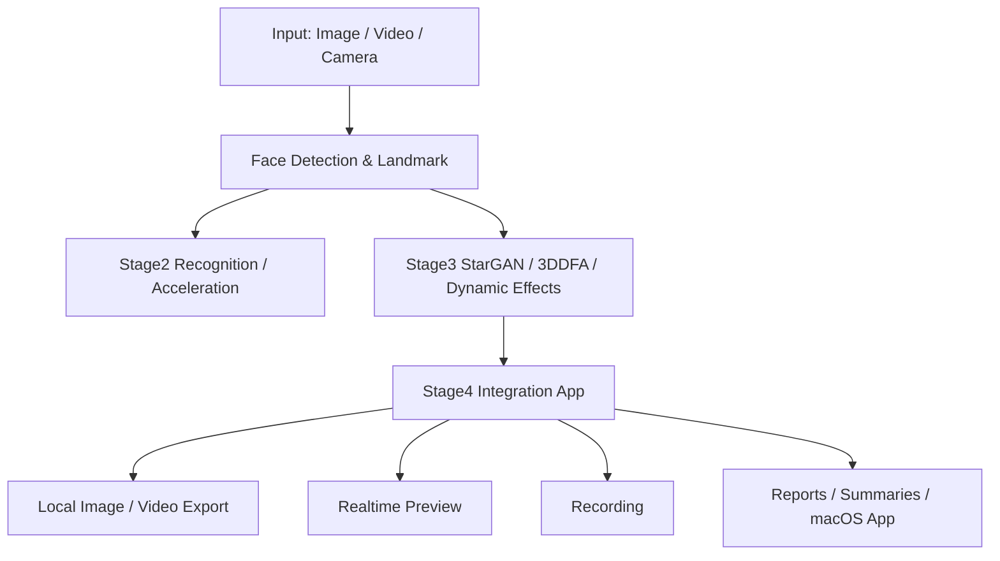
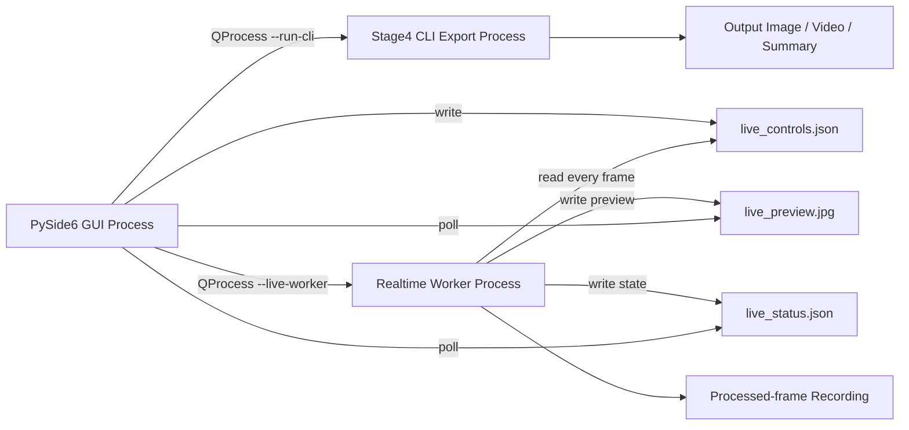

# 人脸视觉特效与三维分析集成系统技术文档

## 摘要

本项目围绕人脸视觉任务，完成了从数据准备、检测、关键点、识别、属性编辑、三维重建、动态特效到本地应用集成的完整流程。最终交付形态是一个 macOS 桌面应用，支持本地图片/视频处理、实时摄像头特效、实时截图、录像保存、结果导出和 `.app` 封装。

项目把多个人脸视觉模块组织成可验证、可运行、可交互的课程项目级系统。Stage2 侧重基础人脸检测、关键点、识别和模型加速；Stage3 侧重 StarGAN 属性编辑、3DDFA_V2 三维重建和 MediaPipe 动态特效；Stage4 侧重工程集成、实时交互、性能优化和 macOS 应用封装。本文档中的数值均来自仓库已有 summary、report 或实际文件检查；没有记录的指标明确标注为 `not recorded` 或人工观察。

## 1. 项目背景与目标

项目面向计算机视觉中的人脸分析与实时特效应用，目标是建立从算法实验到桌面应用的完整链路。项目按任务特点选择合适的位置：识别、属性编辑和三维重建主要作为离线或后续升级能力，动态特效和本地导出作为 Stage4 第一版应用主链路。

项目分阶段完成：

- Stage1：数据集探索、基础检测/关键点/识别可视化，为后续阶段提供背景材料。
- Stage2：基础人脸视觉模块，包括 WIDERFace 检测、300W 关键点、ArcFace 识别，以及模型压缩/推理加速。
- Stage3：高级生成、三维重建和动态特效，包括 StarGAN、3DDFA_V2 和 MediaPipe Face Mesh 动态特效。
- Stage4：系统集成、本地导入处理、实时摄像头特效、实时录像、性能优化和 macOS `.app` 封装。

## 2. 总体系统架构

整体系统由输入层、算法层、应用层和输出层组成。输入层支持图片、视频和摄像头；算法层包含检测、关键点、识别、属性编辑、三维重建和动态特效；应用层由 PySide6 GUI、CLI 和 worker 子进程组成；输出层包括处理后图片/视频、实时预览、录像、summary、报告和 macOS app。



Stage4 实际运行中，GUI 主进程只负责用户交互和显示，不直接加载 OpenCV、MediaPipe 或 Stage3 Task9。视频导出和实时处理运行在子进程中，从而避免 macOS GUI 进程与 OpenCV/MediaPipe 原生库冲突。

## 3. 开发环境与依赖

本地 Stage4 环境来自 `stage-4/reports/summaries/stage4_integration_summary.json` 和 `stage-4/requirements-stage4.txt`：

| 项目 | 版本/状态 |
| -- | -- |
| Python | 3.11.15 |
| Conda/Python executable | `cv-stage4` conda 环境中的 Python，具体绝对路径记录在 Stage4 summary |
| NumPy | 1.26.4 |
| OpenCV | `opencv-contrib-python==4.11.0.86`，summary 中 `cv2_version=4.11.0` |
| MediaPipe | 0.10.21 |
| PySide6 | 6.11.1 |
| Pillow | listed in `stage-4/requirements-stage4.txt` |

Stage4 固定 `numpy==1.26.4`、`opencv-contrib-python==4.11.0.86`、`mediapipe==0.10.21`，是为了减少 OpenCV、MediaPipe、NumPy wheel 之间的 ABI/平台兼容问题。`requirements-stage4.txt` 中只保留 `opencv-contrib-python`，避免同时安装 `opencv-python` 和 `opencv-contrib-python` 造成冲突。

打包依赖来自 `stage-4/requirements-packaging.txt`：

| 依赖 | 用途 |
| -- | -- |
| pyinstaller | 生成 macOS `.app` |
| macholib | macOS Mach-O 依赖分析辅助 |

云端训练/评估环境在 Stage2/Stage3 summary 中记录。例如 Task6 使用 `cuda:0`、`torch_version=2.0.0+cu118`，ONNX Runtime 可用 provider 包含 `TensorrtExecutionProvider`、`CUDAExecutionProvider`、`AzureExecutionProvider`、`CPUExecutionProvider`。Task9 performance summary 记录了 A800 环境信息：`NVIDIA A800-SXM4-80GB`，但 Task9 标注为 MediaPipe + OpenCV Python pipeline，主要按 CPU 路径执行。

## 4. Stage2：人脸检测、关键点、识别与加速

### 4.1 Task3 人脸检测

Task3 初版使用 SSD300 做 WIDERFace 检测训练与评估。后续诊断发现 baseline 的 false positive 过高，尤其在低分数阈值下会产生大量候选框。`stage-2/reports/task3_v2/summaries/ssd300_threshold_sweep_summary.json` 记录了阈值扫描，用于定位误检问题。

第二轮采用 SCRFD-like / RetinaFace-inspired R50-FPN 640 配置，目标是改善 AP50、Precision、Recall 和误检数量。对比来自 `stage-2/reports/task3_v2/summaries/task3_v2_baseline_comparison.json`：

| 模型 | AP50 | Precision | Recall | TP | FP | FN |
| -- | --: | --: | --: | --: | --: | --: |
| SSD300 baseline | 0.3689 | 0.0422 | 0.4410 | 16778 | 380906 | 21264 |
| SCRFD-like R50-FPN 640 | 0.5997 | 0.3006 | 0.6596 | 25091 | 58389 | 12951 |

改进幅度：AP50 绝对提升 0.2308，Precision 约为 baseline 的 7.12 倍，false positive 减少约 84.67%。

关键资源：

- `stage-2/reports/task3_v2/assets/evaluation/scrfd_like_640_eval_metrics.png`
- `stage-2/reports/task3_v2/assets/diagnostics/ssd300_threshold_sweep.png`
- `stage-2/reports/task3_v2/assets/detection/`

### 4.2 Task4 人脸关键点

Task4 使用 300W 数据集和 HRNet 人脸关键点模型。最终保留原始 HRNetV2-W18 baseline，因为后续增强实验没有超过 baseline，属于负向消融。

指标来自 `stage-2/reports/task4/summaries/300w_full_eval_summary.json`：

| Split | NME |
| -- | --: |
| common | 0.029079 |
| challenge | 0.055241 |
| full | 0.034205 |
| test | not recorded，官方 Test images 不在 prepared data root |

增强实验来自 `stage-2/reports/task4_v2/summaries/task4_v2_results_comparison.json`：

| 配置 | common NME | challenge NME | full NME | 结论 |
| -- | --: | --: | --: | -- |
| baseline HRNetV2-W18 | 0.029079 | 0.055241 | 0.034205 | kept |
| W32 strong augmentation 384 | 0.029359 | 0.056059 | 0.034590 | failed ablation |
| W18 mild augmentation 384 | 0.029540 | 0.056285 | 0.034780 | failed ablation |

关键资源：

- `stage-2/reports/task4/assets/evaluation/300w_nme_metrics.png`
- `stage-2/reports/task4/assets/alignment/`

### 4.3 Task5 ArcFace 人脸识别

Task5 初期自研 wrapper 在 LFW 上没有达到目标精度，本地 `lfw_eval_summary.json` 记录的 accuracy 为 0.8167，未满足 `target_lfw_accuracy=0.985`。随后转向官方 InsightFace 训练/验证链路，使用 MS1MV3 full RecordIO 与 aligned 112x112 LFW bin。

最终验收指标来自 `stage-2/reports/task5/summaries/insightface_full_lfw_eval_summary.json`：

| 指标 | 值 |
| -- | --: |
| LFW pairs | 6000 |
| Images | 12000 |
| Positive pairs | 3000 |
| Negative pairs | 3000 |
| Image size | 112x112 |
| Accuracy | 0.9980 |
| Accuracy std | 0.002867 |
| Val@FAR=1e-3 | 0.9967 |
| Target accuracy | 0.985 |
| Target met | true |

需要区分两个精度来源：Task5 的 99.80% 是云端 aligned 112x112 LFW 验收精度；Task6 的本地 LFW consistency/latency 复测 accuracy 约 86%，用于同输入下比较 PyTorch/ONNX/FP16 的速度和一致性，不作为 Task5 验收精度。

关键资源：

- `stage-2/reports/task5/assets/evaluation/lfw_roc_curve.png`
- `stage-2/reports/task5/assets/evaluation/lfw_similarity_histogram.png`

### 4.4 Task6 模型压缩与推理加速

Task6 对 ArcFace R50 做推理加速评估。Dynamic INT8 只量化 Linear 层，不能覆盖 Conv2d-heavy backbone，因此没有成为主要成功路线。最终结论来自 `stage-2/reports/task6/final/summaries/final_latency_summary.json`：Dynamic quantization 保留为 CPU Linear-layer control；部署优先路径是 GPU FP16 或 ONNX Runtime 路线。

模型前向 latency 表，单位为 ms/image：

| Backend | Batch 1 | Batch 16 | Batch 64 | Batch 256 |
| -- | --: | --: | --: | --: |
| PyTorch FP32 CUDA | 9.513 | 2.455 | 2.336 | 9.874 |
| PyTorch FP16 CUDA | 10.662 | 1.453 | 1.331 | 7.572 |
| ONNX FP32 CUDA | 6.060 | 2.592 | 2.496 | not recorded |
| ONNX FP16 CUDA | 7.368 | 1.476 | 1.404 | not recorded |

LFW same-input latency/accuracy 对比：

| Backend | Accuracy | Latency ms/forward image | Throughput img/s | Speedup vs PyTorch FP32 |
| -- | --: | --: | --: | --: |
| PyTorch FP32 CUDA | 0.8605 | 17.948 | 27.859 | 1.000 |
| PyTorch FP16 CUDA | 0.8615 | 3.804 | 131.454 | 4.719 |
| ONNX FP32 CUDA | 0.8605 | 6.554 | 76.293 | 2.739 |
| ONNX FP16 CUDA | 0.8582 | 4.539 | 110.154 | 3.954 |

Task6 summary 记录 `best_backend=pytorch_fp16_cuda`，`best_speedup_vs_pytorch_fp32=4.7186`。报告中将 Dynamic INT8 写为负向诊断。

关键资源：

- `stage-2/reports/task6/final/assets/evaluation/final_latency_comparison.png`
- `stage-2/reports/task6/assets/evaluation/task6_onnx_comparison.png`

## 5. Stage3：属性编辑、三维重建与动态特效

### 5.1 Task7 StarGAN 人脸属性编辑

Task7 使用 CelebA 5 个属性完成 StarGAN 属性编辑：

- Black_Hair
- Blond_Hair
- Brown_Hair
- Male
- Young

该任务采用官方 StarGAN wrapper，并修复了 eval/train mode 与 InstanceNorm 相关问题。评估来自 `stage-3/reports/task7/summaries/task7_evaluation_summary.json`、`attribute_success_summary.json` 和 `identity_retention_summary.json`。

属性编辑成功率：

| 属性 | Total | Primary success | Primary rate | Strict success | Strict rate |
| -- | --: | --: | --: | --: | --: |
| Black_Hair | 512 | 455 | 0.8887 | 453 | 0.8848 |
| Blond_Hair | 512 | 429 | 0.8379 | 419 | 0.8184 |
| Brown_Hair | 512 | 439 | 0.8574 | 438 | 0.8555 |
| Male | 512 | 496 | 0.9688 | 485 | 0.9473 |
| Young | 512 | 477 | 0.9316 | 473 | 0.9238 |

身份保持评估：

| 指标 | 值 |
| -- | --: |
| Pairs | 2560 |
| Valid pairs | 2434 |
| No source face | 10 |
| No generated face | 124 |
| Mean cosine | 0.6215 |
| Median cosine | 0.6295 |
| P10 | 0.4699 |

FID/IS 在 `fid_is_summary.json` 中记录为 `available=false`，`reason=skipped`，因此本文不写 FID/IS 数值。

关键资源：

- `stage-3/reports/task7/assets/evaluation/iter_200000/source_vs_generated/Black_Hair_source_vs_generated.jpg`
- `stage-3/reports/task7/assets/evaluation/iter_200000/source_vs_generated/Blond_Hair_source_vs_generated.jpg`
- `stage-3/reports/task7/assets/pretrained/pretrained_200000_fixed_grid.jpg`

### 5.2 Task8 3DDFA_V2 三维人脸重建

Task8 使用官方 3DDFA_V2，以官方 subprocess wrapper 处理 CelebA 样本。它是 3DMM-based 单图重建。

指标来自 `stage-3/reports/task8/summaries/task8_reconstruction_summary.json` 和 `task8_render_summary.json`：

| 指标 | 值 |
| -- | --: |
| Requested samples | 500 |
| Processed count | 500 |
| Success count | 500 |
| Failure count | 0 |
| Success rate | 1.0 |
| Selected backend | pth |
| Selected mode | gpu |
| Official outputs | 2d_sparse, 3d, pose, obj |
| Rendered showcase samples | 12 |
| Render backend | matplotlib |
| Render angles | frontal, left_yaw_30, right_yaw_30, left_yaw_60, right_yaw_60 |

输出内容包括 2D sparse landmarks、3D overlay、pose 可视化、OBJ mesh 和多视角渲染。

关键资源：

- `stage-3/reports/task8/assets/reconstruction/sample_000/official_2d_sparse.jpg`
- `stage-3/reports/task8/assets/reconstruction/sample_000/official_3d_overlay.jpg`
- `stage-3/reports/task8/assets/reconstruction/sample_000/official_pose.jpg`
- `stage-3/reports/task8/assets/reconstruction/sample_000/official_mesh.obj`
- `stage-3/reports/task8/assets/rendered_views/sample_000/multiview_grid.jpg`

### 5.3 Task9 MediaPipe 动态人脸特效

Task9 使用真实 mp4 输入，基于 MediaPipe Face Mesh 和 OpenCV 实现动态人脸特效。视觉特效包括：

- glasses
- hat
- smooth
- whiten
- lipstick

`fps` 和 `landmarks` 是统计/调试项。

质量路径处理结果来自 `stage-3/reports/task9/summaries/task9_effects_summary.json`：

| 指标 | 值 |
| -- | --: |
| Input video | `stage-3/reports/task9/assets/input/user_video.mp4` |
| Output video | `stage-3/reports/task9/assets/videos/task9_dynamic_effects_demo.mp4` |
| Source frames | 912 |
| Processed frames | 912 |
| Faces detected frames | 912 |
| Process size | 2160 x 4096 |
| Average processing FPS | 5.2947 |
| Detection ms/frame | 9.462 |
| Sticker ms/frame | 15.867 |
| Beauty ms/frame | 78.687 |
| Lipstick ms/frame | 4.276 |
| Render ms/frame | 98.848 |
| Write ms/frame | 50.850 |
| Sticker cache enabled | true |
| Sticker cache size | 102 |

profile benchmark 来自 `task9_performance_summary.json`：

| Profile | Effects | FPS | Total ms/frame |
| -- | -- | --: | --: |
| landmark_only | none | 12.845 | 77.850 |
| stickers_only | glasses, hat | 10.457 | 95.632 |
| beauty_only | smooth, whiten | 6.145 | 162.739 |
| full_effects | glasses, hat, lipstick, smooth, whiten | 5.379 | 185.908 |

Task9 后续修复了帽子/眼镜几何，帽子从全局 bbox/face center 简单定位改为基于眼睛中心、人脸局部坐标轴、forehead anchor 和 sticker anchor 对齐的定位方式。

关键资源：

- `stage-3/reports/task9/assets/videos/task9_dynamic_effects_demo.mp4`
- `stage-4/reports/assets/keyframes/frame_start.jpg`
- `stage-4/reports/assets/keyframes/frame_middle.jpg`
- `stage-4/reports/assets/keyframes/frame_end.jpg`
- `stage-4/reports/assets/videos/stage4_hat_geometry_fix_test.mp4`

## 6. Stage4：项目集成与桌面应用

### 6.1 集成目标

Stage4 的目标是把 Stage2/Stage3 模块组织成统一的本地视觉应用系统。重点不是重新训练模型，而是完成模块化集成、交互设计、稳定运行、结果导出和 macOS 应用封装。第一版主链路复用 Stage3 Task9 动态特效，ArcFace、StarGAN 和 3DDFA 暂作为后续升级接口。

### 6.2 应用功能

Stage4 桌面应用包含首页、本地导入和实时视频页面。

本地导入支持：

- 图片处理。
- 视频处理。
- glasses、hat、smooth、whiten、lipstick 特效选择。
- smooth / whiten / lipstick 强度调节。
- 用户自定义导出路径。
- 默认完整视频、原始分辨率导出。
- fast preview 作为可选模式，显式勾选后才限制分辨率或帧数。

实时视频支持：

- 摄像头实时预览。
- 特效实时开关。
- 强度实时调节。
- 截图保存。
- 开始/停止录像。
- 用户自定义录像保存路径。
- 处理后的实时特效画面写入录像。

UI 能力来自 `stage-4/reports/summaries/stage4_ui_v3_summary.json`，其中记录了 `embedded_realtime_preview=true`、`realtime_recording_supported=true`、`gui_imports_cv2=false`、`gui_imports_mediapipe=false`、`local_export_original_resolution_by_default=true`。

### 6.3 Stage4 软件架构

Stage4 使用 PySide6 GUI 主进程、CLI 子进程和 realtime worker 子进程。GUI 主进程不直接 import `cv2`、`mediapipe`、`numpy`、`stage4_backend` 或 Stage3 Task9，主要原因是曾在 macOS 上遇到 GUI/QThread 内 import OpenCV/MediaPipe 引起的 Bus error。最终架构让 GUI 与 CV runtime 分离。



核心文件：

- `stage-4/code/stage4_desktop_app.py`
- `stage-4/code/stage4_run_cli.py`
- `stage-4/code/stage4_process_image_cli.py`
- `stage-4/code/stage4_live_camera_worker.py`
- `stage-4/code/stage4_backend.py`
- `stage-4/reports/runtime/live_controls.json`
- `stage-4/reports/runtime/live_status.json`
- `stage-4/reports/runtime/live_preview.jpg`

### 6.4 实时特效与录像

worker 子进程负责摄像头读取、MediaPipe Face Mesh、OpenCV 特效渲染和 `cv2.VideoWriter` 录像。GUI 负责写控制文件、显示预览帧、显示状态和日志。录像保存的是已经叠加特效后的输出帧，不是原始摄像头帧。

录像过程中，用户仍可切换特效和调整强度；worker 每帧读取控制文件，因此录制视频会记录切换后的画面。截图和录像互不影响。

### 6.5 性能优化

Stage4 区分实时预览模式和高质量导出模式：

- 实时预览模式：缩放处理分辨率，优先交互流畅性。
- 高质量导出模式：默认完整长度、原始分辨率，不保证实时。

正式 summary 中记录的 Stage4 CLI smoke test：

| Summary | Effects | Frames | FPS | Avg ms/frame | Output |
| -- | -- | --: | --: | --: | -- |
| `stage4_integration_summary.json` | glasses, whiten | 30 | 36.594 | 27.327 | `stage-4/reports/assets/videos/stage4_task9_effects_export.mp4` |
| `stage4_fast_preview_regression_summary.json` | glasses, whiten | 30 | 36.786 | 27.184 | `stage-4/reports/assets/videos/stage4_fast_preview_regression_test.mp4` |
| `stage4_hat_geometry_fix_summary.json` | glasses, hat | 30 | 37.482 | 26.680 | `stage-4/reports/assets/videos/stage4_hat_geometry_fix_test.mp4` |


优化策略包括：

- 降低实时预览处理分辨率。
- worker 只处理最新帧。
- ROI 美颜，减少全图处理开销。
- 贴纸缓存，避免重复 resize/rotate 成本。
- 降低 preview IO 频率。
- 控制 JSON 读取频率。
- GUI 状态轮询限频。

移动端仍未实际部署，当前只是移动端友好优化思路。

### 6.6 macOS 应用封装

macOS app 封装来自 `stage-4/reports/summaries/stage4_packaging_summary.json`：

| 项目 | 值 |
| -- | -- |
| App name | Stage4FaceEffects.app |
| Packaging target | macOS |
| Unified entry | `stage-4/code/stage4_app_main.py` |
| PyInstaller spec | `stage-4/packaging/stage4_face_effects.spec` |
| Build script | `stage-4/packaging/build_macos_app.sh` |
| Dist app path | `stage-4/packaging/dist/Stage4FaceEffects.app` |
| GUI mode | `--gui` |
| run-cli mode | `--run-cli` |
| live-worker mode | `--live-worker` |
| check-env mode | `--check-env` |
| App bundle exists | true |
| Executable exists | true |
| Info.plist exists | true |
| Codesign | ad_hoc |
| Notarized | false |
| Frozen user data dir | `~/Documents/Stage4FaceEffects` |

打包后 GUI 启动 worker/CLI 时，优先调用当前 app executable，并传入 `--run-cli` 或 `--live-worker`。用户输出路径优先；没有选择时，打包模式默认写入 `~/Documents/Stage4FaceEffects/`，不写入 `.app` bundle 内部。

## 7. 关键技术实现

### 7.1 Face Mesh 驱动的动态贴纸

动态贴纸使用 MediaPipe Face Mesh 提供的人脸关键点。眼镜主要依据左右眼中心和眼距确定位置、宽度与旋转角；帽子使用人脸局部坐标系和额头锚点确定贴合位置。贴纸经过 resize、rotate、alpha blending 后叠加到视频帧。

### 7.2 帽子几何修复

早期帽子定位主要依赖 face bbox top、face center 或固定偏移，在人物偏离画面中心或歪头时容易漂移。后续修复改为：

- 计算左右眼中心，且使用多个 eye landmarks 平均。
- 由眼睛连线得到 face_x_axis。
- 在图像坐标系下构造 face_up_axis。
- 使用 brow center / eye midpoint 得到 forehead_anchor。
- 使用 hat_anchor 对齐贴纸内部的 sticker anchor。
- 帽子宽度由 face width 或 eye distance fallback 决定。

`stage4_hat_geometry_fix_summary.json` 中记录了修复测试：30 帧、glasses+hat、processing_fps=37.4818、avg_ms_per_frame=26.6796。

### 7.3 ROI 美颜

smooth、whiten、lipstick 不是生成式商业美颜，而是传统 OpenCV 效果。美颜相关操作尽量限制在人脸区域或嘴唇区域，降低全图处理开销。Task9 benchmark 显示 beauty 仍是主要耗时项之一：quality full_effects 中 average_beauty_ms 为 83.029 ms/frame。

### 7.4 子进程架构

Stage4 最终采用 GUI 与 CV runtime 分离：

- GUI：PySide6，负责界面、路径选择、命令预览、控制文件、日志与状态展示。
- CLI：本地图片/视频处理，复用 Stage3 Task9 backend。
- Worker：摄像头实时处理、预览帧写出、状态写出、录像写出。

该架构解决了 macOS GUI 进程直接加载 OpenCV/MediaPipe 时的稳定性问题，也让打包后 CLI/worker 入口可通过统一 executable 分发。

### 7.5 打包后的路径兼容

`stage-4/code/stage4_packaging_utils.py` 区分源码模式和 PyInstaller frozen 模式：

- 源码模式：默认输出到 `stage-4/reports/`。
- frozen 模式：默认输出到 `~/Documents/Stage4FaceEffects/`。
- 资源路径：优先从 bundle 中查找配置、Stage3 Task9 代码和贴纸。
- 子进程命令：frozen 模式调用当前 executable 加 `--run-cli` 或 `--live-worker`。

## 8. 实验结果汇总

| 阶段 | 模块 | 指标 | 结果 | 来源 |
| -- | -- | -- | -- | -- |
| Stage1 | LFW InsightFace baseline | mean accuracy / AUC | 0.9665 / 0.9897 | `stage-1/reports/assets/evaluation/lfw_insightface_verification_summary.json` |
| Stage2 | Task3 detector baseline | AP50 / P / R | 0.3689 / 0.0422 / 0.4410 | `task3_v2_baseline_comparison.json` |
| Stage2 | Task3 SCRFD-like | AP50 / P / R | 0.5997 / 0.3006 / 0.6596 | `task3_v2_baseline_comparison.json` |
| Stage2 | Task4 HRNet landmark | common / challenge / full NME | 0.029079 / 0.055241 / 0.034205 | `300w_full_eval_summary.json` |
| Stage2 | Task5 ArcFace | LFW accuracy | 0.9980 | `insightface_full_lfw_eval_summary.json` |
| Stage2 | Task6 acceleration | best speedup | 4.7186, PyTorch FP16 CUDA | `final_latency_summary.json` |
| Stage3 | Task7 StarGAN | attribute primary success | 0.8379 to 0.9688 by attribute | `attribute_success_summary.json` |
| Stage3 | Task7 StarGAN | identity mean cosine | 0.6215 | `identity_retention_summary.json` |
| Stage3 | Task8 3DDFA | reconstruction success rate | 1.0 on 500 samples | `task8_reconstruction_summary.json` |
| Stage3 | Task9 full effects quality path | FPS | 5.379 profile FPS / 5.2947 output FPS | `task9_performance_summary.json`, `task9_effects_summary.json` |
| Stage4 | CLI smoke test | frames / FPS | 30 / 36.594 | `stage4_integration_summary.json` |
| Stage4 | fast preview regression | frames / FPS | 30 / 36.786 | `stage4_fast_preview_regression_summary.json` |
| Stage4 | hat geometry fix test | frames / FPS | 30 / 37.482 | `stage4_hat_geometry_fix_summary.json` |
| Stage4 | realtime preview | FPS | manual observation around 30 FPS, not automatic benchmark | project acceptance note |
| Stage4 | macOS packaging | bundle / executable / Info.plist | true / true / true | `stage4_packaging_summary.json` |

Missing or not recorded:

- Task7 FID/IS：summary 记录为 skipped。
- Task4 official 300W Test：missing images，未记录 test NME。
- Stage4 realtime FPS：没有自动 benchmark summary，仅人工验收观察。
- 移动端部署指标：未部署，not recorded。

## 9. 使用说明

### 源码运行

```bash
conda activate cv-stage4
python stage-4/code/stage4_app_main.py --gui
```

### Stage4 桌面应用运行

```bash
python stage-4/code/stage4_desktop_app.py
```

Safe mode：

```bash
python stage-4/code/stage4_desktop_app.py --safe
```

### 本地导入使用流程

1. 打开桌面应用。
2. 进入“本地导入”。
3. 选择图片或视频。
4. 勾选 glasses、hat、smooth、whiten、lipstick。
5. 调整 smooth / whiten / lipstick 强度。
6. 可选：选择导出路径。
7. 点击开始处理。

未勾选 fast preview 时，本地视频默认完整长度和原始分辨率导出；勾选 fast preview 后才传入缩放和最大帧数参数。

### 实时视频使用流程

1. 进入“实时视频”页面。
2. worker 子进程自动启动摄像头。
3. GUI 显示 worker 写出的 `live_preview.jpg`。
4. 特效开关和强度滑条实时写入 `live_controls.json`。
5. worker 每帧读取控制文件并更新效果。

### 录像使用流程

1. 在实时视频页面点击“开始录像”。
2. worker 使用 `cv2.VideoWriter` 保存处理后的输出帧。
3. 录像过程中可切换特效。
4. 点击“停止录像”后保存 mp4。
5. 用户选择路径优先；默认源码模式路径为 `stage-4/reports/assets/recordings/`。

### 打包 app 启动方式

```bash
open stage-4/packaging/dist/Stage4FaceEffects.app
```

如果 macOS 阻止打开，可右键 app 选择“打开”，或在系统设置中允许打开。当前版本没有 Apple notarization。

### 常见问题

- MediaPipe 版本问题：Stage4 固定 `mediapipe==0.10.21`，summary 中存在 `pip check` 平台 warning，但实际 import 和 smoke test 已通过。
- OpenCV / NumPy 冲突：不要同时安装 `opencv-python` 和 `opencv-contrib-python`。
- macOS 摄像头权限：首次进入实时视频时需要授权 Terminal / Python / Stage4FaceEffects。
- app 无法打开：当前没有 notarization，需右键打开或系统设置允许。
- 导出速度慢：原分辨率完整视频导出不保证实时；Task9 quality full effects 在 2160 x 4096 下约 5.3 FPS。

## 10. 项目局限性

- 实时特效不是商业级 AR。
- 复杂遮挡、快速运动、极端姿态下贴纸仍可能漂移。
- 原分辨率完整视频导出不保证实时。
- 移动端没有实际部署。
- StarGAN 和 3DDFA 当前作为离线能力或后续升级接口，没有进入实时链路。
- macOS app 未 notarized，仅用于课程项目本地演示。
- Task7 FID/IS 未计算。
- Task4 official test split 因缺少图片未记录 test NME。

## 11. 后续工作

- Windows `.exe` 打包。
- Android/iOS 原生重构。
- ArcFace 低频身份识别接入。
- StarGAN 图片属性编辑页。
- 3DDFA 单图重建页。
- 更稳定的实时人脸跟踪。
- GPU/Metal/CoreML/TFLite 优化。
- UI/UX 进一步优化。

## 12. 交付物索引

| 类别 | 路径 | 说明 |
| -- | -- | -- |
| Stage1 report | `stage-1/reports/stage1_face_basics_dataset_report.md` | 数据集探索和基础检测/识别材料 |
| Stage2 Task3 | `stage-2/reports/task3_v2/` | 检测改进报告、summary、可视化 |
| Stage2 Task4 | `stage-2/reports/task4/` | 关键点训练/评估报告 |
| Stage2 Task5 | `stage-2/reports/task5/` | ArcFace 训练与 LFW 验收 |
| Stage2 Task6 | `stage-2/reports/task6/final/` | 最终推理加速报告与 latency summary |
| Stage3 Task7 | `stage-3/reports/task7/` | StarGAN 属性编辑报告与可视化 |
| Stage3 Task8 | `stage-3/reports/task8/` | 3DDFA_V2 重建报告、OBJ、渲染图 |
| Stage3 Task9 | `stage-3/reports/task9/` | MediaPipe 动态特效报告与 demo video |
| Stage4 report | `stage-4/reports/stage4_project_integration_report.md` | 项目集成报告 |
| Stage4 README | `stage-4/README_STAGE4.md` | 运行与打包说明 |
| Stage4 app | `stage-4/packaging/dist/Stage4FaceEffects.app` | macOS `.app` |
| Final docs | `reports/final/` | 最终技术文档、总结、索引、checklist |
