# 第一周周报：阶段一人脸识别基础与数据集探索

周期：第一周，2026-05-18 至 2026-05-21

## 1. 本周已完成

- 完成阶段一开发环境与交付目录整理，代码保留在 `demo/`，报告与小体积结果图保留在 `reports/`，原始数据和模型权重分别保留在已忽略的 `data/` 与 `checkpoints/`。
- 完成人脸识别基础概念梳理，覆盖人脸检测、关键点定位、人脸对齐、embedding 提取、人脸验证与身份检索。
- 完成 CelebA 与 LFW 数据集探索。CelebA 共 `202599` 张图像、`10177` 个身份、`40` 个属性；LFW 共 `13233` 张图像、`5749` 个身份、`6000` 对 10-fold verification pairs。
- 使用 InsightFace `buffalo_l` 完成公开测试图关键点可视化，并完成 LFW 10-fold 验证评估：`6000/6000` 对有效，mean accuracy 为 `0.9665`，AUC 为 `0.989726`。
- 按用途整理 `reports/assets/`：数据集图、公开输入图、检测结果、关键点结果、LFW 评估图和周报截图分别归档。

## 2. 运行截图

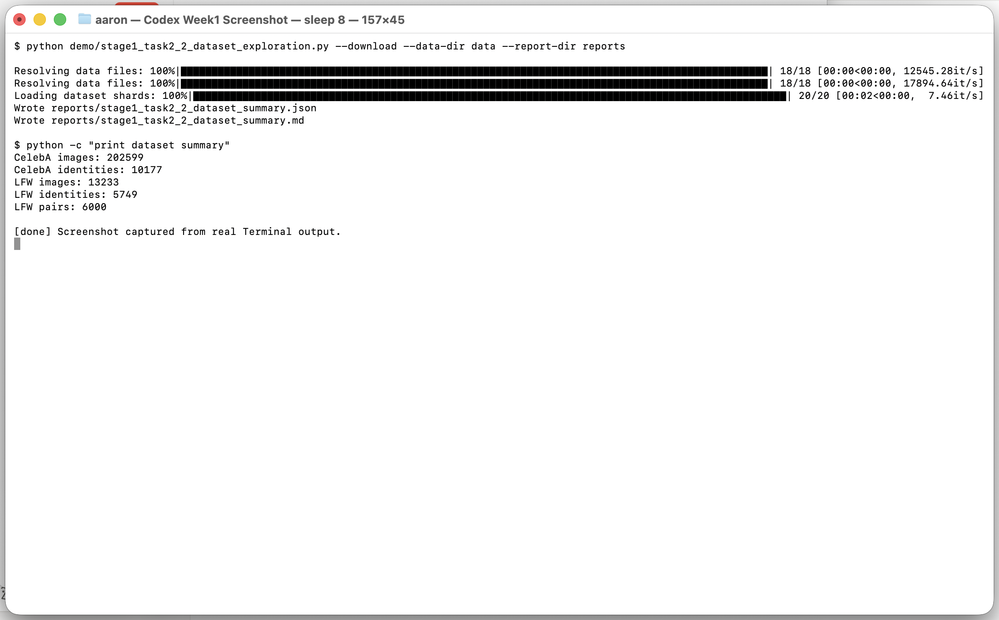

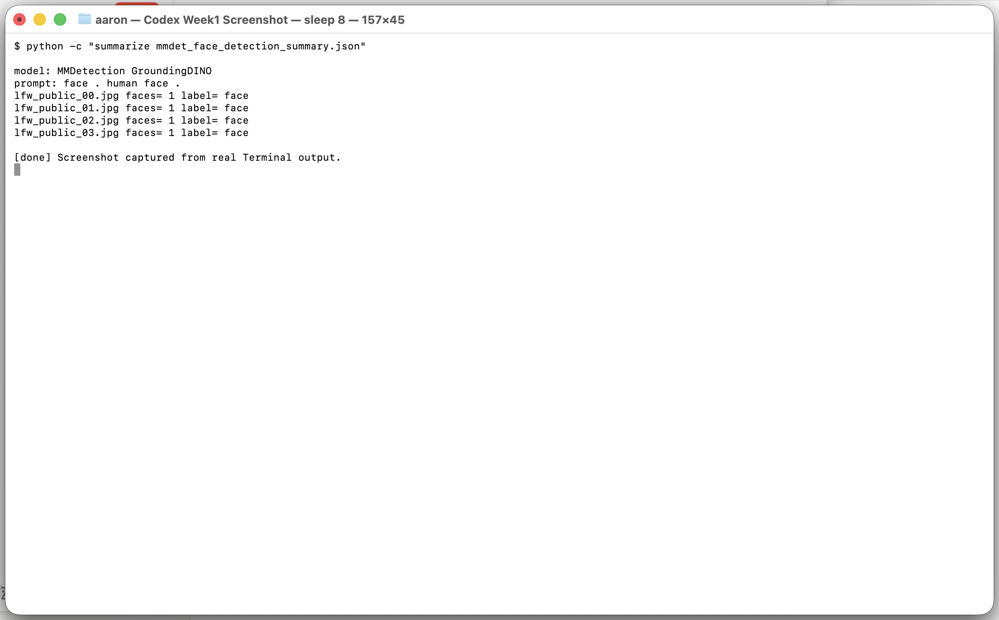

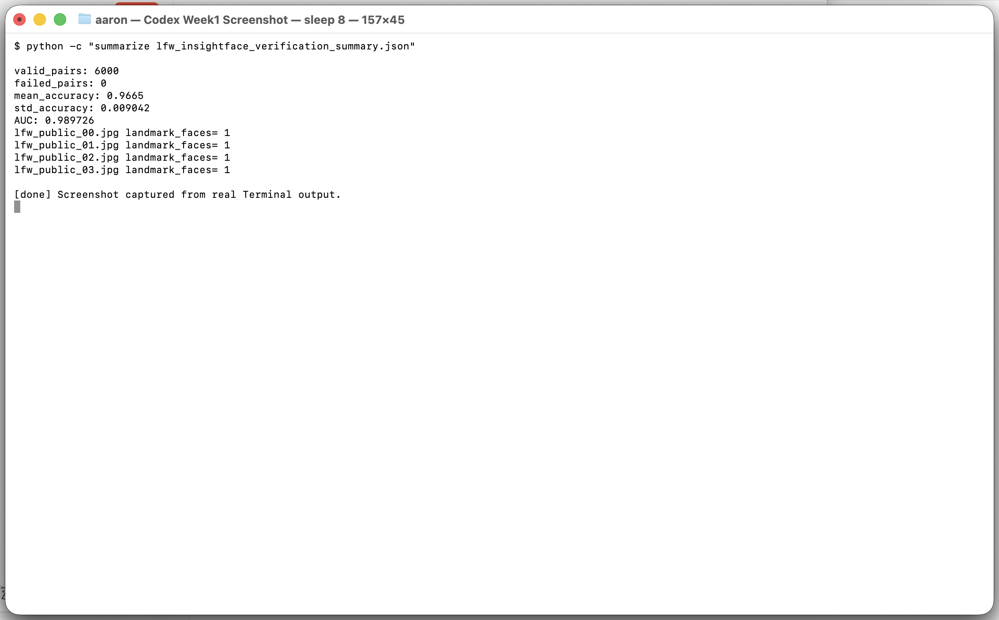

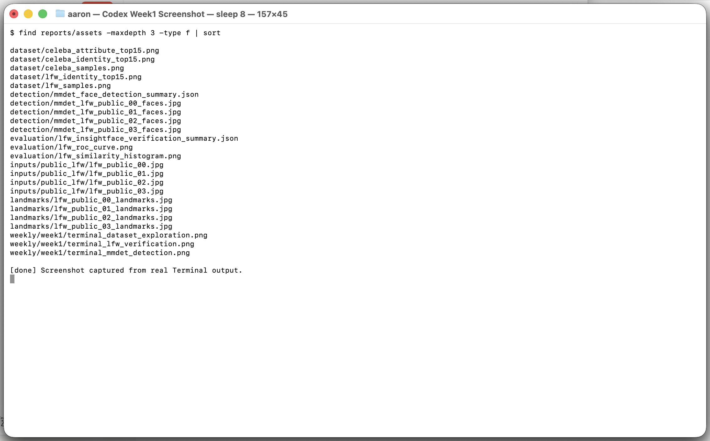

---PAGEBREAK---

## 3. 实验结果与图表

### 3.1 CelebA/LFW 数据集探索

CelebA 用于属性与身份分布探索，LFW 用于人脸验证评估。样本图和分布图均保存为报告资产。

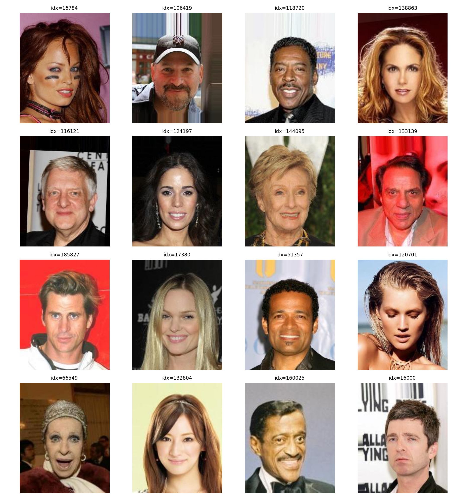

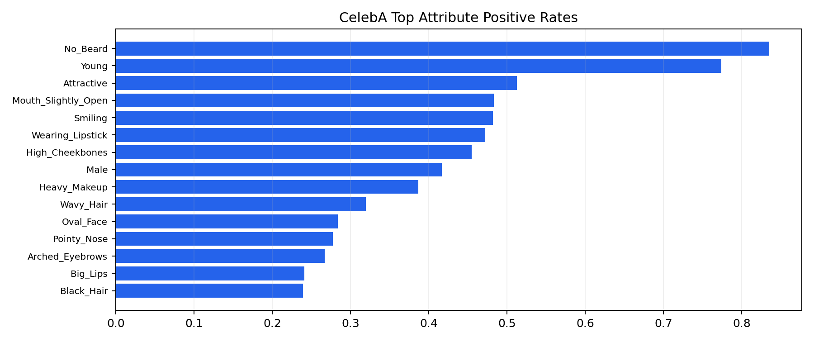

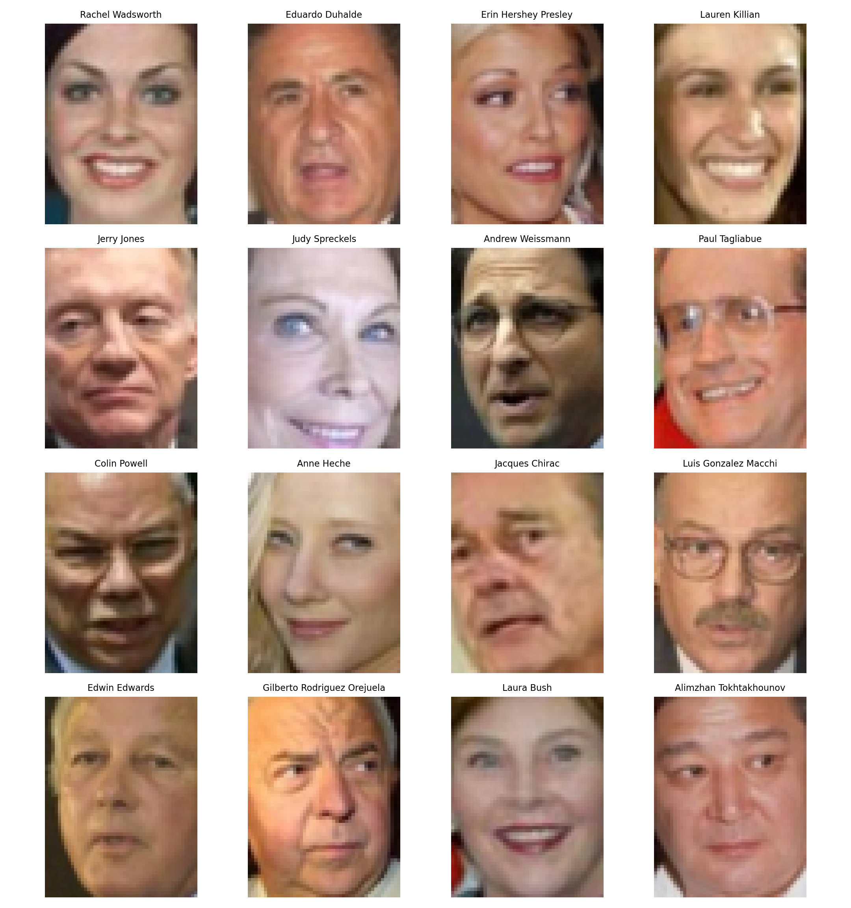

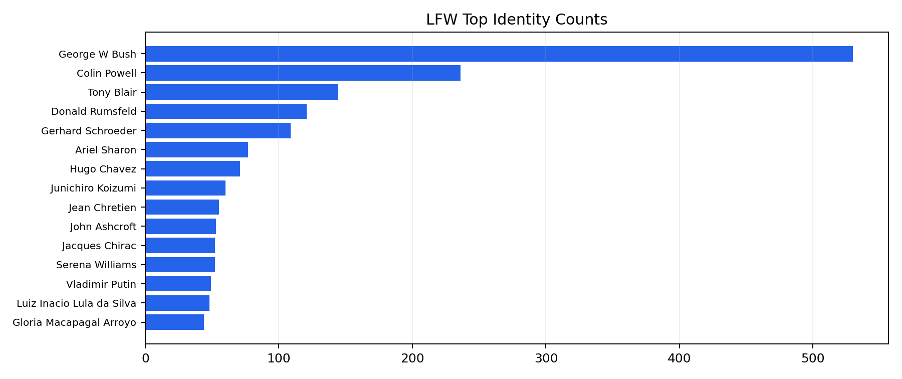

### 3.2 MMDetection 开放词人脸检测

检测输入来自 LFW 公开数据集导出的 `reports/assets/inputs/public_lfw/lfw_public_*.jpg`。GroundingDINO 使用提示词 `face . human face .`，输出 bbox JSON 和可视化图。当前 4 张公开测试图均检测到 1 张脸。

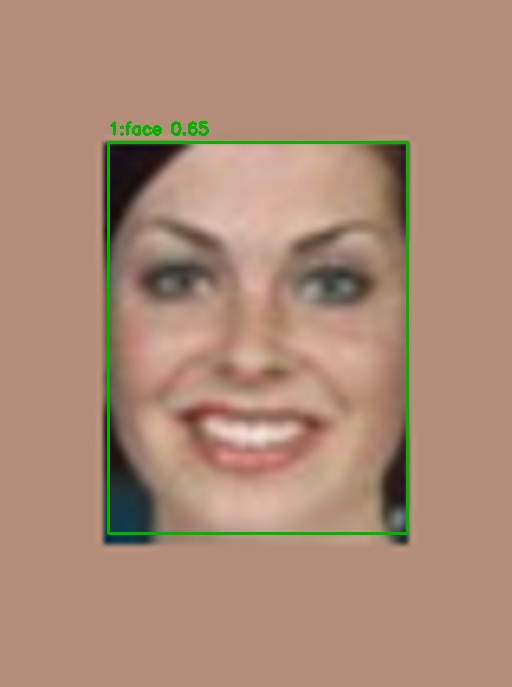

### 3.3 InsightFace 关键点与 LFW 验证

关键点可视化使用 InsightFace `buffalo_l`，标出 bbox、5 点关键点和可用的 106 点关键点。LFW 验证使用 cosine similarity，逐折在训练折选择阈值后在验证折计算准确率。

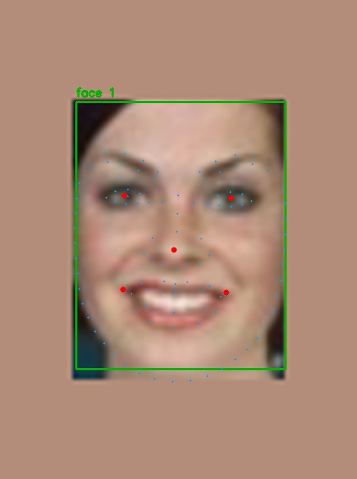

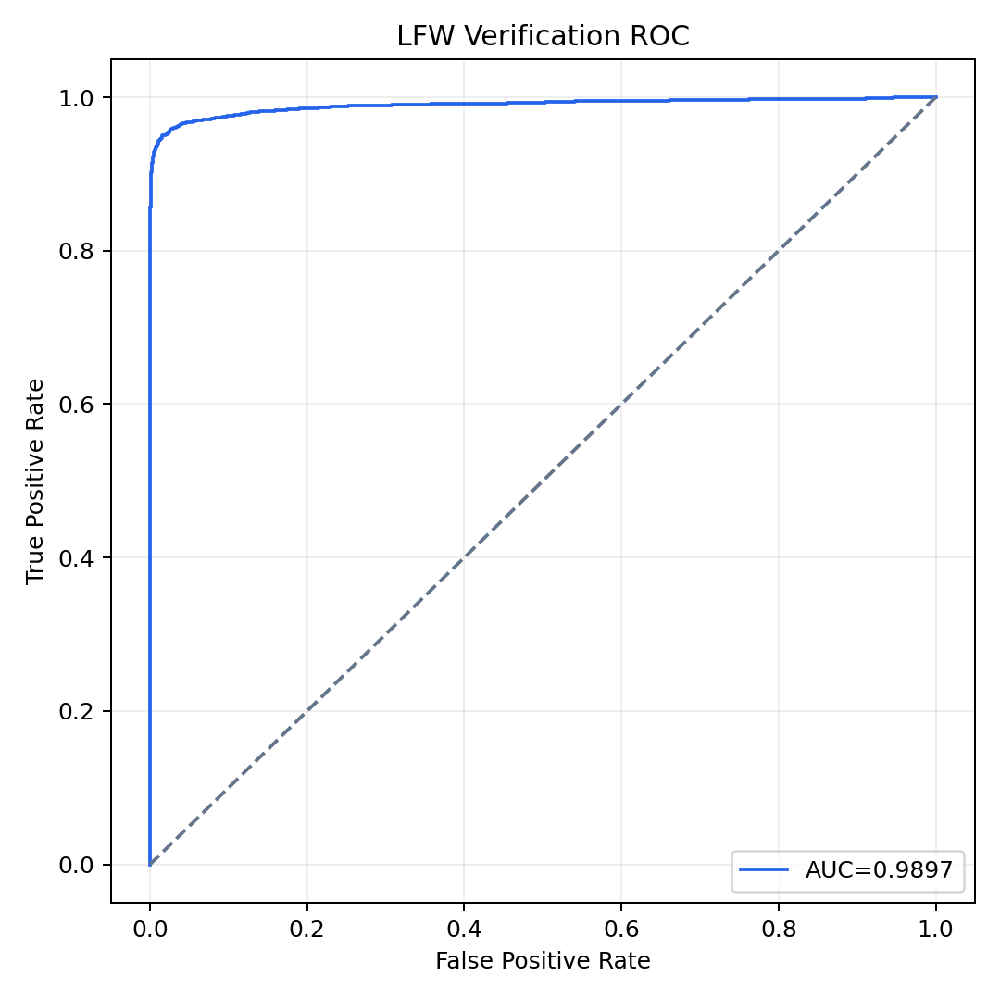

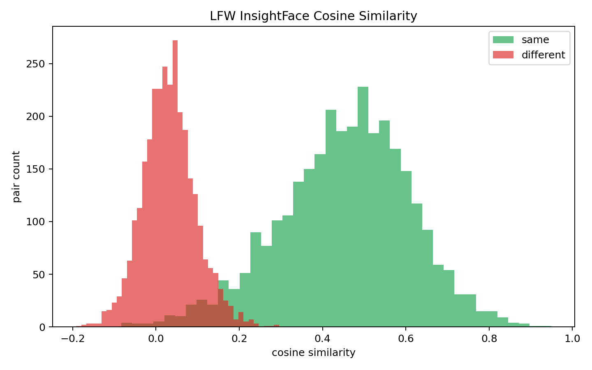

---PAGEBREAK---

## 4. 关键代码段与解释

### 4.1 LFW 图像归一化修复

文件：`demo/stage1_task2_2_dataset_exploration.py`，行号：`93-104`、`367-372`

```python
def image_to_uint8_rgb(image: Any) -> np.ndarray:
    array = np.asarray(image)
    if array.ndim == 2:
        array = np.stack([array, array, array], axis=-1)
    if array.dtype != np.uint8:
        max_value = float(np.nanmax(array)) if array.size else 0.0
        if max_value <= 1.0:
            array = array * 255.0
        array = np.clip(array, 0, 255).astype(np.uint8)
    if array.ndim == 3 and array.shape[-1] == 4:
        array = array[..., :3]
    return array
```

解释：该函数先判断数值范围，必要时乘以 255，再裁剪并转换为 `uint8`，同时兼容灰度图和 RGBA 图。LFW 在当前读取链路中返回 `0..1` 浮点图像，直接转 `uint8` 会导致像素几乎全变为 0，样本网格变黑。

```python
for idx in sample_indices:
    image = image_to_uint8_rgb(people.images[idx])
    samples.append((image, str(people.target_names[int(people.target[idx])])[:32]))

save_image_grid(samples, dataset_dir / "lfw_samples.png")
public_test_images = save_public_lfw_test_images(people, sample_indices, assets_dir)
```

解释：样本网格和公开测试图都复用同一套图像转换逻辑，保证报告图和后续检测输入一致。

### 4.2 MMDetection 推理与 bbox 解析

文件：`demo/stage1_task2_3_mmdet_face_detection.py`，行号：`97-119`、`171-205`

```python
def parse_prediction(prediction: dict[str, Any], score_thr: float) -> list[dict[str, Any]]:
    bboxes = prediction.get("bboxes", [])
    scores = prediction.get("scores", [])
    labels = prediction.get("labels", [])
    label_names = prediction.get("label_names", [])
    detections = []
    for idx, bbox in enumerate(bboxes):
        score = float(scores[idx]) if idx < len(scores) else 0.0
        if score < score_thr:
            continue
        label = labels[idx] if idx < len(labels) else "face"
        if idx < len(label_names):
            label = label_names[idx]
        elif str(label).isdigit():
            label = "face"
        detections.append(
            {"bbox": [round(float(v), 2) for v in bbox], "score": round(score, 4), "label": str(label)}
        )
    return nms_detections(detections)
```

解释：GroundingDINO 可能返回重复候选框或数字标签。这里先按阈值过滤，再将数字标签统一映射为 `face`，最后用 NMS 去掉重叠框，确保报告里的检测结果清晰可读。

```python
for image_path in images:
    result = inferencer(
        inputs=str(image_path),
        texts=args.texts,
        custom_entities=True,
        pred_score_thr=args.score_thr,
        no_save_vis=True,
        no_save_pred=True,
        return_datasamples=False,
    )
    prediction = result["predictions"][0]
    detections = parse_prediction(prediction, args.score_thr)
    vis_path = output_dir / f"mmdet_{image_path.stem}_faces.jpg"
    draw_boxes(image_path, detections, vis_path)
```

解释：脚本把 MMDetection 的推理结果转成统一 JSON 结构，同时输出带 bbox 的标注图，满足报告中“实验结果、图表”的交付要求。

---PAGEBREAK---

### 4.3 InsightFace 关键点与 LFW 10-fold 验证

文件：`demo/stage1_task2_4_landmarks_and_lfw_eval.py`，行号：`131-160`、`292-317`、`319-350`

```python
def cross_validate(scores: np.ndarray, labels: np.ndarray, folds: int = 10) -> dict[str, Any]:
    indices = np.arange(len(scores))
    fold_indices = np.array_split(indices, folds)
    rows = []
    for fold_id, valid_idx in enumerate(fold_indices, start=1):
        train_idx = np.setdiff1d(indices, valid_idx)
        threshold, train_acc = choose_threshold(scores[train_idx], labels[train_idx])
        valid_acc = float(np.mean((scores[valid_idx] >= threshold) == labels[valid_idx]))
        rows.append(
            {
                "fold": fold_id,
                "threshold": round(threshold, 6),
                "train_accuracy": round(train_acc, 6),
                "valid_accuracy": round(valid_acc, 6),
                "valid_pairs": int(len(valid_idx)),
            }
        )
```

解释：LFW 评估采用 10-fold 策略。每一折只在训练折上选阈值，再在验证折上计算准确率，避免直接用验证集调阈值导致指标偏乐观。

```python
for idx in tqdm(range(len(pairs)), desc="LFW pairs"):
    rgb_a = rgb_to_uint8(pairs[idx, 0])
    rgb_b = rgb_to_uint8(pairs[idx, 1])
    emb_a = embedding_for_image(app, recognizer, rgb_a, cache, args.embedding_mode)
    emb_b = embedding_for_image(app, recognizer, rgb_b, cache, args.embedding_mode)
    if emb_a is None or emb_b is None:
        failed_pairs += 1
        failed_images += int(emb_a is None) + int(emb_b is None)
        continue
    scores.append(cosine_similarity(emb_a, emb_b))
    labels.append(int(targets[idx]) == same_label)
```

解释：每对 LFW 图像都会提取 embedding 并计算 cosine similarity，同时记录检测失败数量。本次使用 crop 模式，`6000/6000` 对均有效。

```python
landmark_records = []
for image_path in collect_landmark_images(args.landmark_input_dir):
    landmark_records.append(
        draw_landmarks(
            landmark_app,
            image_path,
            landmark_out_dir / f"{image_path.stem}_landmarks.jpg",
        )
    )
```

解释：关键点可视化与 LFW 验证共用同一个脚本，但输出目录分开：验证图表进入 `evaluation/`，关键点图进入 `landmarks/`，报告资产更容易复查。

## 5. 下周待办

- 启动阶段二：学习并整理 MTCNN、RetinaFace 等人脸检测算法原理，明确与 MMDetection 训练流程的对应关系。
- 准备 WIDER FACE 数据集训练流程，包括数据下载、目录转换、标注格式检查、训练/验证配置和本地缓存策略。
- 基于 MMDetection 搭建 WIDER FACE 人脸检测训练 baseline，优先跑通小规模 smoke training，再扩展到完整训练。
- 在 WIDER FACE 验证集上评估检测模型性能，输出 mAP、可视化样例和失败案例分析。
- 为任务 4.x 做准备，调研 300W/COFW 数据集与常用关键点检测模型，规划关键点训练和人脸对齐实现方案。
- 继续维护交付物规范，只提交代码、报告、摘要 JSON、PDF 和小体积结果图，原始数据、模型权重和缓存继续保留在 Git 忽略目录中。
