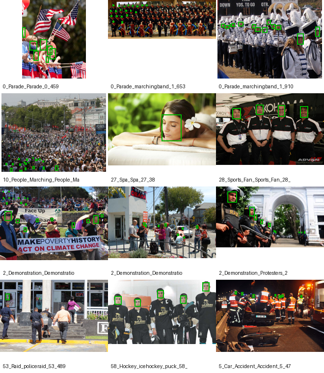
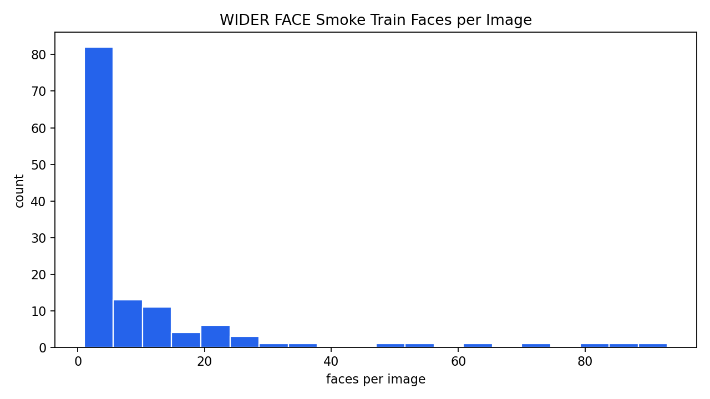
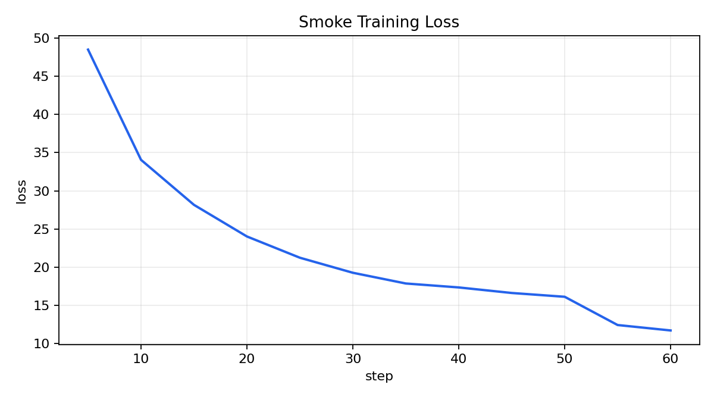
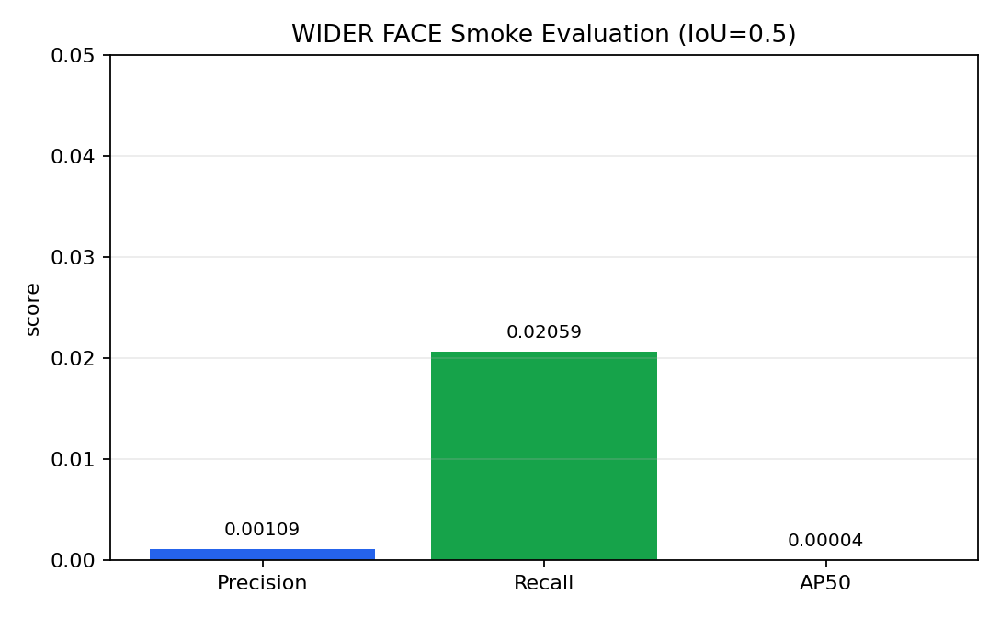
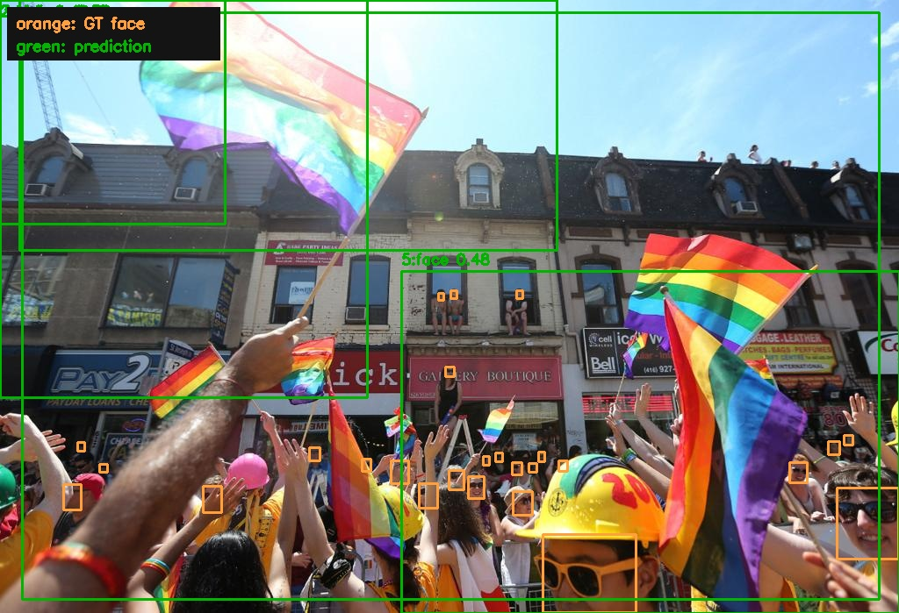

# 阶段二任务 3.x：人脸检测模型训练报告

## 1. 任务范围

本报告覆盖阶段二中的人脸检测模型训练任务：

- 任务 3.1：学习 MTCNN、RetinaFace 等人脸检测算法原理。
- 任务 3.2：使用 MMDetection 框架，在 WIDER FACE 数据集上训练人脸检测模型。
- 任务 3.3：评估模型在 WIDER FACE 验证集上的性能，并展示测试图检测结果。

交付策略采用 smoke training + full training config：本地先跑通小规模训练、评估和可视化链路；全量 WIDER FACE 训练通过完整配置和命令保留。

## 2. 交付物结构

```text
stage-2/
  code/prepare/      # WIDER FACE 下载、转换、smoke 子集
  code/train/        # MMDetection Runner 训练/测试封装
  code/evaluate/     # AP/precision/recall 评估与检测可视化
  configs/mmdet/     # SSD300 smoke/full 配置
  reports/assets/    # 数据集图、训练图、检测图、评估图
  reports/summaries/ # JSON 摘要
```

原始数据、模型权重和训练输出分别进入 `data/`、`checkpoints/`、`work_dirs/`，均由 `.gitignore` 排除。
Docker 环境统一放在项目根目录 `docker/`，stage-1 和 stage-2 共用 `bytedance-cv:project` 镜像。

## 3. 任务 3.1：算法原理整理

算法原理报告见 `reports/task3_1_detection_algorithms.md`。本阶段重点结论：

- MTCNN 是级联式粗到细检测 pipeline，适合理解候选框生成、筛选、bbox 回归和关键点定位。
- RetinaFace 是单阶段密集人脸定位方法，同时预测 bbox 和 5 点关键点，说明结构监督能提升复杂场景检测稳定性。
- WIDER FACE 的主要挑战是小脸、遮挡、姿态变化、密集人群和光照/模糊。
- MMDetection 官方 WIDER FACE SSD300 baseline 适合作为本阶段训练链路 smoke baseline。

## 4. 任务 3.2：数据准备与训练配置

数据准备脚本：

```bash
python code/prepare/stage2_task3_2_prepare_widerface.py \
  --download \
  --data-dir data \
  --report-dir reports \
  --smoke-train 128 \
  --smoke-val 64
```

脚本会完成：

- 使用 `torchvision.datasets.WIDERFace` 下载 train/val。
- 将 WIDER FACE annotation 转换为 MMDetection `WIDERFaceDataset` 使用的 VOC XML。
- 为 MMDetection 官方读取逻辑补齐 `WIDER_train/<event>/` 与 `WIDER_val/<event>/` 相对链接；原始图片仍保留在 `images/` 下。
- 写入 `train.txt`、`val.txt`、`smoke_train.txt`、`smoke_val.txt`。
- 导出 4 张公开验证展示图到 `reports/assets/inputs/wider_val/`。这 4 张仅用于报告展示，不代表训练集规模。
- 生成数据集摘要和样本/分布图到 `reports/summaries/` 与 `reports/assets/dataset/`。

本次数据准备结果：

| split | images | valid faces | 说明 |
| --- | ---: | ---: | --- |
| train | 12,337 | 153,352 | WIDER FACE train，有效框过滤后统计 |
| val | 3,079 | 38,042 | WIDER FACE val，有效框过滤后统计 |
| smoke train | 128 | 1,213 | deterministic 子集，只写列表，不复制大图 |
| smoke val | 64 | 680 | deterministic 子集，用于快速验证 |

样本与分布图：





训练配置：

| 配置 | 用途 | 说明 |
| --- | --- | --- |
| `configs/mmdet/ssd300_widerface_smoke.py` | 本地 smoke training | 1 epoch、小 batch、随机初始化，验证训练链路 |
| `configs/mmdet/ssd300_widerface_full.py` | 全量 WIDER FACE training | 基于官方 SSD300 WIDER FACE 配置，保留完整训练入口 |

Smoke 训练命令：

```bash
cd "/Users/aaron/Documents/字节实习/task/CV project"
docker run --platform linux/amd64 --rm \
  -v "$PWD":/workspace \
  -w /workspace/stage-2 \
  bytedance-cv:project \
  python code/train/stage2_task3_2_run_mmdet.py train \
    --config configs/mmdet/ssd300_widerface_smoke.py \
    --work-dir work_dirs/ssd300_widerface_smoke \
    --summary-out reports/summaries/widerface_smoke_train_summary.json \
    --loss-plot-out reports/assets/training/smoke_loss_curve.png
```

Smoke 训练结果：

| 指标 | 数值 |
| --- | ---: |
| logged train steps | 12 |
| first logged loss | 48.4928 |
| last logged loss | 11.7159 |
| min loss | 11.7159 |
| MMDetection val mAP | 0.000344 |
| MMDetection val AP50 | 0.000000 |



## 5. 任务 3.3：评估与可视化

Smoke 评估命令：

```bash
cd "/Users/aaron/Documents/字节实习/task/CV project"
docker run --platform linux/amd64 --rm \
  -v "$PWD":/workspace \
  -w /workspace/stage-2 \
  bytedance-cv:project \
  python code/evaluate/stage2_task3_3_evaluate_widerface.py \
    --config configs/mmdet/ssd300_widerface_smoke.py \
    --checkpoint work_dirs/ssd300_widerface_smoke/epoch_1.pth \
    --data-root data/WIDERFace \
    --ann-file smoke_val.txt \
    --split val \
    --input-dir reports/assets/inputs/wider_val \
    --out-dir reports/assets/detection \
    --summary-out reports/summaries/widerface_smoke_eval_summary.json \
    --device cpu \
    --score-thr 0.05 \
    --iou-thr 0.5 \
    --visualize-count 4 \
    --vis-top-k 5
```

评估脚本输出：

- `ap50`：IoU=0.5 的 AP。
- `precision` / `recall`：在指定 score threshold 下的检测精度和召回率。
- `tp` / `fp` / `fn`：匹配统计。
- 检测可视化图：橙色框为 WIDER FACE GT 人脸标注，绿色框为模型预测框；可视化只展示 top-5 预测框，完整评估仍使用 `score_thr=0.05` 后的全部检测结果。
- `visualization_pairs`：记录每张 `input_XX_<image_id>.jpg` 与 `detection_XX_<image_id>.jpg` 的一一对应关系。

Smoke 自定义评估结果：

| 指标 | 数值 |
| --- | ---: |
| images | 64 |
| GT faces | 680 |
| TP / FP / FN | 14 / 12,786 / 666 |
| precision | 0.00109 |
| recall | 0.02059 |
| AP50 | 0.000039 |



检测结果示例：

输入原图与检测结果成对保存：





## 6. 当前验收状态

已生成并检查以下文件：

- `reports/summaries/widerface_dataset_summary.json`
- `reports/summaries/widerface_smoke_train_summary.json`
- `reports/summaries/widerface_smoke_eval_summary.json`
- `reports/assets/dataset/widerface_val_samples_with_boxes.png`
- `reports/assets/training/smoke_loss_curve.png`
- `reports/assets/evaluation/widerface_smoke_eval_metrics.png`
- `reports/assets/inputs/wider_val/input_*.jpg`
- `reports/assets/detection/detection_*.jpg`

当前 smoke 指标较低，绿色预测框质量差是正常现象：smoke 配置只训练 1 个 epoch 且随机初始化，目标是证明数据转换、训练、评估和可视化链路完整；模型效果需要使用 full config 在 GPU 上进行更长时间训练。

本次工程修正记录：

- Docker 统一移到项目根目录 `docker/`，并在根 `.dockerignore` 排除各阶段 `data/`、`checkpoints/`、`work_dirs/`，避免原始数据进入镜像上下文。
- 评估脚本改为同步生成 input/detection 配对图片，解决 `inputs/` 与 `detection/` 图片不一致的问题。
- 数据转换补齐 MMDetection `WIDERFaceDataset` 期望的 event 目录层级。
- 训练/评估封装加入 MMDetection 3.3.0 `SSDHead` prediction 兼容补丁，仅补 `custom_cls_channels=False` 标记，不改训练参数。

## 7. 全量训练路径

全量训练使用：

```bash
cd "/Users/aaron/Documents/字节实习/task/CV project"
docker run --platform linux/amd64 --rm \
  -v "$PWD":/workspace \
  -w /workspace/stage-2 \
  bytedance-cv:project \
  python code/train/stage2_task3_2_run_mmdet.py train \
    --config configs/mmdet/ssd300_widerface_full.py \
    --work-dir work_dirs/ssd300_widerface_full
```

全量评估时将 checkpoint 替换为完整训练得到的权重，并将 `--ann-file` 改为 `val.txt`：

```bash
cd "/Users/aaron/Documents/字节实习/task/CV project"
docker run --platform linux/amd64 --rm \
  -v "$PWD":/workspace \
  -w /workspace/stage-2 \
  bytedance-cv:project \
  python code/evaluate/stage2_task3_3_evaluate_widerface.py \
    --config configs/mmdet/ssd300_widerface_full.py \
    --checkpoint work_dirs/ssd300_widerface_full/epoch_24.pth \
    --data-root data/WIDERFace \
    --ann-file val.txt \
    --out-dir reports/assets/detection \
    --summary-out reports/summaries/widerface_full_eval_summary.json \
    --device cpu
```
