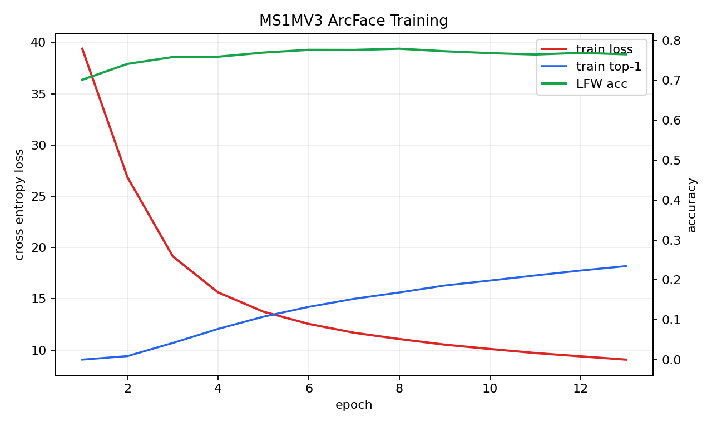

# Stage2 Task 5.x ArcFace Training Report

## Deliverable Layout

Task 5.x remains isolated from task 3.x detection and task 4.x landmark
deliverables:

- code: `stage-2/code/task5/`
- configs: `stage-2/configs/task5_arcface/`
- data: `stage-2/data/task5_ms1mv3_full_recordio/` and `stage-2/data/task5_lfw/`
- reports: `stage-2/reports/task5/`
- work dirs: `stage-2/work_dirs/task5/`
- runtime external source: `stage-2/external/insightface/`

Datasets, runtime-cloned external source, and model checkpoints are local
artifacts only. They are ignored by Git through `data/`, `work_dirs/`,
`stage-2/external/`, `*.rec`, `*.idx`, `*.pth`, and `*.pt` rules.

## Baseline Result From the Previous Wrapper

The previous project-local ResNet50/IResNet50 + ArcFace wrapper completed a real
AutoDL A800 run on the dense MS1MV3 JPEG subset:

- images: `800000`
- identities: `20000`
- epochs completed: `60`
- batch size: `512`
- best LFW accuracy: `0.8167`
- ROC AUC: `0.8791`
- target met: `false`

The training loss dropped to a very low value while LFW stayed far below the
98.5% target. That pattern indicates poor open-set generalization from this
custom subset/pipeline, not merely an unfinished epoch count. The checkpoint is
kept as a failed baseline and is not treated as the final task result.



LFW accuracy starts near 0.75-0.80 after epoch 1 because one epoch already means
a full pass over 800k aligned face images, and LFW is an aligned 1:1 verification
protocol with a threshold selected on each training fold. Later oscillation near
0.8 shows that the model keeps improving the closed-set training classification
objective while the open-set embedding quality does not improve. In other words,
the plateau is mainly a data/pipeline/generalization issue, not simply "too few
epochs" or "learning rate too low".

## Official InsightFace Route

The new main route uses the official InsightFace ArcFace Torch implementation:

- upstream repo: `deepinsight/insightface`
- runtime source path: `stage-2/external/insightface/`
- official subproject: `recognition/arcface_torch`
- data source: `gaunernst/ms1mv3-recordio`
- dataset layout: `data/task5_ms1mv3_full_recordio/ms1m-retinaface-t1/`
- model: ResNet50 / `r50`
- loss: ArcFace margin `(1.0, 0.5, 0.0)`
- full MS1MV3 size: `93431` identities, `5179510` images
- default single A800 config: batch size `128`, lr `0.02`, `20` epochs, fp16
- validation target: `lfw`

The official source is cloned at runtime and the resolved commit SHA is written
to the training summary. The project does not vendor the InsightFace source.

## Final Result

The official full-MS1MV3 run completed on AutoDL A800 and the final `model.pt`
was re-evaluated with an aligned `112x112` InsightFace-format LFW validation
bin:

- checkpoint: `work_dirs/task5/insightface_ms1mv3_r50_full/model.pt`
- upstream InsightFace commit: `658b034e7fc0f4b08a01e11347b6118d8d04c76b`
- training data: `93431` identities, `5179510` images
- validation protocol: LFW `6000` pairs, `3000` positive and `3000` negative
- validation bin inspection: `12000/12000` images are `112x112`
- final LFW accuracy: `0.9980`
- accuracy std: `0.0029`
- VAL at FAR=1e-3: `0.9967`
- target: `0.985`
- target met: `true`

The training-time InsightFace log still contains lower LFW numbers because that
callback initially read a `250x250` deepfunneled `lfw.bin`. After replacing the
validation target with the aligned `112x112` bin, `eval-bin` produced the final
accepted metric above without retraining.

## LFW Validation Bin Note

The official InsightFace validation callback expects the validation target
`lfw.bin` to contain already aligned `112x112` face crops. A bin created from
the ordinary LFW deepfunneled images contains `250x250` images; the callback can
resize those images and print an accuracy, but that number is only a smoke
check. It is not the standard ArcFace/InsightFace LFW acceptance metric and can
look much lower than the real result.

The RecordIO preparation script now inspects `lfw.bin` and writes
`lfw_bin_inspection.image_size_counts` plus `validation_ready`. Use one of these
routes before treating LFW as final:

- copy an official/aligned InsightFace `lfw.bin` with `--lfw-bin-path`
- or generate `lfw.bin` directly from the Kaggle
  `val/{lfw_112x112,lfw_ann.txt}` layout by passing `--lfw-dir data/task5_lfw/val`
- or rebuild `lfw.bin` from a 112x112 aligned LFW image directory with
  `--aligned-lfw-root`

After replacing the bin, run `eval-bin` on the saved `model.pt`; retraining is
not required just to correct the validation target.

## Commands

Prepare LFW if needed:

```bash
cd /root/autodl-tmp/CV-project/stage-2

python code/task5/stage2_task5_3_prepare_lfw.py \
  --data-dir data/task5_lfw \
  --report-dir reports/task5
```

Prepare full MS1MV3 RecordIO and create `lfw.bin`:

```bash
python code/task5/stage2_task5_4_prepare_ms1mv3_recordio.py \
  --download \
  --dataset gaunernst/ms1mv3-recordio \
  --data-dir data/task5_ms1mv3_full_recordio \
  --lfw-dir data/task5_lfw \
  --report-dir reports/task5
```

If the generated summary reports `250x250`, replace the validation bin before
final acceptance:

```bash
python code/task5/stage2_task5_4_prepare_ms1mv3_recordio.py \
  --dataset gaunernst/ms1mv3-recordio \
  --data-dir data/task5_ms1mv3_full_recordio \
  --lfw-dir data/task5_lfw \
  --lfw-bin-path /path/to/aligned/lfw.bin \
  --overwrite-lfw-bin \
  --report-dir reports/task5
```

For the Kaggle validation package with `val/lfw_112x112` and `val/lfw_ann.txt`,
do not use `--lfw-bin-path`; generate the bin from those aligned images:

```bash
python code/task5/stage2_task5_4_prepare_ms1mv3_recordio.py \
  --dataset gaunernst/ms1mv3-recordio \
  --data-dir data/task5_ms1mv3_full_recordio \
  --lfw-dir data/task5_lfw/val \
  --overwrite-lfw-bin \
  --report-dir reports/task5
```

Run official InsightFace setup validation:

```bash
python code/task5/stage2_task5_5_run_insightface.py setup \
  --config configs/task5_arcface/insightface_ms1mv3_r50_full_gpu.py \
  --summary-out reports/task5/summaries/insightface_full_setup_summary.json
```

Train with the official pipeline:

```bash
python code/task5/stage2_task5_5_run_insightface.py train \
  --config configs/task5_arcface/insightface_ms1mv3_r50_full_gpu.py \
  --summary-out reports/task5/summaries/insightface_full_train_summary.json
```

Parse the final official LFW validation result:

```bash
python code/task5/stage2_task5_5_run_insightface.py eval-summary \
  --config configs/task5_arcface/insightface_ms1mv3_r50_full_gpu.py \
  --checkpoint work_dirs/task5/insightface_ms1mv3_r50_full/model.pt \
  --summary-out reports/task5/summaries/insightface_full_lfw_eval_summary.json
```

Or directly re-evaluate the final model on the corrected aligned bin:

```bash
python code/task5/stage2_task5_5_run_insightface.py eval-bin \
  --config configs/task5_arcface/insightface_ms1mv3_r50_full_gpu.py \
  --checkpoint work_dirs/task5/insightface_ms1mv3_r50_full/model.pt \
  --bin-path data/task5_ms1mv3_full_recordio/ms1m-retinaface-t1/lfw.bin \
  --summary-out reports/task5/summaries/insightface_full_lfw_eval_summary.json \
  --batch-size 256 \
  --device cuda:0
```

## Acceptance

The Task5 target is met. The final
`reports/task5/summaries/insightface_full_lfw_eval_summary.json` reports:

```json
{
  "accuracy": 0.998,
  "target_lfw_accuracy": 0.985,
  "target_met": true
}
```
