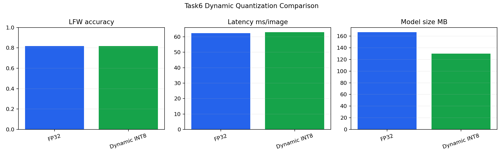
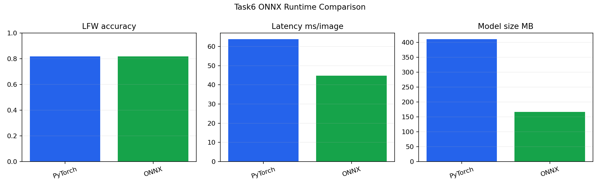

            # Stage2 Task 6.x 人脸识别模型压缩与 ONNX 推理报告

            ## 1. 任务目标

            本任务完成 6.1、6.2、6.3，不包含可选 6.4。实验模型固定为 Task5 第一版自实现 `IResNet50 + ArcFace`，来源于云端结果包 `reports/task5/task5_cloud_results_8167.tar.gz` 中的 `best.pth`。该模型在 LFW 6000-pair 10-fold protocol 上的云端基线准确率约为 `81.67%`。

            ## 2. 优化方法调研

            量化用于降低权重精度和模型体积；剪枝用于删除冗余结构；蒸馏用于把大模型的 embedding 判别能力迁移到小模型。Task6 的实现重点是 PyTorch 动态量化和 ONNX 推理，调研正文见 `task6_1_optimization_methods.md`。

            ## 3. 动态量化实验

            动态量化通过 `torch.quantization.quantize_dynamic(model, {torch.nn.Linear}, dtype=torch.qint8)` 完成，只作用于 `Linear` 层。IResNet50 的计算主体是卷积层，所以该实验重点观察是否能在不明显损失 LFW 精度的前提下降低全连接层相关存储与 CPU 推理成本。

            

            ## 4. ONNX 导出与推理

            ONNX 导出使用动态 batch 维度，输入为 `N x 3 x 112 x 112`，输出为 `N x 512` embedding。ONNX Runtime 推理后重新做 L2 normalization，并使用同一 LFW pair protocol 计算 accuracy、ROC AUC 和推理速度。

            

            ## 5. 性能对比

            | 模型 | LFW accuracy | ROC AUC | latency ms/image | throughput img/s | model size MB |
            |---|---:|---:|---:|---:|---:|
            | FP32 backbone (Task5 first version) | 81.68% | 0.8791 | 62.408 | 16.02 | 166.58 |
| Dynamic quantized INT8 | 81.68% | 0.8790 | 62.935 | 15.89 | 129.86 |
| ONNX Runtime | 81.68% | 0.8791 | 44.860 | 22.29 | 166.32 |

            ONNX 数值一致性：mean cosine `1.000000`，max abs diff `0.000001`。

            ## 6. 结论

            Task6 已完成第一版 ArcFace 模型的动态量化、量化前后性能对比、ONNX 导出和 ONNX Runtime 推理验证。由于源模型本身的 LFW baseline 约为 `81.67%`，Task6 的重点不是继续提升识别精度，而是验证压缩和部署链路是否保持与源模型可比较的 embedding 行为。
