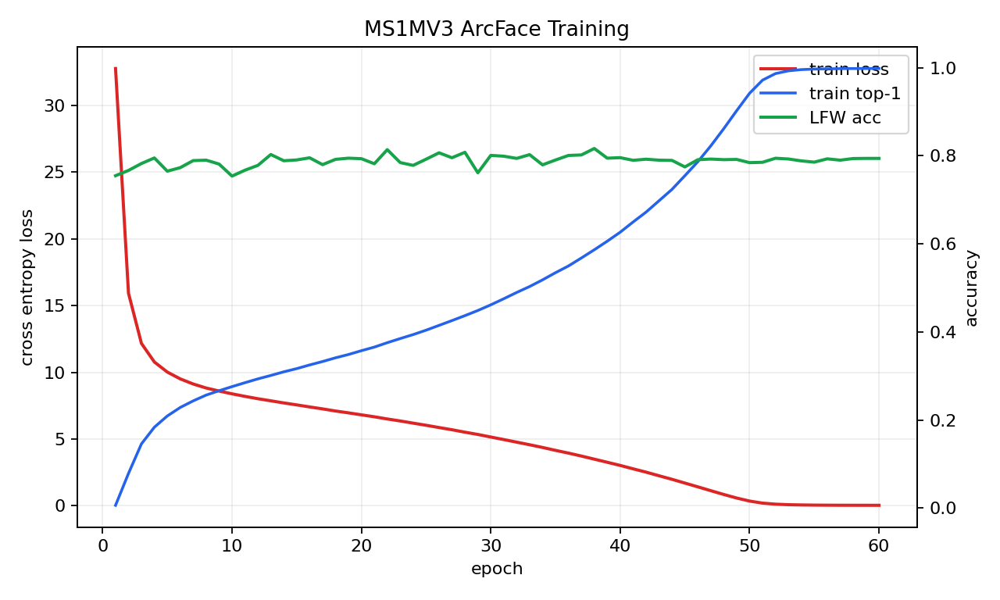
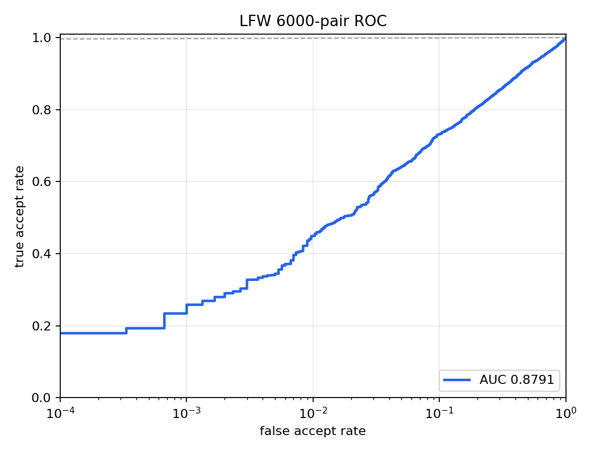

# 第二周周报：阶段二人脸识别训练、压缩与部署

周期：第二周，2026-05-22 至 2026-05-28

## 1. 本周已完成

- 完成 Stage2 Task3.x WIDER FACE 人脸检测训练链路整理，并将检测任务报告、训练曲线、检测可视化保留在 Task3 独立目录。
- 完成 Stage2 Task4.x 300W 人脸关键点检测与仿射对齐交付，输出关键点 overlay、对齐图和任务报告。
- 完成 Stage2 Task5.x 第一版 `IResNet50 + ArcFace` 训练和 LFW 评估。云端第一版 checkpoint 的 LFW accuracy 为 `81.67%`，作为 Task6 模型压缩基线。
- 完成 Stage2 Task6.1/6.2/6.3：模型优化技术调研、PyTorch 动态量化、ONNX 导出与 ONNX Runtime 推理验证。
- 按任务隔离原则整理交付物：Task6 代码在 `code/task6/`，报告在 `reports/task6/`，模型和 ONNX artifact 在 ignored 的 `work_dirs/task6/`。

## 2. 运行截图






---PAGEBREAK---

## 3. 实验结果与图表

### 3.1 Task5 第一版 ArcFace 基线

Task6 使用的源模型来自 `reports/task5/task5_cloud_results_8167.tar.gz`，训练集为 dense MS1MV3 子集，云端训练记录显示最终使用 `800000` 张图片、`20000` 个 identities、`60` 个 epoch。

### 3.2 动态量化结果

| 模型 | LFW accuracy | latency ms/image | model size MB |
|---|---:|---:|---:|
| FP32 | 81.68% | 62.408 | 166.58 |
| Dynamic INT8 | 81.68% | 62.935 | 129.86 |

### 3.3 ONNX 推理结果

| 模型 | LFW accuracy | latency ms/image | model size MB |
|---|---:|---:|---:|
| ONNX Runtime | 81.68% | 44.860 | 166.32 |

ONNX 与 PyTorch embedding 对比：mean cosine `1.000000`，max abs diff `0.000001`。

---PAGEBREAK---

## 4. 关键代码段与解释

### 4.1 Task6 源模型隔离

文件：`code/task6/stage2_task6_prepare_source_model.py`

```python
extract_member(tar, TASK5_BEST, best_out)
extract_member(tar, TASK5_LFW_SUMMARY, lfw_summary_out)
extract_member(tar, TASK5_TRAIN_SUMMARY, train_summary_out)
```

解释：Task6 不直接覆盖 Task5 的 `work_dirs/`，而是从云端 tar 包中只提取第一版 `best.pth` 和 summary 到 Task6 专用目录，保证后续量化和 ONNX 实验不会误用本地旧 checkpoint。

### 4.2 动态量化

文件：`code/task6/stage2_task6_2_quantize_arcface.py`

```python
quantized = torch.quantization.quantize_dynamic(
    fp32_backbone.cpu(), {torch.nn.Linear}, dtype=torch.qint8
)
```

解释：PyTorch 动态量化仅量化 `Linear` 层，适合快速得到 CPU 推理 baseline。由于 IResNet50 以卷积为主，报告中同时记录精度、速度和模型体积，避免只看单一指标。

### 4.3 ONNX 导出

文件：`code/task6/stage2_task6_3_export_onnx.py`

```python
torch.onnx.export(
    backbone,
    dummy,
    onnx_out,
    input_names=["input"],
    output_names=["embedding"],
    dynamic_axes={"input": {0: "batch"}, "embedding": {0: "batch"}},
)
```

解释：导出的 ONNX 模型保留动态 batch 维度，便于在 ONNX Runtime 中按不同 batch size 做推理。输出 embedding 继续使用 LFW 6000-pair 10-fold protocol 评估。

## 5. 下周待办

- 若需要继续提升 Task5 精度，优先切换到官方 InsightFace full MS1MV3 RecordIO 路线，而不是继续扩大第一版自实现训练。
- 在 Task6 基础上尝试静态量化、结构化剪枝或 TensorRT/ONNX Runtime GPU provider，加速效果会比仅动态量化 `Linear` 层更明显。
- 整理最终提交目录，确认 `data/`、`work_dirs/`、`.pth`、`.onnx` 继续被 Git 忽略，只提交代码、报告、summary、PDF 和小体积图表。
