# 第二周周报：Stage2 人脸检测、关键点、识别与部署

周期：第二周，2026-05-22 至 2026-05-28

## 1. 本周已完成

- 完成 Stage2 Task3.x WIDER FACE 人脸检测交付，整理 GPU Docker、数据准备、全量训练、全量评估、检测可视化和独立报告目录。
- 完成 Stage2 Task4.x 300W 人脸关键点检测与仿射对齐交付，输出 HRNet 训练/评估结果、关键点 overlay、aligned face 和 before/after grid。
- 完成 Stage2 Task5.x 第一版 `IResNet50 + ArcFace` 云端训练与 LFW 验证同步。当前展示层已统一为云端 dense 结果：`800000` 张图、`20000` 个 identities、`60` 个 epoch，best LFW accuracy `81.67%`。
- 完成 Stage2 Task6.1/6.2/6.3：模型优化方法调研、PyTorch 动态量化、ONNX 导出、ONNX Runtime 推理和 LFW protocol 对比。
- Task5 展示层在 `reports/task5/`，Task6 代码在 `code/task6/`，Task6 报告在 `reports/task6/`，模型权重与 ONNX 文件保留在 ignored 的 `work_dirs/task6/`。

## 2. 运行截图

### 2.1 Task3-Task6 环境验证

对应任务：Stage2 全阶段环境检查；运行内容：在 GPU Docker 中导入 `mmcv`、`mmdet`、`mmpose`、`insightface`、`datasets`、`transformers`、`reportlab` 并检查 CUDA 与各任务配置；结果解读：`cuda_available True`，Task3-Task6 依赖和配置均可用，说明训练、评估、报告导出链路运行在统一可复现环境中。

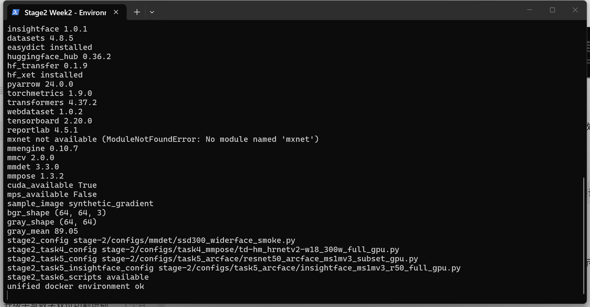

### 2.2 Task5 云端训练结果同步

对应任务：Stage2 Task5.x ArcFace 识别训练结果整理；运行内容：读取并同步 AutoDL 云端 summary，将 `800000` 张训练图、`20000` 个身份、`60` 个 epoch 和 LFW 结果写入 `reports/task5/`；结果解读：best LFW accuracy 和最终 LFW eval accuracy 均为 `0.8167`，说明本周报告采用云端 800k/60 epoch 结果，而不是本地短 demo 训练结果。

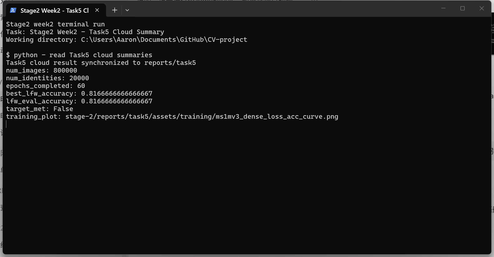

### 2.3 Task6 动态量化与 ONNX 结果检查

对应任务：Stage2 Task6.2 动态量化和 Task6.3 ONNX Runtime 推理；运行内容：读取 quantization 与 ONNX summary，核对 FP32、Dynamic INT8、ONNX Runtime 的 accuracy、体积和数值一致性；结果解读：三种形式的 LFW accuracy 均在 `0.8168` 附近，INT8 体积降到 `129.86 MB`，ONNX mean cosine 为 `1.0`，说明导出后的 embedding 与 PyTorch 基本一致。

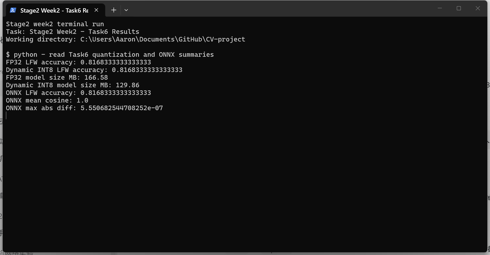

---PAGEBREAK---

## 3. 实验结果与图表

### 3.1 Task3 WIDER FACE 人脸检测

Task3 目标是跑通 WIDER FACE 人脸检测训练与评估链路，并把检测图、训练曲线、评估指标放入 `reports/task3/`，不与后续关键点或识别任务混在一起。

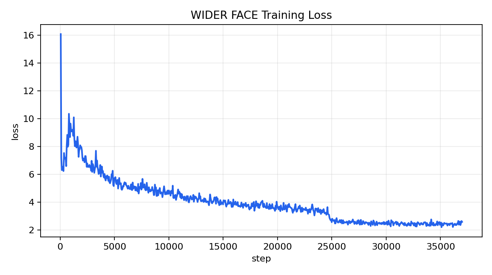

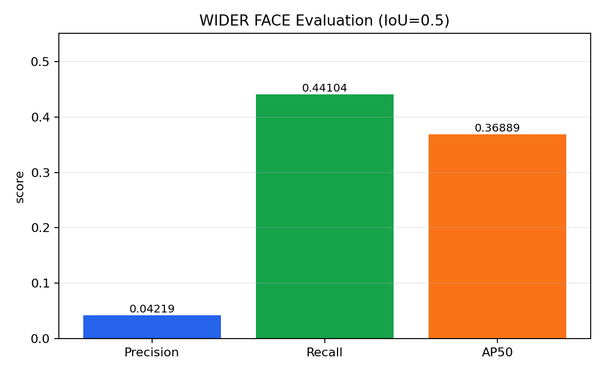

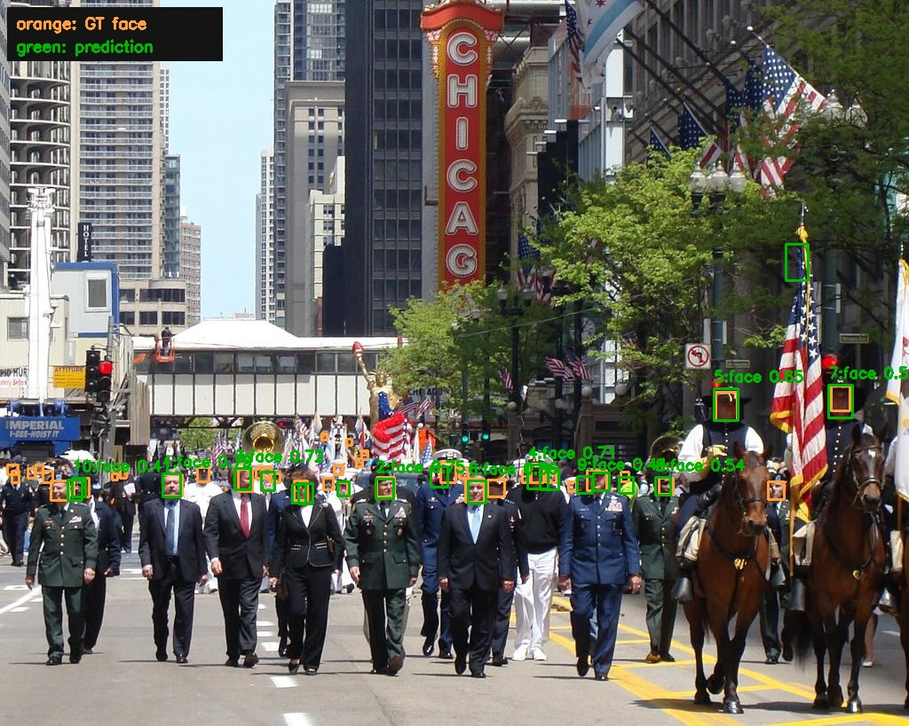

### 3.2 Task4 300W 关键点检测与对齐

Task4 使用 300W + HRNetv2-W18 完成人脸 68 点关键点检测，并基于眼睛、鼻尖和嘴角估计仿射矩阵，把人脸对齐到 112x112 ArcFace 模板。

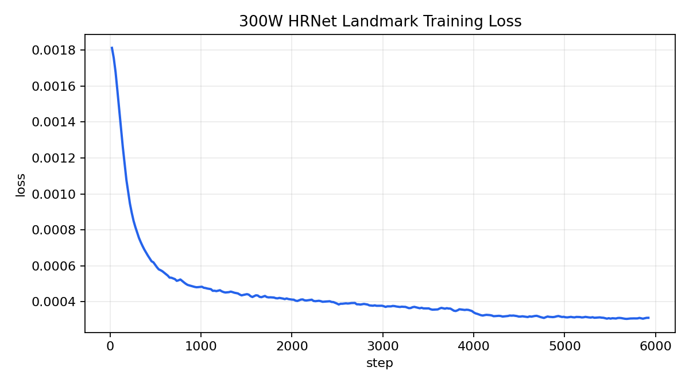

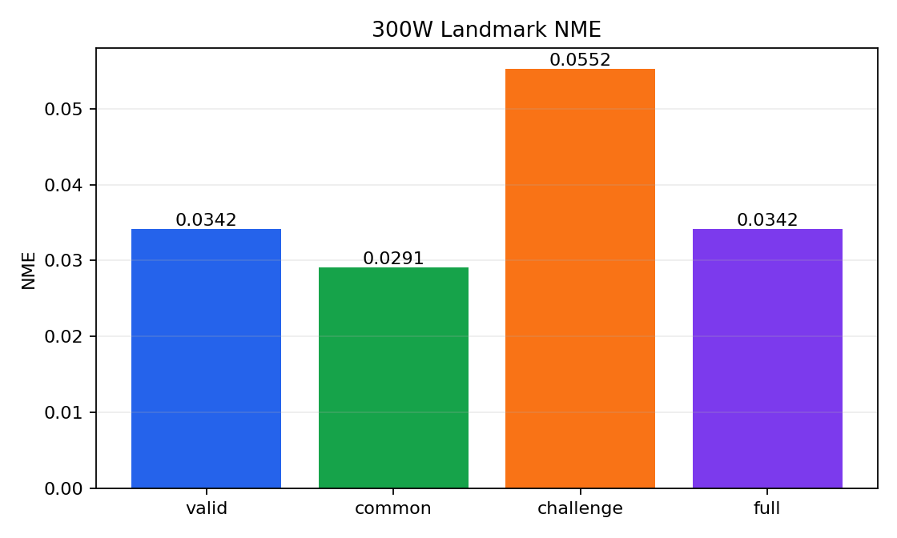


---PAGEBREAK---

### 3.3 Task5 ArcFace 识别训练与 LFW 验证

最佳 LFW 出现在 epoch `38`，accuracy 为 `81.67%`；最终独立评估 summary 中 accuracy 为 `81.67%`，ROC AUC 为 `0.8791`。

LFW accuracy 从 epoch 1 就在 0.75-0.80 附近，是因为 epoch 1 已经完整看过 800k 张训练图，LFW 又是 aligned 1:1 verification protocol，并且每折会在训练折上选择阈值；这会让早期 embedding 已能在相对容易的 LFW 上得到中等准确率。后续 accuracy 波动和停滞，说明 open-set embedding 泛化没有继续提升。

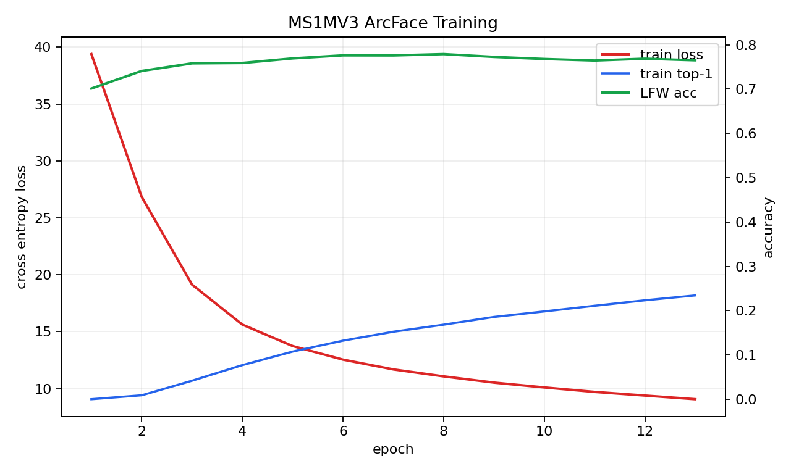

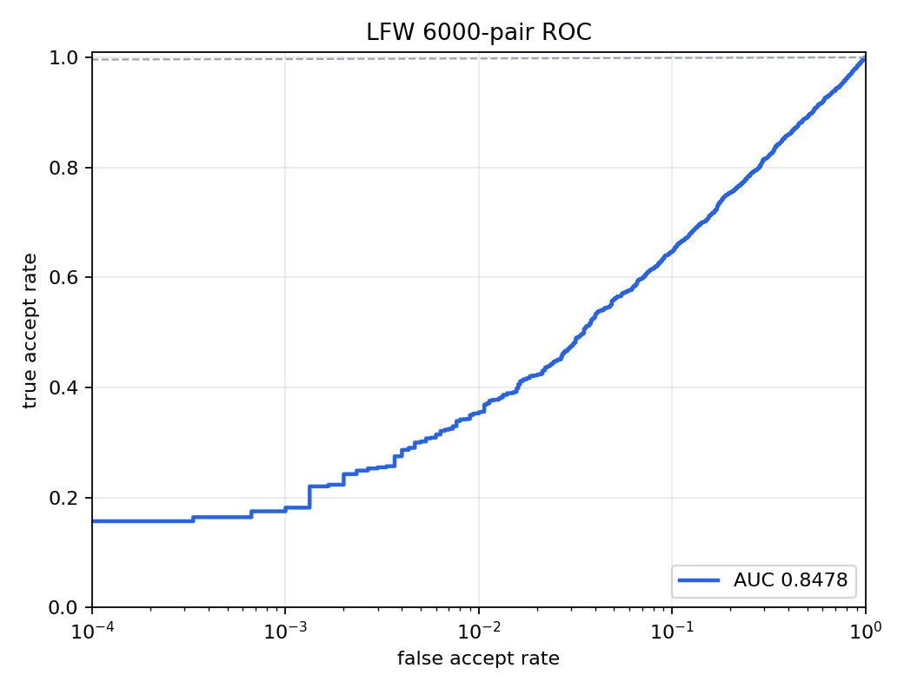

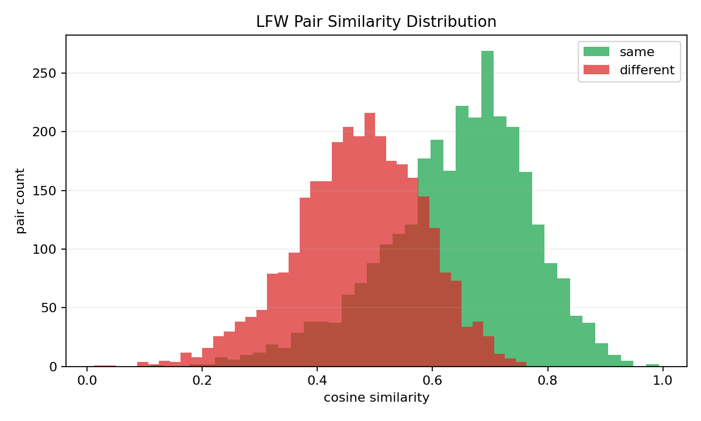

### 3.4 Task6 模型压缩与 ONNX 推理

| 模型 | LFW accuracy | latency ms/image | model size MB |
|---|---:|---:|---:|
| FP32 | 81.68% | 62.408 | 166.58 |
| Dynamic INT8 | 81.68% | 62.935 | 129.86 |
| ONNX Runtime | 81.68% | 44.860 | 166.32 |


---PAGEBREAK---

## 4. 关键代码段与解释

### 4.1 Task3 WIDER FACE 数据转换

文件：`code/task3/stage2_task3_2_prepare_widerface.py`

```python
boxes = valid_boxes(item["annotations"])
raw_box_count = len(item["annotations"]["bbox"])
invalid_faces += max(0, raw_box_count - len(boxes))
write_voc_xml(
    target_annotations / f"{image_id}.xml",
    folder=event_name,
    filename=f"{image_id}.jpg",
    width=width,
    height=height,
    boxes=boxes,
)
if boxes:
    image_ids.append(image_id)
    face_counts.append(len(boxes))
(mmdet_root / f"{split}.txt").write_text("\n".join(sorted(image_ids)) + "\n", encoding="utf-8")
```

解释：Task3 先过滤 WIDER FACE 中无效或空框，再为 MMDetection 写出 VOC XML 和 split 列表。这样训练配置只读 `train.txt`、`val.txt` 和 XML 标注，报告里的数据规模、无效框数量、每图人脸数统计也可以从同一转换过程追溯。

### 4.2 Task3 检测评估与成对可视化

文件：`code/task3/stage2_task3_3_evaluate_widerface.py`

```python
result = inferencer(
    inputs=str(record.image_path),
    pred_score_thr=args.score_thr,
    no_save_vis=True,
    no_save_pred=True,
    return_datasamples=False,
)
detections = parse_prediction(result["predictions"][0], args.score_thr)
input_path = input_dir / f"input_{idx:02d}_{record.image_id}.jpg"
vis_path = detection_dir / f"detection_{idx:02d}_{record.image_id}.jpg"
shutil.copy2(record.image_path, input_path)
draw_detections(record, detections, vis_path, args.vis_top_k)
visualization_pairs.append({"input": str(input_path), "detection": str(vis_path)})
```

解释：评估脚本用 MMDetection `DetInferencer` 对 WIDER FACE validation 图片推理，并同步复制同一张 input 原图，再在 detection 图上叠加 GT 和预测框。`visualization_pairs` 记录 input/detection 的一一对应，避免报告图和测试图来源不一致。

### 4.3 Task4 MMPose 训练与评估封装

文件：`code/task4/stage2_task4_run_mmpose.py`

```python
runner = build_runner(args.config, work_dir=args.work_dir, resume=args.resume)
runner.train()
scalar_rows = parse_scalar_logs(work_dir)
plot_loss(scalar_rows, Path(args.loss_plot_out))
best_checkpoint = copy_best_checkpoint(work_dir)
summary = {
    "best_checkpoint": best_checkpoint,
    "last_loss": float(loss_rows[-1]["loss"]) if loss_rows else None,
    "best_logged_nme": min((find_metric(row) for row in nme_rows), default=None),
}
write_json(Path(args.summary_out), summary)
```

解释：Task4 没有只保存训练日志，而是把 MMPose Runner 的训练输出解析成 loss 曲线、best checkpoint 和 NME summary。周报中的 HRNet loss 图和 NME 表格都来自这个封装脚本。

### 4.4 Task4 68 点关键点到 ArcFace 对齐

文件：`code/task4/stage2_task4_3_align_faces.py`

```python
left_eye = keypoints[36:42].mean(axis=0)
right_eye = keypoints[42:48].mean(axis=0)
nose = keypoints[30]
left_mouth = keypoints[48]
right_mouth = keypoints[54]
src = np.stack([left_eye, right_eye, nose, left_mouth, right_mouth]).astype(np.float32)
matrix, _ = cv2.estimateAffinePartial2D(src, ARCFACE_TEMPLATE, method=cv2.LMEDS)
aligned = cv2.warpAffine(
    image, matrix, (112, 112),
    flags=cv2.INTER_LINEAR,
    borderMode=cv2.BORDER_REFLECT_101,
)
```

解释：Task4 从 68 点关键点中聚合出左眼、右眼、鼻尖和左右嘴角，再估计到 ArcFace 模板的仿射矩阵。输出的 112x112 aligned face 是 Task5 识别训练和验证的标准输入形态。

---PAGEBREAK---

### 4.5 Task5 ArcFace margin head

文件：`code/task5/stage2_task5_run_arcface.py`

```python
cosine = F.linear(F.normalize(embeddings), F.normalize(self.weight)).clamp(-1.0, 1.0)
sine = torch.sqrt((1.0 - torch.pow(cosine, 2)).clamp(0.0, 1.0))
phi = cosine * self.cos_m - sine * self.sin_m
phi = torch.where(cosine > self.th, phi, cosine - self.mm)
one_hot = torch.zeros_like(cosine)
one_hot.scatter_(1, labels.view(-1, 1), 1.0)
output = one_hot * phi + (1.0 - one_hot) * cosine
return output * self.scale
```

解释：ArcFace 先把 embedding 和类别权重都归一化，再只对目标类别加入角度 margin。这样同一身份会被拉得更紧，不同身份之间形成更明显的角度间隔，适合后续用 cosine similarity 做 LFW verification。

### 4.6 Task5 训练循环与 LFW early validation

文件：`code/task5/stage2_task5_run_arcface.py`

```python
with torch.cuda.amp.autocast(enabled=bool(cfg.train.amp) and device.type == "cuda"):
    embeddings = backbone(images)
    logits = margin(embeddings, labels)
    loss = F.cross_entropy(logits, labels) / accum_steps
scaler.scale(loss).backward()
if step % accum_steps == 0 or step == len(train_loader):
    scaler.step(optimizer)
    scaler.update()
    optimizer.zero_grad(set_to_none=True)
    scheduler.step()
if (lfw_dir := Path(cfg.data.lfw_root)).exists() and epoch % int(cfg.train.lfw_eval_interval) == 0:
    eval_metrics = evaluate_lfw(backbone, cfg, lfw_dir, device, batch_size=max(actual_batch_size, 128))
```

解释：训练循环同时处理 AMP、梯度累积、学习率调度和周期性 LFW 评估。每个 epoch 的 train loss、train accuracy、LFW accuracy 会写入 history，best checkpoint 以 LFW accuracy 为准保存。

---PAGEBREAK---

### 4.7 Task6 动态量化

文件：`code/task6/stage2_task6_2_quantize_arcface.py`

```python
fp32_metrics = evaluate_torch_lfw(
    fp32_backbone, cfg, args.lfw_dir, device,
    batch_size=args.batch_size,
    roc_plot_out=args.fp32_roc_out,
)
quantized = torch.quantization.quantize_dynamic(
    fp32_backbone.cpu(), {torch.nn.Linear}, dtype=torch.qint8
)
quantized_metrics = evaluate_torch_lfw(
    quantized, cfg, args.lfw_dir, device,
    batch_size=args.batch_size,
    roc_plot_out=args.quantized_roc_out,
)
plot_task6_comparison(rows, args.comparison_plot_out, "Task6 Dynamic Quantization Comparison")
```

解释：Task6 先用 FP32 backbone 跑完整 LFW protocol，再对 `Linear` 层做动态 int8 量化，并用同一批 LFW pairs 重新评估。周报中的体积、延迟和 accuracy 对比来自这两个可复现实验分支。

### 4.8 Task6 ONNX 导出与一致性验证

文件：`code/task6/stage2_task6_3_export_onnx.py`

```python
torch.onnx.export(
    backbone, dummy, onnx_out,
    input_names=["input"],
    output_names=["embedding"],
    dynamic_axes={"input": {0: "batch"}, "embedding": {0: "batch"}},
    opset_version=opset,
)
feats = session.run([output_name], {input_name: images.numpy().astype(np.float32)})[0]
feats = feats / np.linalg.norm(feats, axis=1, keepdims=True).clip(min=1e-12)
abs_diff = np.abs(torch_feats - onnx_feats)
cosine = np.sum(torch_feats * onnx_feats, axis=1)
```

解释：ONNX 导出保留动态 batch 维度，便于推理时按不同 batch size 输入。导出后脚本不仅跑 ONNX Runtime 的 LFW accuracy，还抽样比较 PyTorch 和 ONNX embedding 的 cosine 与绝对误差，确认部署图没有明显数值偏移。

## 5. 下周待办

- 探索⼈脸特效⽣成技术，⼈脸属性编辑，3D⼈脸重建，动态特效实现
