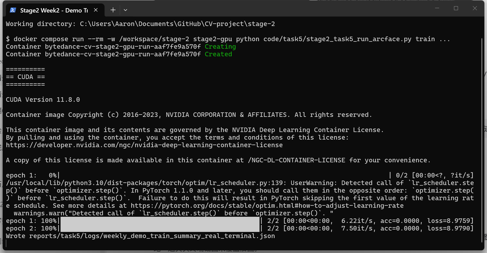

# 第二周周报：Stage2 人脸检测、关键点、识别与部署

周期：第二周，2026-05-22 至 2026-05-28

## 1. 本周已完成

- 完成 Stage2 Task3.x WIDER FACE 人脸检测交付，整理 GPU Docker、数据准备、全量训练、全量评估、检测可视化和独立报告目录。
- 完成 Stage2 Task4.x 300W 人脸关键点检测与仿射对齐交付，输出 HRNet 训练/评估结果、关键点 overlay、aligned face 和 before/after grid。
- 完成 Stage2 Task5.x 第一版 `IResNet50 + ArcFace` 云端训练与 LFW 验证同步。当前展示层已统一为云端 dense 结果：`800000` 张图、`20000` 个 identities、`60` 个 epoch，best LFW accuracy `81.67%`。
- 完成 Stage2 Task6.1/6.2/6.3：模型优化方法调研、PyTorch 动态量化、ONNX 导出、ONNX Runtime 推理和 LFW protocol 对比。
- 按任务隔离原则整理交付物：Task5 展示层在 `reports/task5/`，Task6 代码在 `code/task6/`，Task6 报告在 `reports/task6/`，模型权重与 ONNX 文件保留在 ignored 的 `work_dirs/task6/`。

## 2. 运行截图

以下截图均为本机 PowerShell/Windows Terminal 真实运行命令后的界面；本节只放终端运行画面，不放实验结果图表。




---PAGEBREAK---

## 3. 实验结果与图表

### 3.1 Task3 WIDER FACE 人脸检测

Task3 目标是跑通 WIDER FACE 人脸检测训练与评估链路，并把检测图、训练曲线、评估指标放入 `reports/task3/`，不与后续关键点或识别任务混在一起。


### 3.2 Task4 300W 关键点检测与对齐

Task4 使用 300W + HRNetv2-W18 完成人脸 68 点关键点检测，并基于眼睛、鼻尖和嘴角估计仿射矩阵，把人脸对齐到 112x112 ArcFace 模板。


---PAGEBREAK---

### 3.3 Task5 ArcFace 识别训练与 LFW 验证

Task5 展示层已同步为云端 800k dense 结果。训练曲线改为三个分面：训练 loss、训练 top-1、LFW accuracy，避免三条曲线挤在同一坐标系中。最佳 LFW 出现在 epoch `38`，accuracy 为 `81.67%`；最终独立评估 summary 中 accuracy 为 `81.67%`，ROC AUC 为 `0.8791`。

LFW accuracy 从 epoch 1 就在 0.75-0.80 附近，是因为 epoch 1 已经完整看过 800k 张训练图，LFW 又是 aligned 1:1 verification protocol，并且每折会在训练折上选择阈值；这会让早期 embedding 已能在相对容易的 LFW 上得到中等准确率。后续 accuracy 波动和停滞，说明第一版自实现模型逐渐把 closed-set 分类身份拟合得更好，但 open-set embedding 泛化没有继续提升，所以不是单纯“epoch 太少”或“学习率太低”能解释。


### 3.4 Task6 模型压缩与 ONNX 推理

| 模型 | LFW accuracy | latency ms/image | model size MB |
|---|---:|---:|---:|
| FP32 | 81.68% | 62.408 | 166.58 |
| Dynamic INT8 | 81.68% | 62.935 | 129.86 |
| ONNX Runtime | 81.68% | 44.860 | 166.32 |


---PAGEBREAK---

## 4. 关键代码段与解释

### 4.1 Task3 WIDER FACE 数据与检测链路

文件：`code/prepare/stage2_task3_2_prepare_widerface.py`、`code/evaluate/stage2_task3_3_evaluate_widerface.py`

```python
writer.writerow(["image_path", "x1", "y1", "w", "h", "blur", "expression", "illumination", "invalid", "occlusion", "pose"])
detections = nms_detections(detections, iou_thr=args.iou_thr)
draw_detections(image, detections[: args.vis_top_k], out_path)
```

解释：Task3 将 WIDER FACE 标注转换为训练可读的结构化索引，评估阶段再按 score threshold 和 IoU NMS 得到检测框，并输出固定数量的可视化样例，保证训练、评估和报告图可以追溯。

### 4.2 Task4 关键点驱动的人脸对齐

文件：`code/task4/stage2_task4_3_align_faces.py`

```python
src = np.float32([left_eye, right_eye, nose_tip, left_mouth, right_mouth])
dst = np.float32(ARCFACE_TEMPLATE_112)
matrix, inliers = cv2.estimateAffinePartial2D(src, dst, method=cv2.LMEDS)
aligned = cv2.warpAffine(image, matrix, (112, 112), flags=cv2.INTER_LINEAR)
```

解释：Task4 不只画关键点，还把左眼、右眼、鼻尖和嘴角映射到 ArcFace 112x112 模板。这样输出的 aligned face 可以直接服务后续人脸识别模型输入。

### 4.3 Task5 ArcFace margin 与 LFW 10-fold 验证

文件：`code/task5/stage2_task5_run_arcface.py`

```python
cosine = F.linear(F.normalize(embeddings), F.normalize(self.weight))
theta = torch.acos(cosine.clamp(-1.0 + 1e-7, 1.0 - 1e-7))
target_logits = torch.cos(theta + self.margin)
logits = cosine.scatter(1, labels.view(-1, 1), target_logits.gather(1, labels.view(-1, 1))) * self.scale
```

解释：ArcFace 在目标类别角度上加入 margin，使同一身份的 embedding 更紧、不同身份之间角度间隔更大。LFW 评估则使用 6000 pairs 的 10-fold protocol，每一折只在训练折选阈值，再在测试折计算 accuracy。

### 4.4 Task6 动态量化与 ONNX 导出

文件：`code/task6/stage2_task6_2_quantize_arcface.py`、`code/task6/stage2_task6_3_export_onnx.py`

```python
quantized = torch.quantization.quantize_dynamic(
    fp32_backbone.cpu(), {torch.nn.Linear}, dtype=torch.qint8
)
torch.onnx.export(
    backbone, dummy, onnx_out,
    input_names=["input"], output_names=["embedding"],
    dynamic_axes={"input": {0: "batch"}, "embedding": {0: "batch"}},
)
```

解释：动态量化只压缩 `Linear` 层，因此对 IResNet50 这种卷积为主的模型提升有限；ONNX 导出保留动态 batch 维度，并用同一 LFW protocol 验证 embedding 数值一致性和推理指标。

## 5. 下周待办

- 如果继续追求 Task5 的 98.5% LFW 目标，优先采用官方 InsightFace full MS1MV3 RecordIO 训练路线，而不是继续扩大第一版自实现训练。
- 在 Task6 基础上尝试静态量化、结构化剪枝或 TensorRT/ONNX Runtime GPU provider，预期比仅动态量化 `Linear` 层更有部署收益。
- 整理最终提交目录，确认 `data/`、`work_dirs/`、`.pth`、`.onnx`、云端 tar 包继续被 Git 忽略，只提交代码、报告、summary、PDF 和小体积图表。
