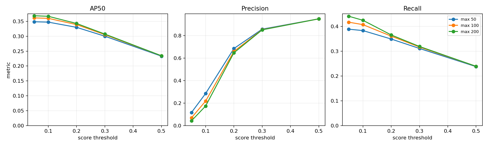
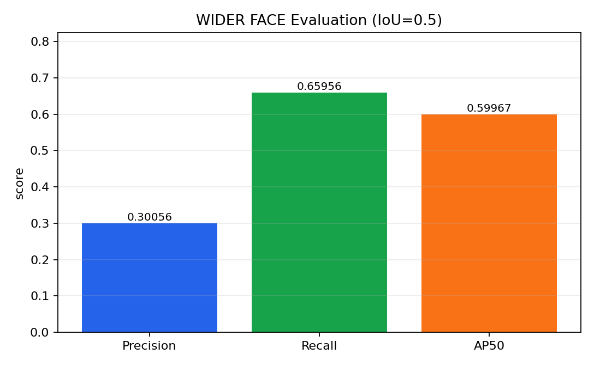
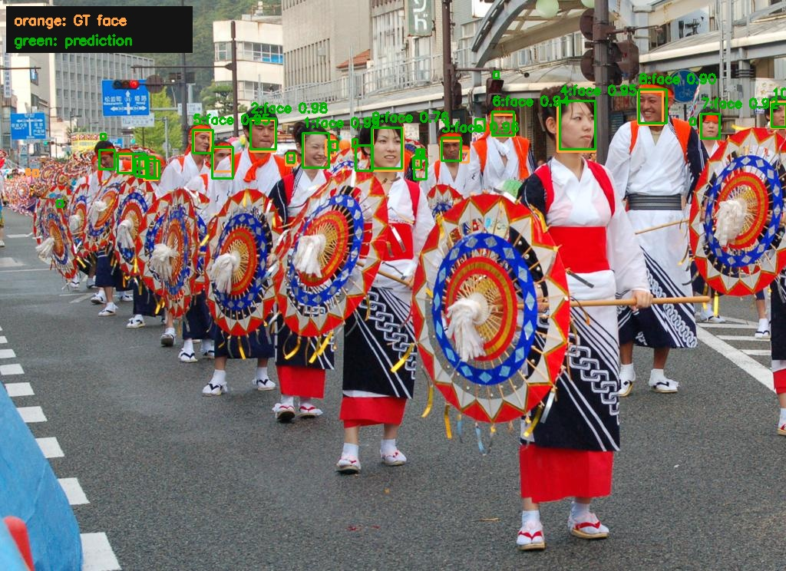
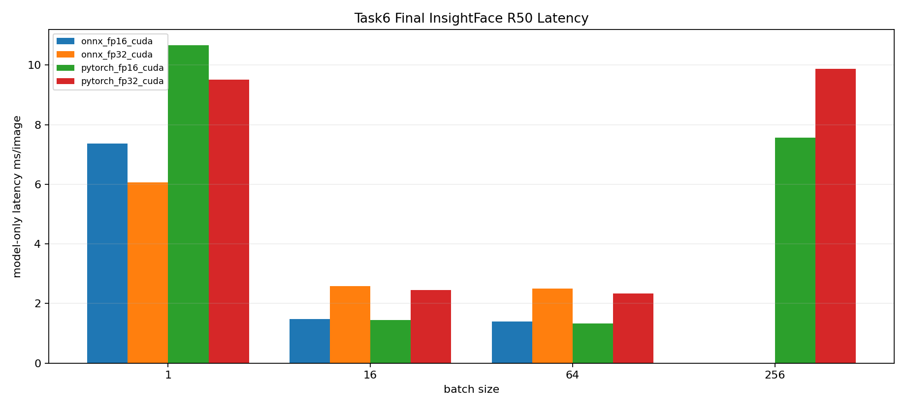

# 第三周调整周报：Stage2 

周期：第三周，2026-05-30 至 2026-06-02

## 1. 本周已完成

| 任务 | 问题 | 本次修正动作 | 当前结论 |
|---|---|---|---|
| Task3 WIDER FACE 人脸检测 | AP50 `0.3689`，Precision `0.0422`，Recall `0.4410`，误检很高 | 先做 SSD300 score threshold / max_per_img 诊断，再训练 SCRFD-like R50-FPN 640 检测器 | AP50 提升到 `0.5997`，Precision 提升到 `0.3006`，Recall 提升到 `0.6596`，FP 从 `380906` 降到 `58389` |
| Task4 300W 关键点 | common NME `0.0291`，challenge NME `0.0552`，遮挡和大姿态场景表现不足 | 尝试 W32/384 强增强、W18/384 轻增强、低学习率微调，并做 checkpoint sweep | 增强实验未优于 baseline，最终保留原 HRNetv2-W18；本轮结论是负向消融，不夸大为提升 |
| Task5 ArcFace 识别 | LFW 泛化不足 | 从自研 wrapper 切换到官方 InsightFace ArcFace 训练和 aligned 112x112 LFW bin 验证 | LFW accuracy 从 `81.67%` 提升到 `99.80%`，超过 `98.5%` 目标 |
| Task6 模型压缩 | Dynamic INT8 时延没有下降 | 补充时延根因分析，并在最终 InsightFace R50 上测试 PyTorch FP16、ONNX FP32、ONNX FP16 GPU 路线 | Dynamic INT8 不适合 Conv2d-heavy backbone；PyTorch FP16 达到 `7.607 ms/image`，约 `4.72x` 加速 |

本周新增和修订的主要材料集中在 `reports/task3_v2/`、`reports/task4_v2/`、`reports/task5/` 和 `reports/task6/final/`。原始数据、权重、ONNX 文件和训练目录仍保留在 ignored 的 `data/`、`work_dirs/`、`checkpoints/` 中，不进入 repo 交付物。

## 2. 问题回应

### 2.1 Task3：WIDER FACE 检测误检过高

原始 SSD300 baseline 在 WIDER FACE val 上的 AP50 为 `0.3689`，Precision 只有 `0.0422`。主要问题是低阈值和 SSD300 对密集小脸场景不够适配，导致每张图保留大量低质量候选框，FP 达到 `380906`，并不是检不出脸。

本次先做了后处理诊断：复用同一次推理结果，仅改变 score threshold 和 max_per_img。结果显示阈值升高确实能显著降低误检，例如 `score_thr=0.2, max_per_img=200` 时 Precision 可到 `0.6462`，但 Recall 降到 `0.3656`，AP50 也降到 `0.3429`。这说明单纯调阈值可以让图更干净，但会牺牲召回和整体 AP。

因此第二步改为结构调整：使用 SCRFD/RetinaFace 思路的 R50-FPN 640 检测器，在 MMDetection 3.x 内实现，不额外引入旧版框架。相比 SSD300，主要变化是 640 输入、P2-P6 FPN、多尺度 dense anchors、focal loss 和更适合小脸的训练设置。

| 模型 | score thr | TP | FP | FN | Precision | Recall | AP50 |
|---|---:|---:|---:|---:|---:|---:|---:|
| SSD300 baseline | 0.05 | 16778 | 380906 | 21264 | 0.0422 | 0.4410 | 0.3689 |
| SCRFD-like R50-FPN 640 | 0.10 | 25091 | 58389 | 12951 | 0.3006 | 0.6596 | 0.5997 |
| 变化 | - | +8313 | -322517 | -8313 | +0.2584 | +0.2185 | +0.2308 |

当前检测器已经显著缓解误检问题：FP 下降约 `84.67%`，Precision 约为原来的 `7.12x`。但 Precision `0.3006` 仍不是生产级，后续还需要继续做 hard negative mining、更强数据增强、多尺度测试或直接对齐RetinaFace/SCRFD 官方训练策略。







### 2.2 Task4：300W challenge 子集 NME 偏高

原始 HRNetv2-W18 在 300W common 子集上 NME 为 `0.0291`，challenge 子集为 `0.0552`。challenge 子集更接近遮挡、大姿态、表情变化等困难场景，当前模型在困难样本上仍然偏弱。

我按建议尝试了数据增强和模型调优，但结果没有超过 baseline：

| 实验 | 配置 | common NME | challenge NME | full NME | 结论 |
|---|---|---:|---:|---:|---|
| Baseline | HRNetv2-W18, 256 输入 | 0.02908 | 0.05524 | 0.03420 | 当前保留 |
| Round1 | HRNetv2-W32, 384 输入，强增强 | 0.02936 | 0.05606 | 0.03459 | 未提升 |
| Round2 | HRNetv2-W18, 384 输入，轻增强 | 0.02954 | 0.05628 | 0.03478 | 未提升 |

现阶段判断是：300W challenge 只有 135 张验证图，样本少且难度集中，直接加大 rotate/scale/shift 并不一定提升真实困难样本泛化；同时更高输入分辨率和更大 backbone 会改变收敛状态，如果没有更稳的预训练、人脸 crop 质量控制和 hard subset 采样，容易出现 common/challenge 同时轻微退化。

因此当前提交策略是保留原 HRNetv2-W18 baseline，而W32 强增强和 W18 轻增强是负向消融。下一步可以是：引入遮挡/大姿态相关外部预训练 checkpoint，重新检查 detector-to-landmark crop 质量，或针对 challenge 样本做更精细的姿态与遮挡分桶评估。

### 2.3 Task5：LFW 泛化不足

原自研 `IResNet50 + ArcFace` wrapper 使用 800k images / 20k identities / 60 epochs 后，LFW accuracy 仍停在 `81.67%`，未达到 `98.5%` 目标。复查后判断问题主要来自训练与验证协议不完全对齐：训练采用自研数据封装和 deep-funneled LFW 处理，和 InsightFace 常用的 aligned 112x112 RecordIO/LFW bin 路径存在差异。

本次改用官方 InsightFace ArcFace 训练与验证链路：

- 训练数据切换为 MS1MV3 full RecordIO，包含 `5179510` 张图、`93431` 个 identities。
- 验证使用 InsightFace 格式的 aligned 112x112 `lfw.bin`，共 `6000` pairs、`12000` images。
- 验证脚本先检查 bin 内图片尺寸，确认 `12000` 张都是 `112x112`，再用官方 10-fold verification protocol 评估。

| 路线 | 数据与协议 | LFW accuracy | 是否达到 98.5% |
|---|---|---:|---|
| 自研 wrapper | 800k / 20k，deep-funneled LFW 处理 | 81.67% | 否 |
| 官方 InsightFace | MS1MV3 full RecordIO，aligned 112x112 LFW bin | 99.80% | 是 |

最终 InsightFace 路线的 LFW accuracy 为 `99.80%`，accuracy std 为 `0.2867%`，`val@FAR=1e-3` 为 `99.67%`。

### 2.4 Task6：模型压缩时延没有下降

原 Task6 中 PyTorch Dynamic INT8 的模型体积从 `166.58 MB` 降到 `129.86 MB`，但延迟从 `62.408 ms/image` 变成 `62.935 ms/image`，没有下降。原因在于：`torch.quantization.quantize_dynamic(model, {torch.nn.Linear}, dtype=torch.qint8)` 只量化 Linear 层，而 ArcFace/IResNet50 推理主要耗时在 Conv2d、BN、PReLU 等卷积 backbone 上；卷积仍是 FP32，Linear 层量化收益很小，还可能引入 quantize/dequantize 开销。

因此本次把 Dynamic INT8 定位为“体积控制实验”，不再把它作为主要加速路线。最终在已达标的 InsightFace R50 checkpoint 上测试 PyTorch FP16、ONNX FP32 CUDA、ONNX FP16 CUDA：

| 后端 | LFW 本地同输入复核 accuracy | latency ms/image | throughput img/s | 相对 PyTorch FP32 |
|---|---:|---:|---:|---:|
| PyTorch FP32 CUDA | 86.05% | 35.895 | 27.86 | 1.00x |
| PyTorch FP16 CUDA | 86.15% | 7.607 | 131.45 | 4.72x |
| ONNX FP32 CUDA | 86.05% | 13.107 | 76.29 | 2.74x |
| ONNX FP16 CUDA | 85.82% | 9.078 | 110.15 | 3.95x |

说明：Task5 的验收精度仍以云端 aligned 112x112 LFW bin 的 `99.80%` 为准；由于112*112 lfw bin保留在在云端，本地依然为旧验证集，Task6 表中的本地 accuracy 只用于同一输入下比较不同部署后端的一致性和速度，不作为 Task5 验收指标。ONNX FP32 与 PyTorch embedding 的 mean cosine 为 `0.9999996`，ONNX FP16 的 mean cosine 为 `0.9999937`，数值一致性可接受。



---PAGEBREAK---

## 3. 实验结果对比汇总

### 3.1 Task3 检测修正汇总

| 指标 | SSD300 baseline | SCRFD-like R50-FPN 640 | 改善 |
|---|---:|---:|---:|
| AP50 | 0.3689 | 0.5997 | +0.2308 |
| Precision | 0.0422 | 0.3006 | +0.2584 |
| Recall | 0.4410 | 0.6596 | +0.2185 |
| FP | 380906 | 58389 | -84.67% |
| TP | 16778 | 25091 | +8313 |
| FN | 21264 | 12951 | -8313 |

### 3.2 Task4 关键点消融汇总

| 指标 | Baseline | W32 强增强 | W18 轻增强 | 当前选择 |
|---|---:|---:|---:|---|
| common NME | 0.02908 | 0.02936 | 0.02954 | baseline |
| challenge NME | 0.05524 | 0.05606 | 0.05628 | baseline |
| full NME | 0.03420 | 0.03459 | 0.03478 | baseline |

### 3.3 Task5 LFW 泛化汇总

| 指标 | 自研 wrapper | 官方 InsightFace |
|---|---:|---:|
| 训练图片数 | 800000 | 5179510 |
| identity 数 | 20000 | 93431 |
| LFW pairs | 6000 | 6000 |
| LFW image size | deep-funneled 流程 | aligned 112x112 |
| LFW accuracy | 81.67% | 99.80% |
| target 98.5% | 未达到 | 已达到 |

### 3.4 Task6 部署加速汇总

| 方法 | 主要作用 | 结果 |
|---|---|---|
| Dynamic INT8 | 压缩 Linear 层参数体积 | 体积下降，但时延无改善 |
| ONNX Runtime CPU | 图优化和 CPU kernel 优化 | 原旧链路约 `1.42x` 加速 |
| PyTorch FP16 CUDA | GPU 半精度推理 | 最终链路 `4.72x` 加速 |
| ONNX FP16 CUDA | ONNX 图 + GPU 半精度 | 最终链路 `3.95x` 加速，ONNX FP16 体积约 `83.18 MB` |

## 4. 关键代码段与解释

### 4.1 Task3 threshold sweep 诊断误检来源

文件：`code/task3/stage2_task3_4_threshold_sweep.py`

```python
raw_predictions: dict[str, list[dict[str, Any]]] = {}
for idx, record in enumerate(records, start=1):
    result = inferencer(
        inputs=str(record.image_path),
        pred_score_thr=min_score_thr,
        no_save_vis=True,
        no_save_pred=True,
        return_datasamples=False,
    )
    raw_predictions[record.image_id] = parse_prediction(result["predictions"][0], min_score_thr)

for max_per_img in max_per_img_values:
    for score_thr in score_thrs:
        predictions = {
            image_id: [det for det in detections if float(det["score"]) >= score_thr][:max_per_img]
            for image_id, detections in raw_predictions.items()
        }
        metrics = evaluate_records(records, predictions, args.iou_thr)
```

解释：这个脚本只推理一次，然后复用 raw predictions 扫描不同 score threshold 和 max_per_img。结果证明 SSD300 的误检既有阈值问题，也有模型结构对小脸不适配的问题；单纯提高阈值可以减少 FP，但会损失 Recall 和 AP50。

### 4.2 Task3 SCRFD-like R50-FPN 640 配置

文件：`configs/mmdet/scrfd_like_r50_fpn_widerface_640_gpu.py`

```python
input_size = 640
model = dict(
    type="RetinaNet",
    backbone=dict(type="ResNet", depth=50, out_indices=(0, 1, 2, 3)),
    neck=dict(type="FPN", in_channels=[256, 512, 1024, 2048], out_channels=256, start_level=0, num_outs=5),
    bbox_head=dict(
        type="RetinaHead",
        num_classes=1,
        anchor_generator=dict(
            type="AnchorGenerator",
            octave_base_scale=2,
            scales_per_octave=3,
            ratios=[1.0],
            strides=[4, 8, 16, 32, 64],
        ),
        loss_cls=dict(type="FocalLoss", use_sigmoid=True, gamma=2.0, alpha=0.25),
    ),
)
```

解释：新的检测器保留在 MMDetection 体系内，但借鉴 SCRFD/RetinaFace 的小脸检测思路。FPN 从 stride 4 开始覆盖更小尺度，单一人脸比例 anchor 减少无关形状假设，focal loss 用于缓解密集背景带来的正负样本不均衡。

### 4.3 Task4 强增强配置

文件：`configs/task4_mmpose/td-hm_hrnetv2-w32_300w_aug_cloud.py`

```python
train_pipeline = [
    dict(type="LoadImage"),
    dict(type="GetBBoxCenterScale"),
    dict(type="RandomFlip", direction="horizontal"),
    dict(type="RandomBBoxTransform", shift_prob=0.3, rotate_factor=80, scale_factor=(0.65, 1.45)),
    dict(type="TopdownAffine", input_size=codec["input_size"]),
    dict(type="GenerateTarget", encoder=codec),
    dict(type="PackPoseInputs"),
]
```

解释：这是尝试的强增强分支，目标是让模型看到更多旋转、尺度和框偏移扰动，从而改善 challenge 子集的大姿态和遮挡泛化。但最终 common/challenge/full NME 均未超过 baseline，因此作为负向消融记录。

### 4.4 Task4 checkpoint sweep

文件：`code/task4/stage2_task4_4_sweep_checkpoints.py`

```python
for checkpoint in checkpoints:
    metrics = evaluate_checkpoint(args.config, checkpoint, Path(args.work_dir), splits)
    raw_results[str(checkpoint)] = metrics
    row: dict[str, Any] = {"checkpoint": str(checkpoint), "missing": False}
    for split, values in metrics.items():
        row[f"{split}_nme"] = find_metric(values) if isinstance(values, dict) else None
    rows.append(row)
    print(json.dumps(row, ensure_ascii=False))
```

解释：Task4 不只看单个 validation 数值，而是按 common、challenge、valid/full 多个 split 评估 checkpoint。这样可以避免只优化 common 子集却牺牲 challenge 子集，也能清楚说明为什么本轮保留 baseline。

### 4.6 Task5 官方 InsightFace LFW bin 检查与验证

文件：`code/task5/stage2_task5_5_run_insightface.py`

```python
inspection = inspect_lfw_bin(bin_path)
metrics = evaluate_lfw_bin(
    cfg=cfg,
    checkpoint=checkpoint,
    bin_path=bin_path,
    batch_size=int(args.batch_size),
    device_name=args.device,
)
summary = {
    "target_name": args.target_name,
    "bin_path": str(bin_path),
    "bin_inspection": inspection,
    "metrics": metrics,
    "accuracy": metrics["accuracy"],
    "target_lfw_accuracy": float(cfg.targets.lfw_accuracy),
    "target_met": bool(metrics["accuracy"] >= float(cfg.targets.lfw_accuracy)),
}
```

解释：修正 LFW 泛化问题时，先检查 `lfw.bin` 是否可读、pairs 数量是否为 6000、图片是否全部是 aligned 112x112，再用官方 verification protocol 输出 accuracy 和 target_met。最终 `99.80%` 的结论来自这个独立 post-training eval。

### 4.7 Task6 动态量化根因分析

文件：`code/task6/stage2_task6_4_latency_diagnosis.py`

```python
def static_model_profile(model: torch.nn.Module) -> dict[str, Any]:
    total_params = sum(param.numel() for param in model.parameters())
    conv_params = module_param_count(model, torch.nn.Conv2d)
    linear_params = module_param_count(model, torch.nn.Linear)
    bn_params = module_param_count(model, torch.nn.BatchNorm2d)
    return {
        "total_params": int(total_params),
        "conv2d_params": int(conv_params),
        "linear_params": int(linear_params),
        "conv2d_param_ratio": conv_params / max(total_params, 1),
        "linear_param_ratio": linear_params / max(total_params, 1),
        "batchnorm2d_params": int(bn_params),
    }
```

解释：这个诊断脚本统计 backbone 中 Conv2d、Linear、BatchNorm 参数占比。结论是 ArcFace R50 的主要计算都在卷积层，PyTorch Dynamic INT8 只量化 Linear 层，所以模型体积下降不代表端到端时延下降。

### 4.8 Task6 最终 FP16/ONNX 延迟评估

文件：`code/task6/stage2_task6_5_final_insightface_latency.py`

```python
def run_lfw_torch(model, bins, issame, image_size, batch_size, device, precision, label):
    dtype = torch.float16 if precision == "fp16" else torch.float32
    embeddings_by_flip: list[np.ndarray] = []
    if device.type == "cuda":
        torch.cuda.synchronize(device)
    started = time.perf_counter()
    for flip in (False, True):
        chunks: list[np.ndarray] = []
        for start in range(0, len(bins), batch_size):
            batch = bins[start : start + batch_size]
            arrays = [image_bytes_to_array(raw, image_size, flip=flip, dtype=np.float32) for raw in batch]
            tensor = torch.from_numpy(np.stack(arrays)).to(device=device, dtype=dtype)
            output = model(tensor).detach().float().cpu().numpy()
            chunks.append(output)
        embeddings_by_flip.append(np.concatenate(chunks, axis=0))
    if device.type == "cuda":
        torch.cuda.synchronize(device)
    elapsed = time.perf_counter() - started
```

解释：最终延迟测试在同一个 LFW bin、同一个 batch 策略和同一个 10-fold 协议下比较 PyTorch FP32、PyTorch FP16、ONNX FP32 和 ONNX FP16。这样能把“模型压缩是否真正加速”从旧的 Dynamic INT8 误区中拆出来，得到更合理的部署结论。

---PAGEBREAK---

## 6. 交付物索引

| 内容 | 路径 |
|---|---|
| 第二周修订周报 Markdown | `reports/weekly/week2_report_2026-05-28.md` |
| Task3 v2 检测改进报告 | `reports/task3_v2/stage2_task3_v2_detection_improvement_plan.md` |
| Task3 v2 指标 summary | `reports/task3_v2/summaries/task3_v2_baseline_comparison.json` |
| Task4 v2 消融 summary | `reports/task4_v2/summaries/task4_v2_results_comparison.json` |
| Task5 官方 InsightFace LFW summary | `reports/task5/summaries/insightface_full_lfw_eval_summary.json` |
| Task6 时延根因分析 | `reports/task6/task6_latency_diagnosis.md` |
| Task6 最终时延报告 | `reports/task6/final/stage2_task6_final_latency_report.md` |

