# Stage3 Task7 StarGAN Attribute Editing Report

## 1. Scope

This report covers only Stage3 Task 7.x: face attribute editing with StarGAN on CelebA. The official StarGAN source is kept outside this Git deliverable at `/Users/aaron/Documents/字节实习/task/StarGAN`; `stage-3` contains wrappers, configs, reports, summaries, and generated evidence.

## 2. Setup And Fixed Samples

- CelebA prepared: `True`
- fixed sample count: `16`
- selected attrs: `['Black_Hair', 'Blond_Hair', 'Brown_Hair', 'Male', 'Young']`
- train command return code: `0`
- final checkpoint: `/root/autodl-tmp/CV-project/stage-3/work_dirs/task7/stargan_celeba_128_full/models/200000-G.ckpt`

Fixed input faces:

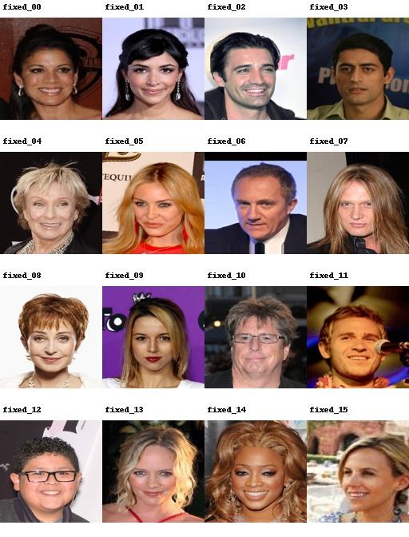

Target labels are saved before generation in `/root/autodl-tmp/CV-project/stage-3/reports/task7/summaries/fixed_samples_target_labels.json` and `/root/autodl-tmp/CV-project/stage-3/reports/task7/summaries/fixed_samples_target_labels.csv`. Hair-color target labels are validated as mutually exclusive for every generated direction.

## 3. Pretrained Sanity Check

The official CelebA 128 pretrained checkpoint is used as a reference before accepting the self-trained run.

- pretrained checkpoint: `/root/autodl-tmp/task/StarGAN/stargan_celeba_128/models/200000-G.ckpt`
- pretrained fixed grid: `/root/autodl-tmp/CV-project/stage-3/reports/task7/assets/pretrained/pretrained_200000_fixed_grid.jpg`

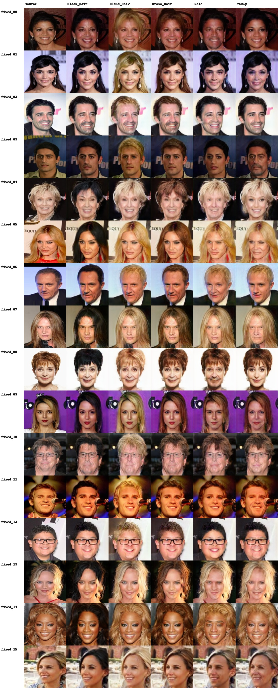

## 4. Self-trained Results

Final self-trained fixed grid:

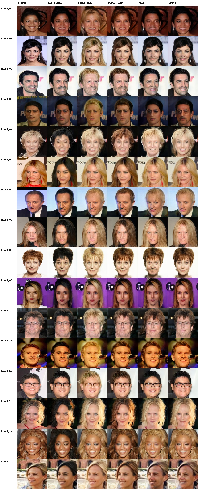

Intermediate fixed-sample monitoring:

- iter `10000`: 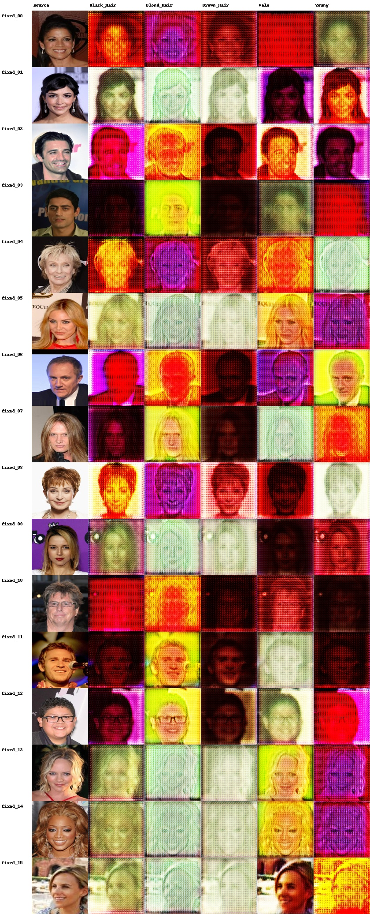
- iter `20000`: 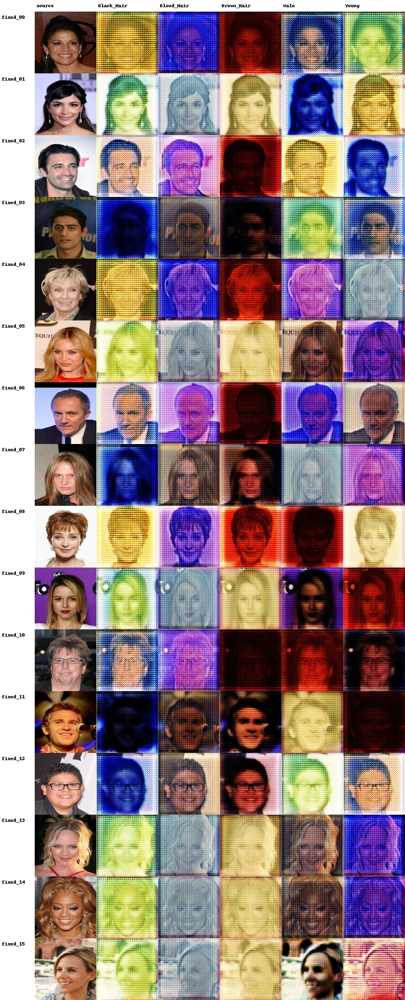
- iter `30000`: 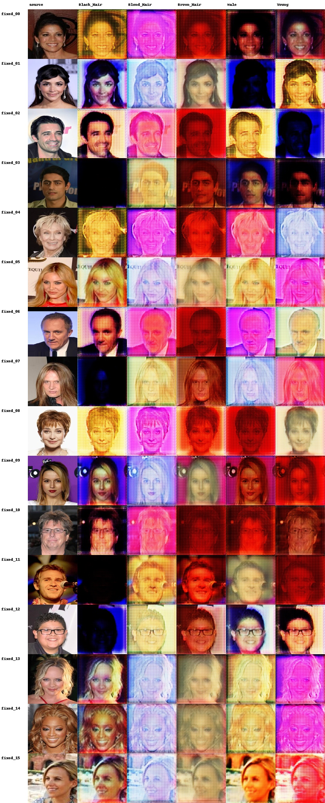
- iter `40000`: 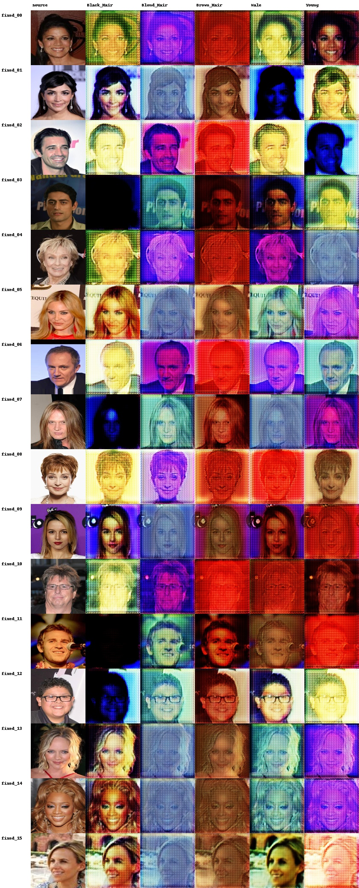
- iter `50000`: 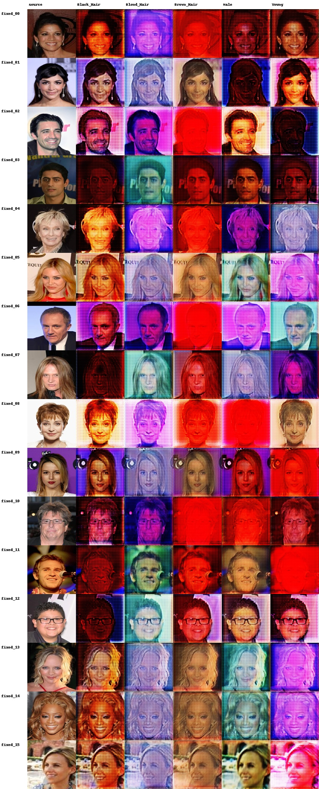
- iter `60000`: 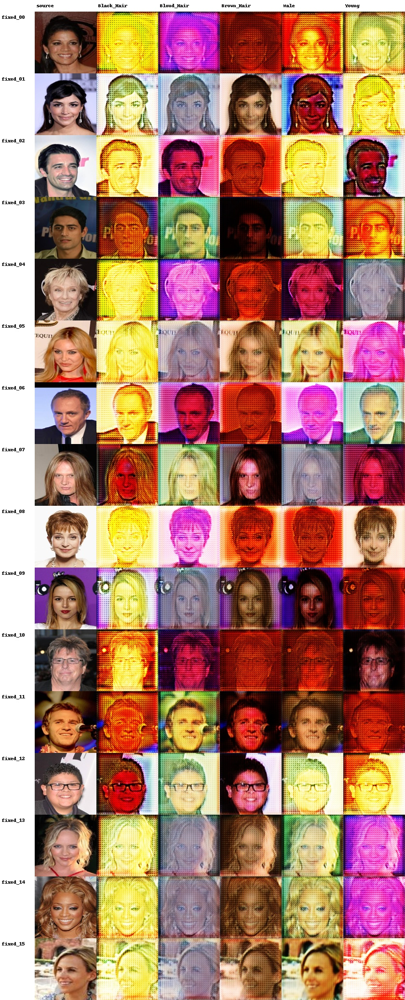
- iter `70000`: 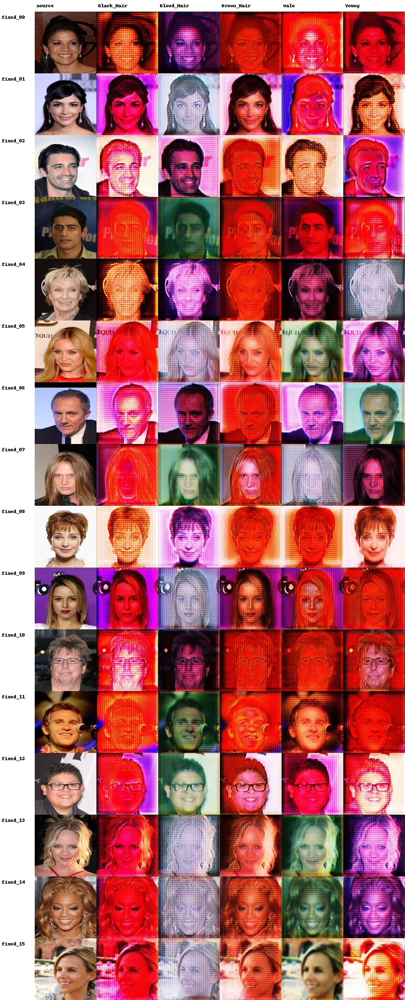
- iter `80000`: 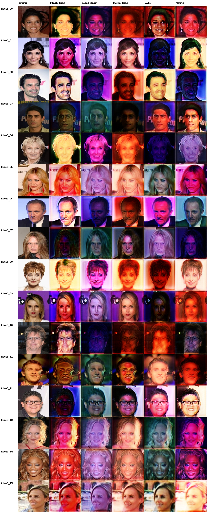
- iter `90000`: 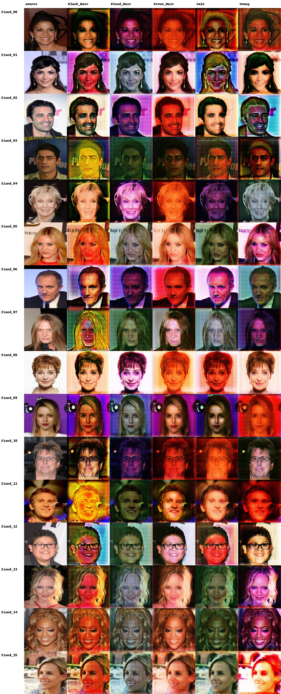
- iter `100000`: 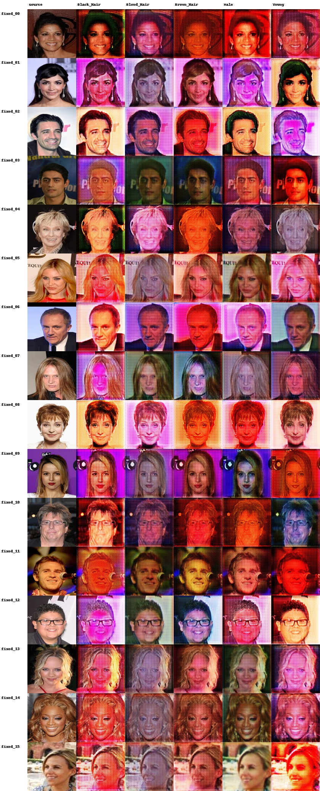
- iter `110000`: 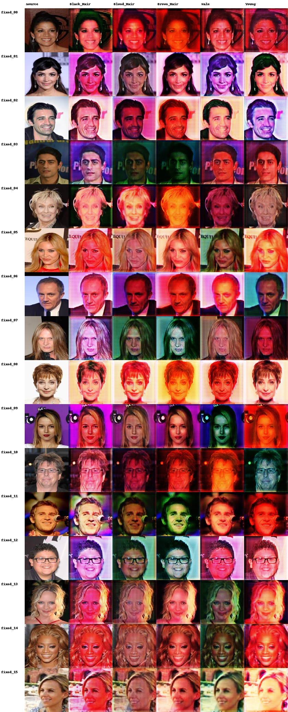
- iter `120000`: 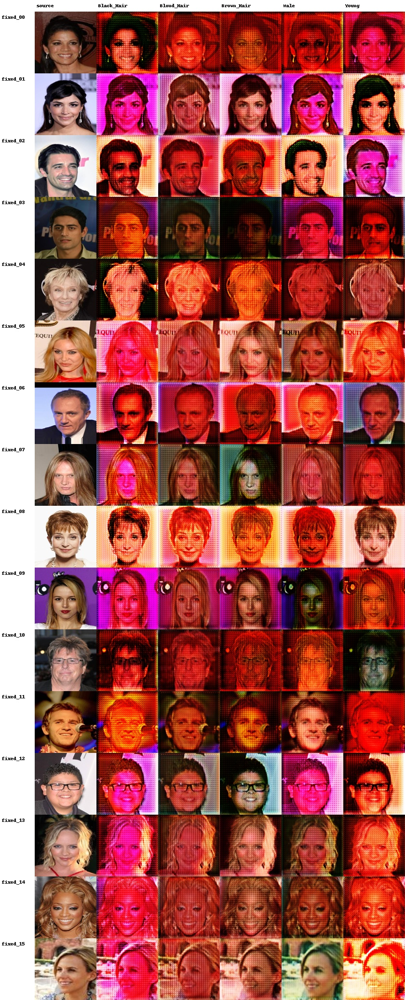
- iter `130000`: 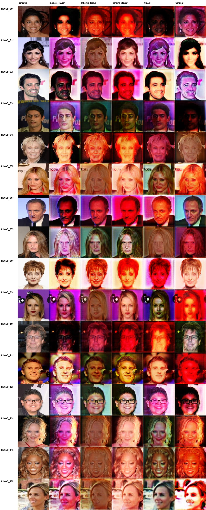
- iter `140000`: 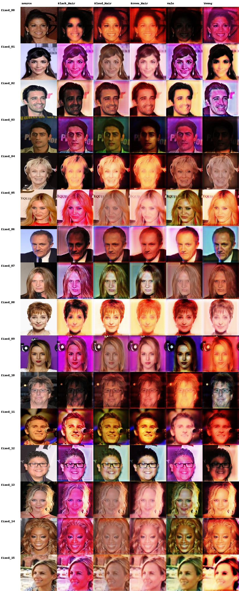
- iter `150000`: 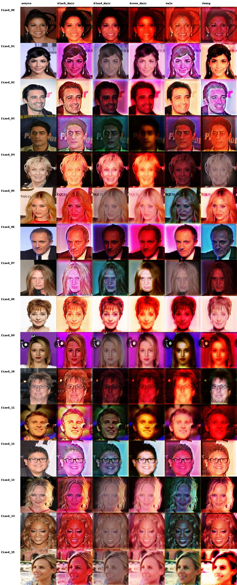
- iter `160000`: 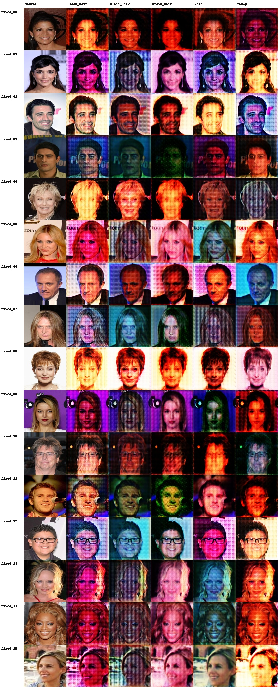
- iter `170000`: 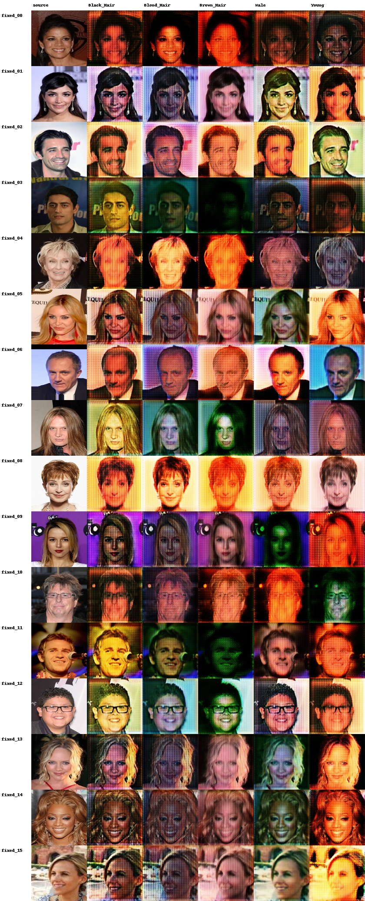
- iter `180000`: 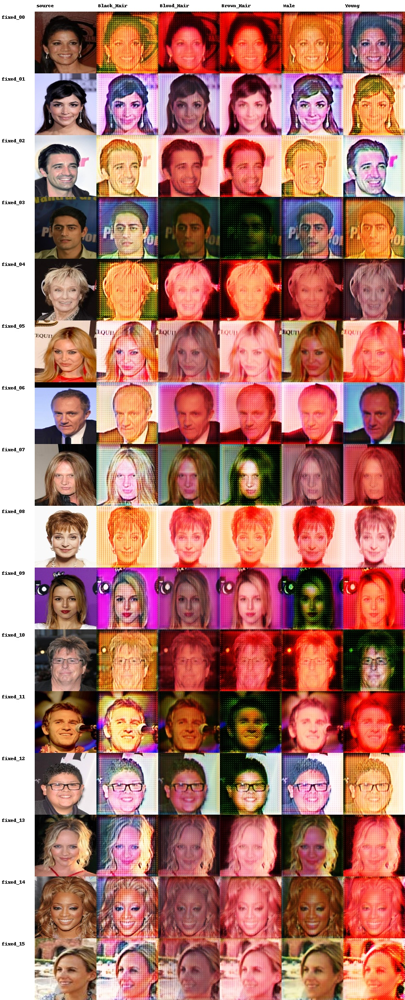
- iter `190000`: 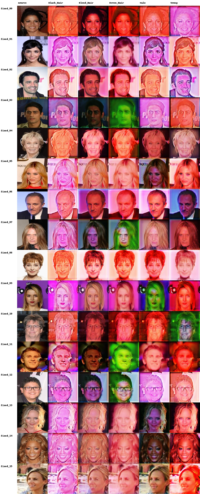
- iter `200000`: 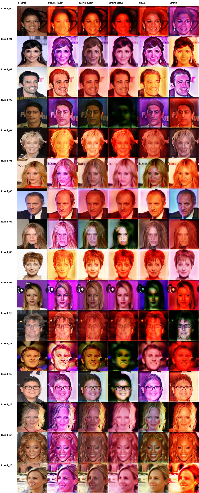

## 5. Quantitative Evaluation

Attribute classifier:

- checkpoint: `/root/autodl-tmp/CV-project/stage-3/work_dirs/task7/attribute_classifier/resnet18_5attrs.pt`
- final exact accuracy: `67.53%`
- per-attribute accuracy: `{'Black_Hair': 0.919959979989995, 'Blond_Hair': 0.9564782391195598, 'Brown_Hair': 0.8819409704852427, 'Male': 0.9859929964982491, 'Young': 0.888944472236118}`

Attribute edit success:

| Direction | Samples | Primary success | Strict 5-attr success |
| --- | ---: | ---: | ---: |
| Black_Hair | 512 | 88.87% | 88.48% |
| Blond_Hair | 512 | 83.79% | 81.84% |
| Brown_Hair | 512 | 85.74% | 85.55% |
| Male | 512 | 96.88% | 94.73% |
| Young | 512 | 93.16% | 92.38% |

Identity retention with InsightFace `buffalo_l`:

- valid pairs: `2434` / `2560`
- mean cosine: `0.6215`
- median cosine: `0.6295`
- p10 cosine: `0.4699`
- no generated face: `124`

FID/IS auxiliary metrics:

- available: `False`
- FID: `N/A`
- Inception Score: `N/A +/- N/A`
- note: FID/IS are auxiliary; acceptance focuses on attribute success and identity retention.

## 6. Failure Case Analysis

- Attribute miss: `180182.jpg` direction `Black_Hair`, target `[1, 0, 0, 0, 1]`, predicted `[0, 0, 0, 0, 1]`.
- Attribute miss: `193652.jpg` direction `Black_Hair`, target `[1, 0, 0, 1, 0]`, predicted `[0, 0, 0, 1, 0]`.
- Attribute miss: `027825.jpg` direction `Black_Hair`, target `[1, 0, 0, 1, 1]`, predicted `[0, 0, 0, 1, 1]`.
- Attribute miss: `016160.jpg` direction `Black_Hair`, target `[1, 0, 0, 0, 1]`, predicted `[0, 0, 0, 0, 1]`.
- Attribute miss: `174667.jpg` direction `Black_Hair`, target `[1, 0, 0, 0, 1]`, predicted `[0, 0, 0, 0, 1]`.
- Attribute miss: `129818.jpg` direction `Black_Hair`, target `[1, 0, 0, 1, 0]`, predicted `[0, 0, 0, 1, 0]`.
- Attribute miss: `201256.jpg` direction `Black_Hair`, target `[1, 0, 0, 0, 1]`, predicted `[0, 0, 0, 0, 1]`.
- Attribute miss: `040792.jpg` direction `Black_Hair`, target `[1, 0, 0, 1, 0]`, predicted `[0, 0, 0, 1, 1]`.
- Identity drift: `018394.jpg` direction `Blond_Hair`, cosine `0.209`.
- Identity drift: `005109.jpg` direction `Male`, cosine `0.328`.
- Identity drift: `174667.jpg` direction `Male`, cosine `0.326`.
- Identity drift: `040792.jpg` direction `Male`, cosine `0.331`.
- Identity drift: `005109.jpg` direction `Young`, cosine `0.324`.
- Identity drift: `174667.jpg` direction `Young`, cosine `0.314`.
- Identity drift: `129839.jpg` direction `Male`, cosine `0.327`.
- Identity drift: `182446.jpg` direction `Male`, cosine `0.348`.

Common failure modes to inspect manually are: target attribute not activated, identity drift after large gender/age edits, hair-color ambiguity, and local artifacts around hairline, glasses, or background.
