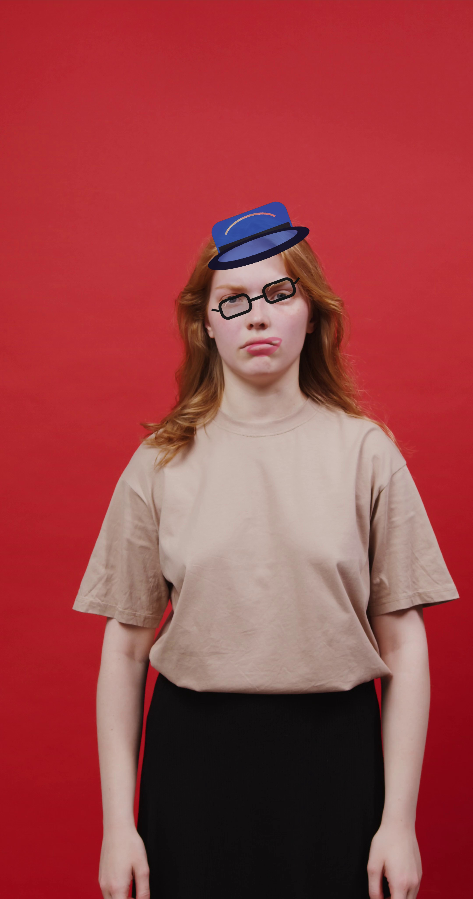
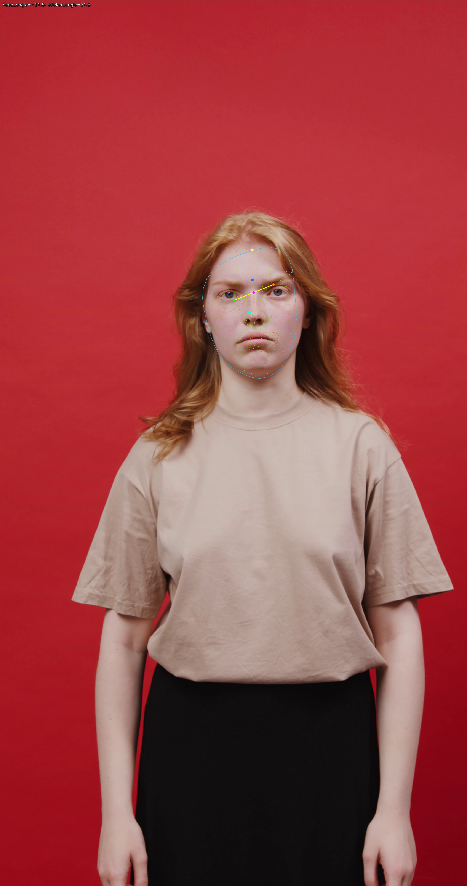
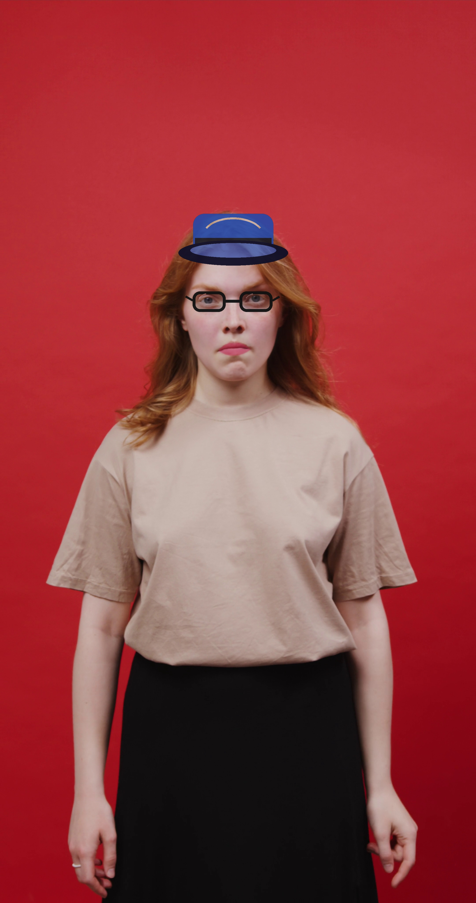
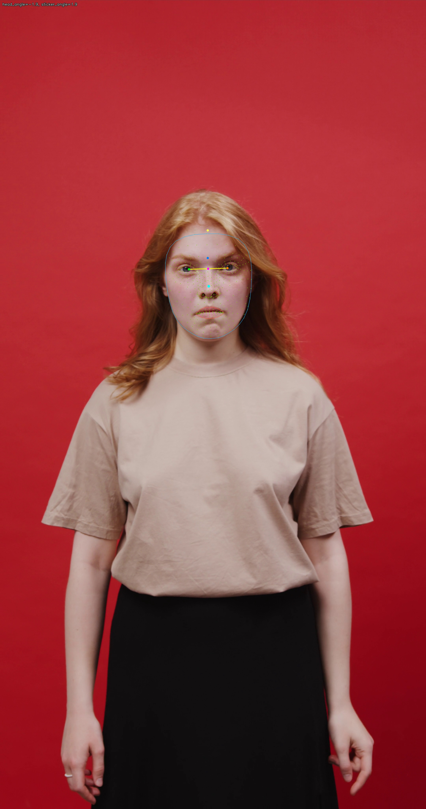
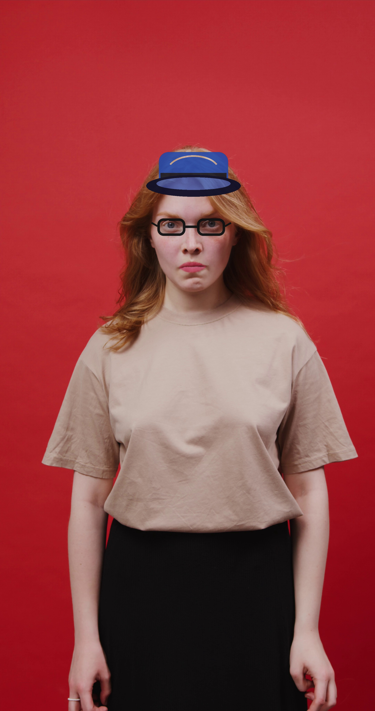
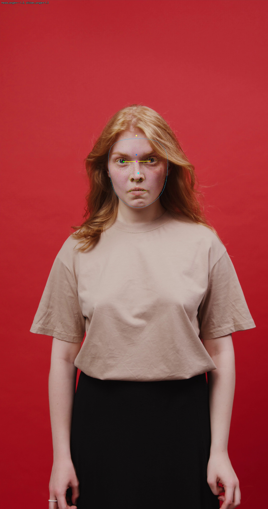
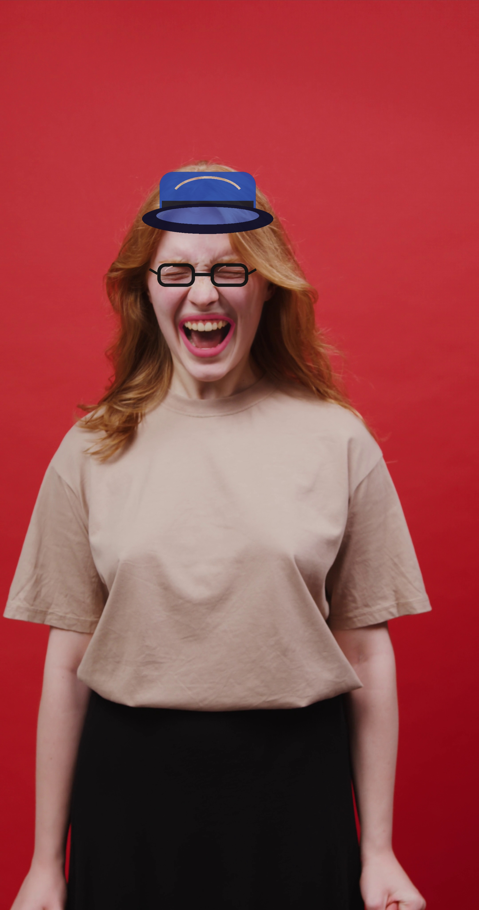
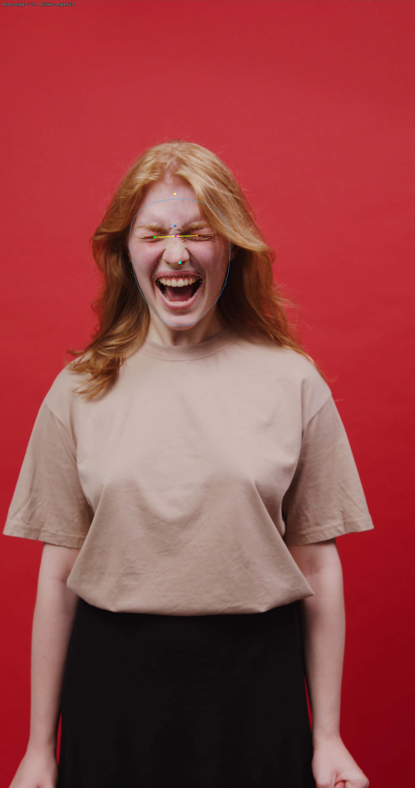
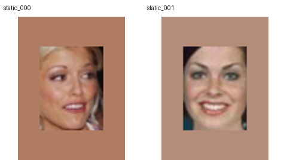

# Stage3 Task9: 基于人脸关键点的动态贴纸与美颜美妆

## 1. 任务简介

本任务实现基于 MediaPipe Face Mesh 的实时人脸关键点检测和动态特效。动态视频演示只使用用户提供的真实 mp4；CelebA 仅用于静态图片 smoke test 和效果图展示，不会被拼接成假连续视频。

交付内容包括：

- `code/task9/`: 环境检查、素材准备、特效运行、demo 整理、benchmark 和报告脚本。
- `configs/task9_effects/`: A800/MediaPipe 配置。
- `reports/task9/assets/`: 用户视频位置、静态图片、贴纸、结果图、关键帧和 demo video。
- `reports/task9/summaries/`: 环境、准备、效果、demo、性能 summary。

## 2. 基本原理

MediaPipe Face Mesh 可在单张图像或视频帧中预测 468 个三维人脸关键点。贴纸类 AR 特效通常选取稳定的语义关键点作为锚点：眼镜使用左右眼外眼角估计中心、尺度和旋转角；帽子使用脸颊宽度与脸部上沿估计头部宽度和额头位置。贴纸是透明 PNG，经过缩放、旋转后用 alpha blend 叠加到原帧。

美颜美妆使用传统图像处理完成。磨皮使用双边滤波并限制在人脸 mask 内，尽量保留边缘；美白在人脸区域提升亮度并轻微调整饱和度，避免整图过曝；口红根据嘴唇关键点生成 polygon mask，在嘴唇区域叠加指定颜色。

## 3. 实验设置

- 静态图片来源: `CelebA_static_only`。
- 静态样本数量: `3`。
- 用户视频状态: `available`。
- 默认用户视频路径: `reports/task9/assets/input/user_video.mp4`。
- OpenCV: `4.13.0`。
- MediaPipe: `N/A`。
- Python: `3.8.10 (default, Jun  4 2021, 15:09:15) `。

## 4. 动态视频 Demo

视频 demo 已生成：

- Demo video: `assets/videos/task9_dynamic_effects_demo.mp4`
- Benchmark FPS: `5.379004486990989`
- Processed frames: `912`
- Faces detected frames: `912`

关键帧：

- Frame 0 after: 
- Frame 0 landmarks: 
- Frame 114 after: 
- Frame 114 landmarks: 
- Frame 228 after: 
- Frame 228 landmarks: 
- Frame 342 after: 
- Frame 342 landmarks: 

## 5. 静态效果展示

## 6. 性能分析

- Benchmark type: `video`。
- Processing mode: `quality`。
- Process size: `2160` x `4096`。
- 平均 FPS: `5.379004486990989`。
- 图片吞吐: `N/A` images/s。
- 平均检测耗时: `9.187342104779784` ms。
- 平均贴纸耗时: `17.246056656483887` ms。
- 平均美颜耗时: `83.02906757269643` ms。
- 平均口红耗时: `4.717958000439562` ms。
- 平均渲染耗时: `105.01267348024014` ms。
- 平均写入耗时: `55.2670280714601` ms。
- CPU/GPU 说明: 本实验主要使用 MediaPipe + OpenCV，标准 Python pipeline 主要由 CPU 执行。A800 可被记录为环境信息，但本任务不强制使用 GPU，也不假设 MediaPipe 使用 A800。

分效果 benchmark:

| Profile | FPS | Detection ms | Sticker ms | Beauty ms | Lipstick ms | Write ms | Total ms |
| --- | ---: | ---: | ---: | ---: | ---: | ---: | ---: |
| `landmark_only` | 12.845 | 8.322 | 0.000 | 0.000 | 0.000 | 52.733 | 77.850 |
| `stickers_only` | 10.457 | 9.120 | 18.037 | 0.000 | 0.000 | 52.678 | 95.632 |
| `beauty_only` | 6.145 | 9.369 | 0.000 | 81.473 | 0.000 | 55.228 | 162.739 |
| `full_effects` | 5.379 | 9.187 | 17.246 | 83.029 | 4.718 | 55.267 | 185.908 |

性能优化说明：Face Mesh 检测本身通常较快，主要瓶颈来自 CPU 图像特效渲染。优化版提供 fast mode，通过降低处理分辨率、只在 face/lips ROI 内做美颜、在 ROI 小图上执行 bilateral filter、以及贴纸旋转缩放缓存来提升吞吐。`--device cuda` 仅作为可选实验标记；若没有自定义 GPU MediaPipe/OpenCV/Torch 图像处理实现，summary 会明确记录 fallback CPU。

## 7. 局限性

- 极端姿态、遮挡、运动模糊和强光照会影响 Face Mesh 关键点稳定性。
- 本任务使用简单自生成贴纸，视觉精细度不如商业 AR 素材。
- 美颜美妆是传统图像处理实现，不是深度学习美颜模型。
- 没有用户 mp4 时，只能展示静态图片效果；报告不会把 CelebA 多人图片拼接成连续动态视频。

## 8. 结论

Task9 构建了一个轻量、稳定、可复现的人脸关键点动态特效 pipeline。真实视频输入用于展示贴纸和美颜美妆的逐帧跟踪效果；CelebA 仅保留为静态 smoke test，避免不同人物图片拼接造成错误的动态演示结论。
