# 第三周周报：Stage3 人脸属性编辑、三维重建与动态特效

周期：第三周，2026-06-03 至 2026-06-07

## 1. 本周已完成

* 完成 Stage3 Task7.x StarGAN 人脸属性编辑交付，整理官方 StarGAN wrapper、CelebA 数据准备、预训练 sanity check、自训练/预训练效果对比、属性编辑指标、身份保持指标和独立报告目录。
* 完成 Stage3 Task8.x 3DDFA_V2 单图三维人脸重建交付，整理官方 3DDFA_V2 subprocess wrapper、CelebA 输入样本、2D sparse landmarks、3D overlay、pose、OBJ mesh 和多视角渲染结果。
* 完成 Stage3 Task9.x MediaPipe Face Mesh 动态人脸特效交付，支持真实 mp4 视频输入，输出眼镜、帽子、磨皮、美白、口红动态效果、关键帧和 demo video。
* Stage3 代码集中在 `code/task7/`、`code/task8/`、`code/task9/`，报告和结果集中在 `reports/task7/`、`reports/task8/`、`reports/task9/`，权重、原始数据和第三方 repo 不进入最终 repo 交付。

## 2. 运行截图

### 2.1 Task7-Task9 本地入口验证

对应任务：Stage3 全阶段脚本入口检查。

运行内容：在本地 MacBook 终端调用 Task7、Task8、Task9 的 `--help`，确认脚本入口和参数说明可访问。

结果解读：本地截图证明代码入口可以被真实调用；由于本地没有完整云端数据、A800 环境和所有依赖，完整训练、重建和视频效果以 AutoDL summary 为准。

运行截图说明：下面截图由本地真实命令输出渲染生成，命令包括：

```bash
cd "/Users/aaron/Documents/字节实习/task/CV project/stage-3"

python code/task7/stage3_task7_run_stargan.py --help
python code/task8/stage3_task8_run_reconstruction.py --help
python code/task9/stage3_task9_run_effects.py --help
python code/task9/stage3_task9_benchmark.py --help
```

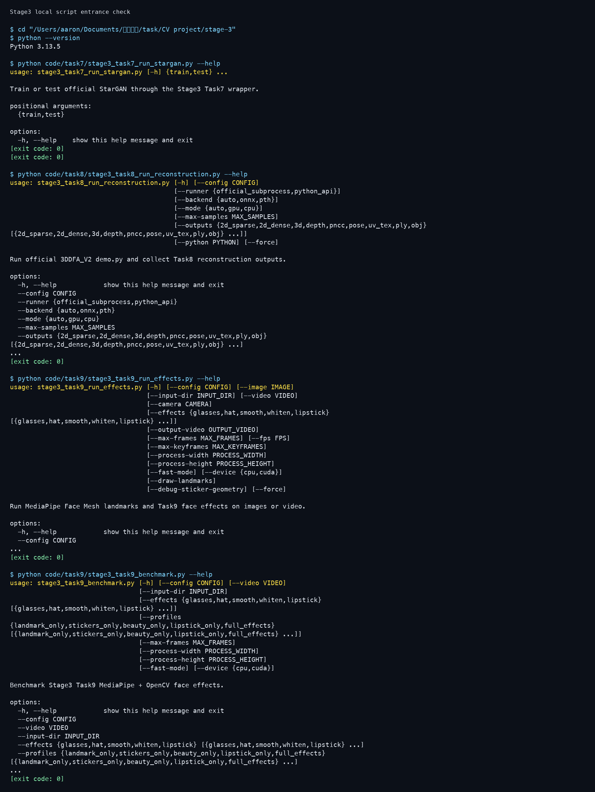

### 2.2 Task7 StarGAN help 运行截图

对应任务：Stage3 Task7.x 人脸属性编辑。

运行内容：本地运行 `python code/task7/stage3_task7_run_stargan.py --help`，检查 StarGAN wrapper 的配置、checkpoint、运行模式和输出目录参数。

结果解读：Task7 入口可调用，说明本地代码结构和 argparse 入口正常；真正的 CelebA 数据、官方 StarGAN repo 和训练权重仍以云端环境为准。

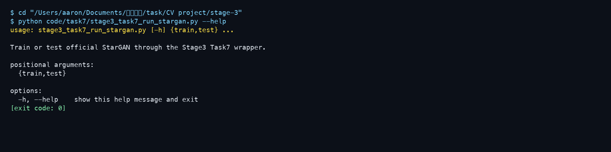

### 2.3 Task8 3DDFA_V2 help 运行截图

对应任务：Stage3 Task8.x 单图三维人脸重建。

运行内容：本地运行 `python code/task8/stage3_task8_run_reconstruction.py --help`，确认官方 3DDFA_V2 subprocess wrapper 的 backend、mode、样本数和输出参数。

结果解读：Task8 wrapper 入口正常；实际 3DDFA_V2 官方 repo、权重和 GPU 推理结果以 AutoDL summary 记录为准，第三方 repo 不放入 stage-3。

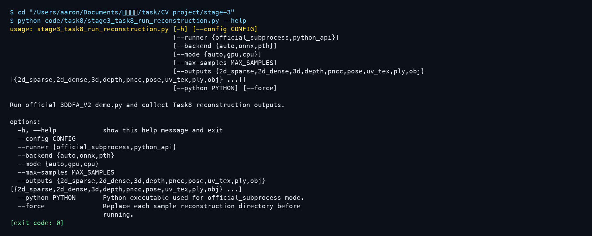

### 2.4 Task9 动态特效 help 与 py_compile 运行截图

对应任务：Stage3 Task9.x 动态人脸特效。

运行内容：本地运行 `python code/task9/stage3_task9_run_effects.py --help`，并对 Task9 关键脚本执行 `py_compile` 语法检查。

结果解读：Task9 的动态效果入口、参数说明和核心脚本语法检查可在本地跑通；完整视频处理、benchmark 和 demo video 仍以云端 summary 与结果文件为准。

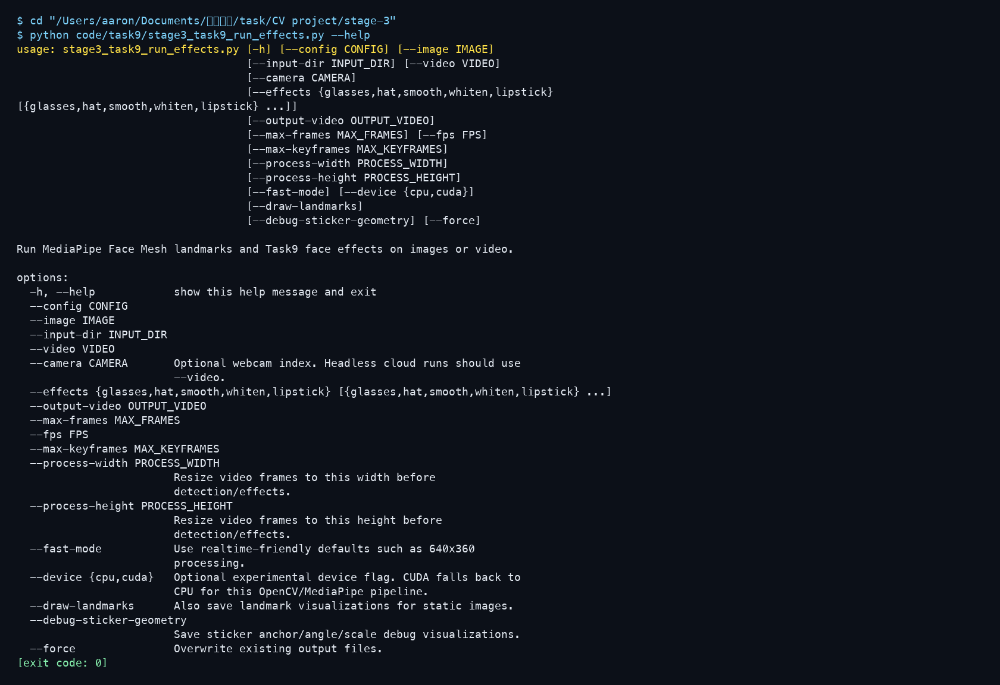

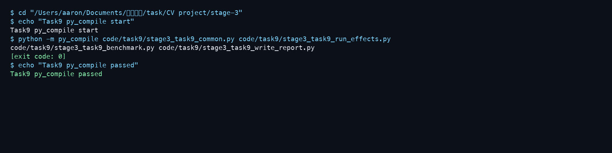

---PAGEBREAK---

## 3. 实验结果与图表

### 3.1 Task7 StarGAN 人脸属性编辑

Task7 目标是使用 StarGAN 实现人脸属性编辑，围绕 CelebA 5 个属性进行编辑和评估，包括 Black_Hair、Blond_Hair、Brown_Hair、Male、Young。代码封装官方 StarGAN 路线，stage-3 只保留 wrapper、配置、summary、报告和结果图，不把第三方官方 repo 复制进交付目录。

早期生成图出现颜色伪影和属性编辑不稳定，排查后发现官方 StarGAN test 路径没有显式切到 `eval()`，而 wrapper 使用 `eval()` 后会和官方 Generator 的 InstanceNorm 行为不一致。修复后 wrapper 按官方测试路径保持对应模式，并统一 denorm/save_image 逻辑，视觉结果恢复正常。

| Attribute | Primary success | Strict success |
| --- | ---: | ---: |
| Black_Hair | 88.87% | 88.48% |
| Blond_Hair | 83.79% | 81.84% |
| Brown_Hair | 85.74% | 85.55% |
| Male | 96.88% | 94.73% |
| Young | 93.16% | 92.38% |

身份保持评估使用生成图和源图的人脸 embedding cosine 作为参考：valid pairs 为 2434，mean cosine 为 0.6215，median cosine 为 0.6295；其中 no source face 为 10，no generated face 为 124。该指标说明自动身份评估中有 2434/2560 个 pairs 成功提取 embedding，说明大部分生成结果可用于身份保持评估。少量 generated images 未通过检测器，可能与低分辨率、局部伪影或检测阈值有关。

FID/IS 本次未计算，因此本报告主要使用属性编辑成功率、身份保持指标和可视化结果作为评价依据。

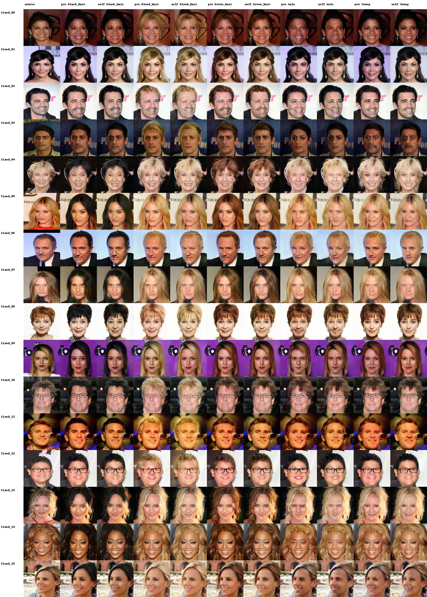


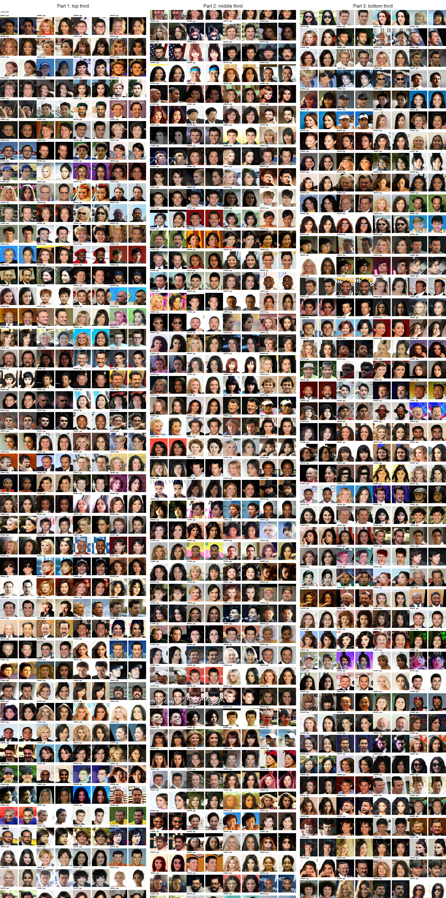

### 3.2 Task8 3DDFA_V2 单图三维人脸重建

Task8 使用官方 3DDFA_V2 完成单图 3D face reconstruction。输入是少量 CelebA 静态人脸样本，输出包括 2D sparse landmarks、3D overlay、pose estimation、OBJ mesh 和多视角渲染图。

stage-3 只保存 wrapper、summary 和输出结果，官方 3DDFA_V2 repo 以外部路径和 commit 记录，不复制进交付目录。

| 指标 | 结果 |
| --- | --- |
| 输入样本数 | 8 |
| 成功重建样本数 | 8 |
| Reconstruction backend | pth |
| Reconstruction mode | gpu |
| Render backend | matplotlib |
| 输出类型 | 2d_sparse / 3d / pose / obj |
| 多视角角度 | frontal / left_yaw_30 / right_yaw_30 / left_yaw_60 / right_yaw_60 |

结果结论：3DDFA_V2 官方 wrapper 能从单张人脸恢复粗略 3D 形状并导出 OBJ；但重建精度依赖官方模型和输入质量，本阶段不做精细几何误差评估。

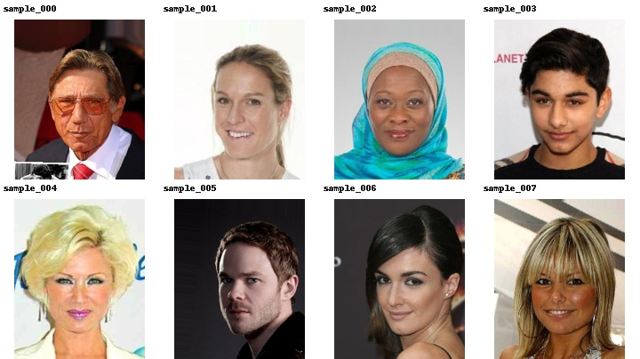

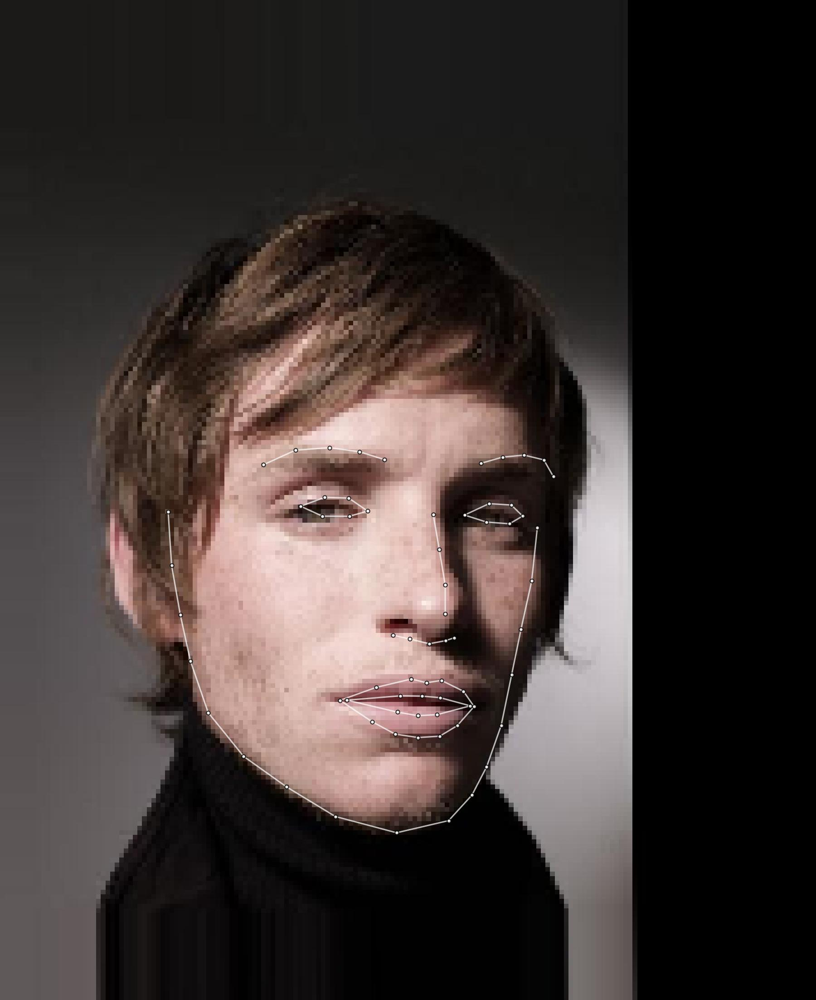

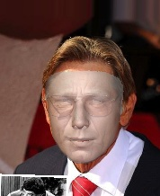

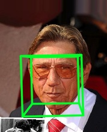

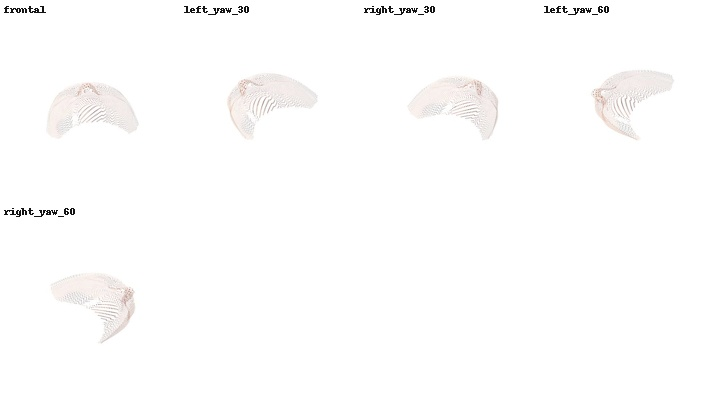

---PAGEBREAK---

### 3.3 Task9 MediaPipe 动态人脸特效

Task9 目标是基于实时人脸关键点检测实现动态贴纸、美颜和美妆。最终方案使用真实 mp4 作为动态输入。

视觉效果方面，眼镜和帽子能随人脸运动，方向和尺度基本正确；口红、美白和磨皮有可见效果。但当前实现属于传统 OpenCV 图像处理和 alpha blend，不是商业级 AR 精修，复杂遮挡、快速运动和极端姿态下仍可能出现贴纸漂移或局部不自然。

贴纸几何方面，早期眼镜角度曾反向，帽子位置偏低偏小。修复后 eye centers 使用多个 landmark 平均，head angle 由左右眼中心估计，sticker rotation 使用 `-angle_deg`，帽子基于 face width、brow/face center 上移，并新增 debug geometry 输出辅助检查。

性能方面，原始全分辨率版本较慢，瓶颈主要在 CPU 图像渲染、ROI 美颜和视频写出。当前已加入 ROI 美颜、ROI downscale bilateral smoothing、sticker resize/rotate cache 和 profile benchmark。需要说明的是，当前仓库里的 `task9_performance_summary.json` 记录的是 quality/original-resolution benchmark，不是 fast mode；summary 显示 `fast_mode_requested=false`，处理尺寸为 2160x4096。因此这里不把结果写成实时，只把它作为原分辨率质量路径的性能分析。

| Profile | FPS | Detection ms/frame | Sticker ms/frame | Beauty ms/frame | Lipstick ms/frame | Render ms/frame | Write ms/frame |
| --- | ---: | ---: | ---: | ---: | ---: | ---: | ---: |
| landmark_only | 12.85 | 8.32 | 0.00 | 0.00 | 0.00 | 0.00 | 52.73 |
| stickers_only | 10.46 | 9.12 | 18.04 | 0.00 | 0.00 | 18.04 | 52.68 |
| beauty_only | 6.14 | 9.37 | 0.00 | 81.47 | 0.00 | 81.48 | 55.23 |
| full_effects | 5.38 | 9.19 | 17.25 | 83.03 | 4.72 | 105.01 | 55.27 |

`landmark_only` 用于观察 Face Mesh 检测链路本身，`full_effects` 是最终全特效路径。A800 CUDA 可用，Torch CUDA 可用，但当前 Task9 标准 MediaPipe + OpenCV Python pipeline 主要由 CPU 执行，A800 只作为环境信息记录，不能声称 GPU 直接加速。


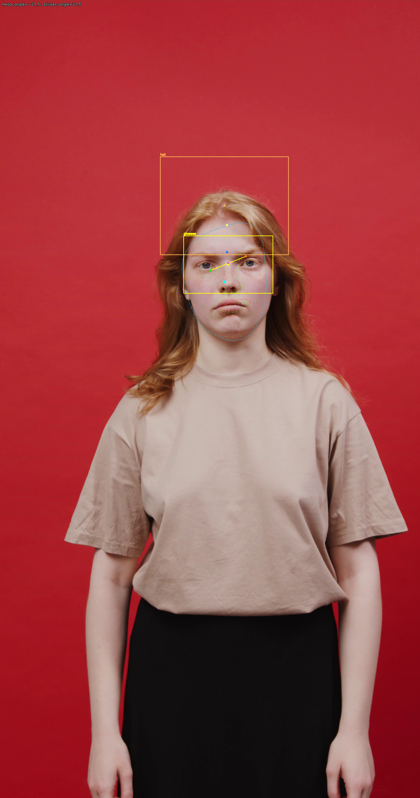

Demo video 路径：`reports/task9/assets/videos/task9_dynamic_effects_demo.mp4`

---PAGEBREAK---

## 4. 关键代码段与解释

### 4.1 Task7 StarGAN 数据与属性准备

文件：`code/task7/stage3_task7_common.py`

```python
def build_target_labels(label: list[int], attrs: list[str]) -> list[dict[str, Any]]:
    validate_selected_attrs(attrs, len(label))
    if hair_sum_from_label(label, attrs) > 1:
        raise ValueError(f"Original label has conflicting hair attrs: {label}")
    targets: list[dict[str, Any]] = []
    hair_indices = [attrs.index(name) for name in HAIR_ATTRS]
    for attr_idx, attr_name in enumerate(attrs):
        target = list(label)
        if attr_name in HAIR_ATTRS:
            for hair_idx in hair_indices:
                target[hair_idx] = 0
            target[attr_idx] = 1
        else:
            target[attr_idx] = 0 if target[attr_idx] else 1
        validate_target_label(target, attrs, direction=attr_name)
        targets.append(
            {
                "direction": attr_name,
                "label": target,
                "attrs": {name: bool(target[idx]) for idx, name in enumerate(attrs)},
            }
        )
    return targets
```

解释：这里把 CelebA 的源属性转换成 StarGAN 需要的 target labels。头发颜色属性互斥，因此生成 Black/Blond/Brown Hair 时会先清空其他发色，再只打开目标发色；Male、Young 这类二值属性则做翻转。

### 4.2 Task7 StarGAN 生成与 wrapper 修复

文件：`code/task7/stage3_task7_common.py`

```python
def load_generator(cfg: dict[str, Any], checkpoint: Path, device: str):
    import torch

    repo = stargan_repo(cfg)
    Generator = import_stargan_generator(repo)
    generator = Generator(
        int(cfg_get(cfg, "model", "g_conv_dim", 64)),
        int(cfg_get(cfg, "model", "c_dim", 5)),
        int(cfg_get(cfg, "model", "g_repeat_num", 6)),
    )
    try:
        state = torch.load(str(checkpoint), map_location=lambda storage, loc: storage, weights_only=True)
    except TypeError:
        state = torch.load(str(checkpoint), map_location=lambda storage, loc: storage)
    result = generator.load_state_dict(state, strict=True)
    print(
        "Loaded StarGAN generator checkpoint "
        f"{checkpoint} with strict=True; keys={len(state)}, "
        f"missing={len(result.missing_keys)}, unexpected={len(result.unexpected_keys)}"
    )
    generator.to(device)
    # Official yunjey/StarGAN Solver.test() does not call G.eval(). The
    # generator uses InstanceNorm2d(track_running_stats=True), so keep training
    # mode during no-grad inference to mirror official test-time behavior.
    generator.train()
    return generator
```

解释：这段是 Task7 修复的关键。wrapper 加载官方 StarGAN Generator 后保持和官方 test 路径一致的模式，避免因为 `eval()` 与 InstanceNorm running stats 行为差异造成生成图颜色伪影。

### 4.3 Task7 属性成功率与身份保持评估

文件：`code/task7/stage3_task7_evaluate.py`

```python
def predict_generated_attrs(cfg: dict[str, Any], model: nn.Module, manifest: dict[str, Any], device: str) -> dict[str, Any]:
    attrs = selected_attrs(cfg)
    image_size = int(cfg_get(cfg, "model", "image_size", 128))
    paths = [Path(record["generated_path"]) for record in manifest["records"]]
    dataset = GeneratedImageDataset(paths, image_size)
    loader = DataLoader(dataset, batch_size=int(cfg_get(cfg, "evaluation", "batch_size", 64)), shuffle=False)
    predictions: dict[str, list[int]] = {}
    threshold = float(cfg_get(cfg, "evaluation", "attribute_threshold", 0.5))
    with torch.no_grad():
        for images, batch_paths in loader:
            logits = model(images.to(device))
            pred = (torch.sigmoid(logits) >= threshold).int().cpu().numpy()
            for path, row in zip(batch_paths, pred):
                predictions[path] = [int(x) for x in row.tolist()]

    per_direction: dict[str, dict[str, Any]] = {}
    records = []
    for record in manifest["records"]:
        direction = record["direction"]
        target = [int(v) for v in record["target_label"]]
        pred = predictions[record["generated_path"]]
        attr_idx = attrs.index(direction)
        primary_success = pred[attr_idx] == target[attr_idx]
        if direction in HAIR_ATTRS:
            hair_idxs = [attrs.index(name) for name in HAIR_ATTRS]
            primary_success = primary_success and sum(pred[idx] for idx in hair_idxs) == 1
```

解释：属性成功率不是只看图，而是用属性分类器对生成图重新预测。Primary success 关注目标属性是否编辑成功，发色还要求三种发色互斥；Strict success 要求五个属性完全匹配 target label。

### 4.4 Task8 3DDFA_V2 官方 subprocess 调用

文件：`code/task8/stage3_task8_run_reconstruction.py`

```python
def build_official_command(
    cfg: Dict[str, Any],
    image_path: Path,
    opt: str,
    backend: str,
    mode: str,
    python_bin: str,
) -> List[str]:
    cmd = [
        python_bin,
        "demo.py",
        "-c",
        official_config_arg(cfg),
        "-f",
        str(image_path),
        "-m",
        mode,
        "-o",
        opt,
        "--show_flag",
        show_flag_value(cfg),
    ]
    if backend == "onnx":
        cmd.append("--onnx")
    return cmd
```

解释：Task8 没有复制或改写官方 3DDFA_V2，而是通过 subprocess 调用官方 `demo.py`。stage-3 保存 wrapper、summary 和归档结果，第三方 repo 路径、backend 和 commit 写入 summary，便于复现实验。

### 4.5 Task8 OBJ 多视角渲染

文件：`code/task8/stage3_task8_render_views.py`

```python
def parse_angles(cfg: Dict[str, Any]) -> List[Dict[str, float]]:
    raw = cfg_get(cfg, "render", "angles", [])
    angles = []
    for item in raw:
        if isinstance(item, dict):
            angles.append(
                {
                    "name": str(item.get("name", "view")),
                    "yaw": float(item.get("yaw", 0.0)),
                    "pitch": float(item.get("pitch", 0.0)),
                }
            )
        elif isinstance(item, (tuple, list)) and len(item) >= 2:
            angles.append({"name": str(item[0]), "yaw": float(item[1]), "pitch": float(item[2]) if len(item) > 2 else 0.0})
    if not angles:
        angles = [
            {"name": "frontal", "yaw": 0.0, "pitch": 0.0},
            {"name": "left_yaw_30", "yaw": -30.0, "pitch": 0.0},
            {"name": "right_yaw_30", "yaw": 30.0, "pitch": 0.0},
        ]
    return angles
```

解释：多视角渲染根据配置生成不同 yaw 角度。当前 summary 选择 matplotlib fallback，适合把 OBJ mesh 以稳定、轻量的方式渲染成 frontal 和左右 yaw 视角图。

### 4.6 Task9 Face Mesh 单帧处理

文件：`code/task9/stage3_task9_run_effects.py`

```python
def process_frame(self, frame_bgr: Any, save_landmark_frame: bool = False) -> Dict[str, Any]:
    points, detection_seconds = self.detect_landmarks(frame_bgr)
    output = frame_bgr.copy()
    landmark_frame = None
    debug_geometry_frame = None
    geometry = None
    sticker_boxes: List[Dict[str, Any]] = []
    render_seconds = 0.0
    beauty_seconds = 0.0
    lipstick_seconds = 0.0
    sticker_seconds = 0.0
    face_detected = points is not None
    if face_detected:
        h, w = frame_bgr.shape[:2]
        geometry = estimate_face_transform_from_landmarks(points, w, h)
        started = time.perf_counter()
        if "smooth" in self.enabled_effects:
            effect_started = time.perf_counter()
            output = self.apply_smooth(output, points)
            beauty_seconds += time.perf_counter() - effect_started
        if "whiten" in self.enabled_effects:
            effect_started = time.perf_counter()
            output = self.apply_whiten(output, points)
            beauty_seconds += time.perf_counter() - effect_started
```

解释：单帧先跑 MediaPipe Face Mesh 得到 468 点，再按启用效果分派到 smooth、whiten、lipstick、hat、glasses。函数同时记录 detection、sticker、beauty、lipstick、render 的耗时，后续 benchmark 直接复用这些字段。

### 4.7 Task9 贴纸几何修复

文件：`code/task9/stage3_task9_common.py`

```python
def estimate_face_transform_from_landmarks(points: Any, image_width: int, image_height: int) -> Optional[Dict[str, Any]]:
    """Estimate stable face geometry from MediaPipe Face Mesh pixel landmarks."""
    if points is None or len(points) <= max(LEFT_EYE_REGION + RIGHT_EYE_REGION + FACE_OVAL):
        return None

    eye_a = mean_landmark_point(points, RIGHT_EYE_REGION)
    eye_b = mean_landmark_point(points, LEFT_EYE_REGION)
    if eye_a[0] <= eye_b[0]:
        left_eye_center, right_eye_center = eye_a, eye_b
    else:
        left_eye_center, right_eye_center = eye_b, eye_a

    eye_distance = euclidean(left_eye_center, right_eye_center)
    if eye_distance < max(12.0, min(image_width, image_height) * 0.025):
        return None

    angle_deg = math.degrees(
        math.atan2(right_eye_center[1] - left_eye_center[1], right_eye_center[0] - left_eye_center[0])
    )
    face_min_x, face_min_y, face_max_x, face_max_y = landmark_bbox(points, FACE_OVAL)
    bbox_width = max(0.0, face_max_x - face_min_x)
    cheek_width = 0.0
```

解释：几何修复不再依赖单个点，而是用多个眼部 landmark 平均得到稳定眼中心，用左右眼中心估计头部角度，再输出 `sticker_angle_deg=-angle_deg` 给贴纸旋转，避免眼镜方向反向。

### 4.8 Task9 ROI 美颜与性能优化

文件：`code/task9/stage3_task9_run_effects.py`

```python
def fast_bilateral_roi(self, roi: Any):
    cv2 = self.cv2
    if roi.size == 0:
        return roi
    d = max(1, int(self.smooth_diameter))
    if self.smooth_backend != "bilateral_fast" or self.smooth_downscale >= 0.98:
        return cv2.bilateralFilter(roi, d=d, sigmaColor=self.smooth_sigma_color, sigmaSpace=self.smooth_sigma_space)
    h, w = roi.shape[:2]
    small_w = max(8, int(round(w * self.smooth_downscale)))
    small_h = max(8, int(round(h * self.smooth_downscale)))
    small = cv2.resize(roi, (small_w, small_h), interpolation=cv2.INTER_AREA)
    filtered_small = cv2.bilateralFilter(
        small,
        d=d,
        sigmaColor=self.smooth_sigma_color,
        sigmaSpace=self.smooth_sigma_space,
    )
    return cv2.resize(filtered_small, (w, h), interpolation=cv2.INTER_LINEAR)
```

解释：原始全帧 bilateralFilter 代价很高，优化后只在 face ROI 内处理，并且先把 ROI 降采样再滤波，最后恢复到 ROI 原尺寸。这能减少 CPU 渲染开销，但当前原分辨率 quality 路径仍明显慢于实时。

### 4.9 Task9 分 profile benchmark

文件：`code/task9/stage3_task9_benchmark.py`

```python
def effects_for_profile(profile: str, cfg: Dict[str, Any], requested_effects: Set[str]) -> Set[str]:
    if profile == "landmark_only":
        return set()
    if profile == "stickers_only":
        return {"glasses", "hat"}
    if profile == "beauty_only":
        return {"smooth", "whiten"}
    if profile == "lipstick_only":
        return {"lipstick"}
    if requested_effects:
        return set(requested_effects)
    return {"glasses", "hat", "smooth", "whiten", "lipstick"}


def empty_profile_totals() -> Dict[str, float]:
    return {
        "detection_seconds": 0.0,
        "sticker_seconds": 0.0,
        "beauty_seconds": 0.0,
        "lipstick_seconds": 0.0,
        "render_seconds": 0.0,
        "write_seconds": 0.0,
    }
```

解释：benchmark 将 landmark_only、stickers_only、beauty_only、full_effects 拆开，能看出 Face Mesh 检测、贴纸、美颜、口红和写视频分别消耗多少时间。当前数据说明全特效主要慢在美颜/render/write，而不是单纯 landmark detection。

---PAGEBREAK---

## 5. 下周待办

项目集成交付与总结


## 6. 交付物索引

| 内容 | 路径 |
| --- | --- |
| Stage3 周报 Markdown | `reports/weekly/week3_report_2026-06-07.md` |
| Weekly 本地运行截图 | `reports/weekly/assets/` |
| Task7 report | `reports/task7/stage3_task7_stargan_attribute_editing_report.md` |
| Task7 summaries | `reports/task7/summaries/` |
| Task7 assets | `reports/task7/assets/` |
| Task8 report | `reports/task8/stage3_task8_3d_face_reconstruction_report.md` |
| Task8 summaries | `reports/task8/summaries/` |
| Task8 rendered views | `reports/task8/assets/rendered_views/` |
| Task8 OBJ mesh outputs | `reports/task8/assets/reconstruction/*/official_mesh.obj` |
| Task9 report | `reports/task9/stage3_task9_dynamic_face_effects_report.md` |
| Task9 performance summary | `reports/task9/summaries/task9_performance_summary.json` |
| Task9 effects summary | `reports/task9/summaries/task9_effects_summary.json` |
| Task9 keyframes | `reports/task9/assets/outputs/keyframes/` |
| Task9 demo video | `reports/task9/assets/videos/task9_dynamic_effects_demo.mp4` |
|                           |                                                              |
